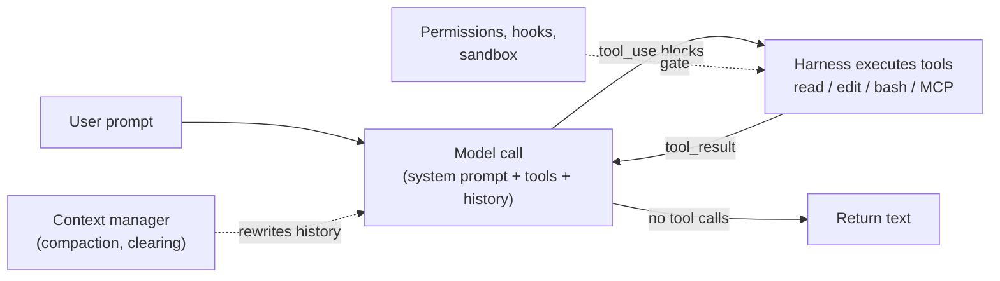

# Anatomy of an Agent Harness

*Research program: agent harnesses. Written 2026-09-08. Status: verified with notes.*

## What this document answers

- What an agent harness is, from first principles, with a ~30-line sketch of the core loop.
- How a production harness differs from that sketch, part by part, using concrete references: OpenAI Codex CLI, Google Gemini CLI, OpenHands, pi (Mario Zechner), Thorsten Ball's "How to build an agent", and the Claude Agent SDK / Claude Code.
- What goes wrong when each part is missing.
- The "thin vs thick harness" tension: what has moved into the model or the vendor's API, and what still lives outside.

## TL;DR

- The loop is trivial. Ball builds a code-editing agent in under 400 lines of Go with three tools (Apr 2025) [1][2]; pi ships four default tools and shows 103k GitHub stars as of Sep 2026 [3][4]. The hard problems are in the other six parts.
- Production harnesses have converged on the same mechanisms regardless of vendor: hierarchical instruction files (`CLAUDE.md`, `AGENTS.md`, `GEMINI.md`), compaction, subagents with isolated context, OS sandboxes (Seatbelt, bubblewrap/seccomp), tiered permission modes, cron-style scheduling [10][14][15][31][35][37][40].
- The biggest 2025–26 shift: model vendors are absorbing harness functions into APIs and clouds. Anthropic offers server-side compaction (beta launched Feb 5, 2026; header dated Jan 12, 2026), a memory tool (beta Sept 29, 2025; tool type dated Aug 18, 2025), context editing (Sept 29, 2025), a hosted "Managed Agents" harness (public beta Apr 8, 2026), memory curation ("dreams", research preview), and cloud "routines" [23][24][25][26][18][51]. This supports "the harness is where the value is" but cuts against "a third party gets to own it."
- Permission fatigue was real and is being solved with models, not dialogs: Claude Code's auto mode routes actions through a classifier and is the built-in starting mode on Pro, Max, and Team plans [14]; Anthropic's Aug 7, 2026 announcement and the Claude Code "What's new" page date the default switch to Aug 14, 2026 [46][52][53].
- Surfaces have already multiplied at the vendor level. Claude Code lists terminal, desktop, IDE, web, Remote Control (phone), Slack, and CI, and states "the underlying agentic loop is identical" [7]. Codex ships CLI, IDE extension, desktop app, and web [30]. The surface is separable, which the thesis needs, but vendors are doing the separating.
- Counter-evidence to "thick is better": pi's README argues baked-in features (to-dos, plan mode, sub-agents, permission popups) belong in extensions because they "confuse models" or dictate workflow [4]. Features are cheap to copy; enforcement and plumbing are not.
- No reference harness targets non-technical people. All assume a repo, a shell, and git. The nearest moves (Cowork/Dispatch, routines, Managed Agents) are Anthropic products [21][18][25].

## 1. What a harness is

**Analogy.** A frontier model is a brilliant contractor with total amnesia who can only talk. The harness is the job site: someone reads the instructions aloud each morning (context), hands over tools and reports back what happened (tools, loop), keeps the notebook (memory), decides which actions need sign-off and locks the dangerous cabinets (permissions), provides the site (runtime), is the phone you reach them on (surface), and coordinates the crew (orchestration).

**Precisely.** A model API is a stateless function: messages in, one message out. An agent is a program that calls it in a loop, executes the tool calls the model requests, feeds results back, and stops when the model stops asking. Anthropic's docs describe Claude Code exactly this way: it "serves as the agentic harness around Claude: it provides the tools, context management, and execution environment that turn a language model into a capable coding agent" [7]. This document uses seven parts consistently: loop, tools, context and memory, permissions and safety, runtime, surface, orchestration.

## 2. The loop, in about 30 lines

The sketch follows Ball's structure (Apr 2025): keep a message list, call the model with tool definitions, run any `tool_use` blocks, append `tool_result` blocks, repeat until the model returns no tool calls [1][2].

```python
import subprocess, anthropic

TOOLS = [
  {"name": "read_file", "description": "Read a file and return its contents.",
   "input_schema": {"type": "object", "properties": {"path": {"type": "string"}}, "required": ["path"]}},
  {"name": "bash", "description": "Run a shell command and return stdout+stderr.",
   "input_schema": {"type": "object", "properties": {"cmd": {"type": "string"}}, "required": ["cmd"]}},
]

def run_tool(name, args):                      # the harness, not the model, executes tools
    if name == "read_file":
        return open(args["path"]).read()
    r = subprocess.run(args["cmd"], shell=True, capture_output=True, text=True, timeout=60)
    return r.stdout + r.stderr

client, messages = anthropic.Anthropic(), []
while True:
    messages.append({"role": "user", "content": input("you> ")})
    while True:                                 # the agentic loop
        resp = client.messages.create(model="claude-sonnet-5", max_tokens=4096,
                                      system="You are a coding agent.", tools=TOOLS, messages=messages)
        messages.append({"role": "assistant", "content": resp.content})
        for b in resp.content:
            if b.type == "text": print(b.text)
        calls = [b for b in resp.content if b.type == "tool_use"]
        if not calls: break                     # stop condition: model made no tool calls
        messages.append({"role": "user", "content": [
            {"type": "tool_result", "tool_use_id": b.id, "content": run_tool(b.name, b.input)}
            for b in calls]})
```

Three things to notice. The model never runs anything; it emits structured requests and the harness decides whether and how to execute them. The only stop condition is "no tool calls," which the model controls. And the message list grows forever: every file read and command output stays in the window.



Ball's point, as quoted verbatim in a secondary copy (the primary was unreachable from this environment), is that there is no hidden machinery: "It's an LLM, a loop, and enough tokens" [1][55]. The Claude Agent SDK documents the same five-step cycle and notes that a turn "happens without yielding control back to your code" [8].

## 3. From toy to production, part by part

### 3.1 Loop: stopping and steering

Production loops add hard caps and human steering. The Claude Agent SDK exposes `max_turns` and `max_budget_usd`, returns typed result subtypes (`error_max_turns`, `error_during_execution`), runs read-only tools concurrently but state-changing tools sequentially, and lets hooks (`PreToolUse`, `Stop`, `PreCompact`) intercept or block steps from outside the model's context [8]. Claude Code adds `Esc` to cancel the running tool and reads queued corrections "as soon as the current action completes" [7].

Keeping the model *going* is now also a harness feature. Claude Code's `/goal` wraps a Stop hook: after each turn "a small fast model checks whether the condition holds" and returns "not yet met," "met," or "impossible" [20]. OpenHands models the loop as an append-only event log with state persistence [40][41]. pi stores sessions as a JSONL tree and lets you branch from any earlier point with `/tree` [4].

*Without it:* runaway spend, no interrupt, and "done" defined by an optimistic model. Anthropic's long-running-agents repo puts it bluntly: "Agents will mark a feature 'passing' after a unit test or a curl when the UI is visibly broken. Asking nicely in the prompt doesn't reliably stop this" [29].

### 3.2 Tools and integrations

Tool count stays small. Ball: `read_file`, `list_files`, `edit_file` [1]. pi: `read`, `write`, `edit`, `bash`, plus `grep`, `find`, `ls` [4]. Claude Code groups built-ins as file operations, search, execution, web, discovery (`ToolSearch`), and orchestration (`Agent`, `Skill`, `AskUserQuestion`) [8]. OpenHands ships `FileEditorTool`, `TerminalTool`, `TaskTrackerTool` [40]. Gemini CLI's core package handles "registering available tools," "interpreting tool use requests," executing them, and "returning tool execution results" [39].

What changes in production is tool *design*:

- Definitions are context. Claude Code defers MCP tool schemas and loads them on demand, because "a few servers with many tools can consume significant context before the agent does any work" [8].
- Results are context. Every harness truncates, pages, or later clears output (3.3).
- Integration is standardizing on MCP. pi deliberately omits it: "build CLI tools with READMEs ... or build an extension that adds MCP support" [4].
- Some tools hurt. pi dropped built-in to-dos because "they confuse models. Use a TODO.md file" [4].

Anthropic's "Writing tools for agents" (Sept 2025) could not be fetched and is not quoted.

*Without it:* the model can only talk; with bad tools it burns context on schemas and noise.

### 3.3 Context management

**Analogy.** The window is a whiteboard photographed before every model call. Everything on it costs money and attention; nothing off it exists.

Anthropic's "Effective context engineering" (Sept 2025; via secondary excerpts) frames context as a finite "attention budget" and names three remedies: compaction, structured note-taking, and sub-agents [27]. The reference harnesses implement all three, plus just-in-time loading:

| Mechanism | Claude Code / Agent SDK | Gemini CLI | OpenHands | pi |
|---|---|---|---|---|
| Compaction | Auto-compact near the limit: "clears older tool outputs first, then summarizes"; root `CLAUDE.md` re-injected; a thrashing guard stops infinite loops [7][10] | "Chat history compression" [39] | Condenser replaces "the first half of all events with a single summary event"; summaries re-summarized; "hard context reset" as last resort [41] | `/compact`; "Compaction is lossy. The full history remains in the JSONL file" [4] |
| Tool-result clearing | API `clear_tool_uses_20250919` keeps the call record, drops the payload [24] | — | Event tombstones ("Condensation" markers) applied by a View [41] | — |
| Subagent isolation | Each subagent "runs in its own context window"; only the summary returns [11] | Subagents run "in a separate context loop" [38] | SDK delegation | "Spawn pi instances via tmux" [4] |
| Just-in-time loading | Skills load on use; nested `CLAUDE.md` and path-scoped rules load when matching files are read [10][12] | "Just-in-time" GEMINI.md tier scanned on file access [35] | Skills marketplace [40] | Skills, prompt templates [4] |

Anthropic's cookbook reports, on one research-agent task, a peak of 335,279 input tokens falling to 173,137 with clearing and 169,164 with compaction; a memory tool saved four file re-reads in a second session [24]. Vendor measurements, single task.

The structural change is that compaction is now an API feature. Anthropic's server-side compaction (beta launched Feb 5, 2026 under the header `compact-2026-01-12`, default trigger 150,000 input tokens) is "the recommended strategy for managing context in long-running conversations" and works "without client-side summarization code" [23][51].

*Without it:* sessions hit the window and die, or quality decays silently.

### 3.4 Memory

Every harness examined uses plain files; nothing cleverer exists yet.

**Instruction files (human-written).** Claude Code loads `CLAUDE.md` from managed-policy, user, project, and local scopes, concatenated root-down, with `@path` imports and path-scoped `.claude/rules/` [10]. Gemini CLI does the same with `GEMINI.md` and lets you rename the file to `AGENTS.md` in settings [35]. pi loads `AGENTS.md` or `CLAUDE.md` from global, parent, and current directories [4]. Codex uses `AGENTS.md`; its in-repo docs now redirect to developers.openai.com, unreachable here [30]. `AGENTS.md` ("a README for agents") launched Aug 2025, claims 60k+ projects on its site, and was contributed to the Linux Foundation's Agentic AI Foundation at its Dec 9, 2025 formation (launch and contribution dates via secondary reports of the Linux Foundation release) [44]. Claude Code "reads `CLAUDE.md`, not `AGENTS.md`" and suggests an import or symlink [10].

Two facts matter for builders: instruction files are "context, not enforced configuration," delivered "as a user message after the system prompt," and adherence drops past roughly 200 lines [10].

**Agent-written memory.** Claude Code's auto memory (on by default) writes `MEMORY.md` plus topic files per repository; the first 200 lines or 25 KB load each session; subagents can have their own [10][11]. The API memory tool (`memory_20250818`) gives the model `view/create/str_replace/insert/delete/rename` over a client-hosted directory [24]. Managed Agents adds hosted memory stores and "dreams": async jobs that read a store plus 1–100 sessions and emit a reorganized store with "duplicates merged, stale or contradicted entries replaced" (research preview, header `dreaming-2026-04-21`) [26]. Anthropic's platform release notes date the research preview to May 6, 2026 [51]; the customer "~6x" claim (Harvey, per secondary reports) is unverified against a primary source [49].

**Structured notes for long runs.** Anthropic's Nov 2025 harness post (via secondary summaries) uses an initializer agent that writes a feature list and `init.sh`, then repeatedly wakes a coding agent that works one feature, commits, and leaves a progress note [28]. The May 2026 example repo implements this with `PROGRESS.md`, a default-FAIL `test-results.json`, and hooks that block writes until evidence is read [29].

*Without it:* the agent repeats yesterday's mistakes, and conversation-only instructions vanish at the next compaction [7].

### 3.5 Permissions and safety

**Analogy.** Permission modes are the sign-off rules; the sandbox is the locked cabinet. One decides whether an action is attempted; the other limits what it reaches.

Claude Code's docs make the split explicit: "Permission modes decide whether a tool call runs and whether you are prompted first. Isolation restricts what a command can access once it runs" [16]. And: "Permission rules are enforced by Claude Code, not by the model" [13].

| Harness | Approval layer | Isolation layer | "Yolo" mode |
|---|---|---|---|
| Claude Code | Modes `default`, `acceptEdits`, `plan`, `auto`, `dontAsk`, `bypassPermissions`; rules like `Bash(npm *)` [13][8] | Bash sandbox: Seatbelt (macOS) or bubblewrap + socat + optional seccomp (Linux/WSL2); domain-allowlist proxy; credential masking; `sandbox-runtime` wraps the whole process [15][16] | `--dangerously-skip-permissions`: "offers no protection against prompt injection"; refuses to run as root [14][16] |
| Codex CLI | Approval policy `untrusted` / `on-request` (default; `on-failure` survives as an alias) / `granular` / `never`; `/permissions` picker (confirmed in `codex-rs` source; docs unreachable) [30][32] | Sandbox `read-only` / `workspace-write` / `danger-full-access`; Linux via bubblewrap `--ro-bind / /`, `--unshare-user/pid/net`, `PR_SET_NO_NEW_PRIVS`, seccomp network filter; `.git` and `.codex` re-bound read-only [31][32] | `danger-full-access` |
| Gemini CLI | Per-tool confirmation; checkpoint before each approved write (off by default) [36] | Off by default; Seatbelt profiles (default `permissive-open`), Docker/Podman, Windows `icacls`, gVisor, LXC [37] | Sandbox off (default) |
| OpenHands | "Confirmation modes for critical operations" (wording unverified) plus a security analyzer; both exist in SDK code as `ConfirmationPolicy` and `LLMSecurityAnalyzer` [40] | Local workspace by default in V1; Docker/Kubernetes via Agent Server [40][47] | Local, no confirmation |
| pi | None: "Pi does not include a built-in permission system" [3] | "Run in a container" (micro-VM, Docker, OpenShell documented) [3][4] | The default |

The 2026 development is the classifier. In auto mode "a separate classifier model reviews actions before they run, blocking anything that escalates beyond your request, targets unrecognized infrastructure, or appears driven by hostile content Claude read"; it reviews subagent work at three points and pauses back to prompting after 3 consecutive or 20 total blocks [14]. Anthropic's Aug 7, 2026 announcement and the Claude Code "What's new" page (Week 32) date the default switch to Aug 14, 2026 [46][52][53]. The docs add: "the classifier is a per-action control, not an isolation boundary" [16].

Blast radius is where honest docs get uncomfortable. The per-command sandbox "restricts only Bash commands. Built-in file tools, MCP servers, and hooks still run directly on your host" [16]; there is an "unsandboxed retry escape hatch" admins must disable [15]; and any egress "can still leak data the agent can read" [16].

*Without it:* one prompt injection in a fetched page becomes `rm -rf` or credential exfiltration.

### 3.6 Runtime

| Dimension | Local process | Vendor cloud | Self-hosted / SDK |
|---|---|---|---|
| Examples | Claude Code, Codex, Gemini CLI, pi; OpenHands local workspace | Claude Code on the web (Anthropic VMs, credential proxy); Codex Web; OpenHands Cloud; Managed Agents [17][30][42][25] | OpenHands Agent Server on Docker/Kubernetes; Agent SDK in your container; Managed Agents "self-hosted sandbox" [40][9][25] |
| Durability | Claude Code writes every message to JSONL and snapshots files before edits (`Esc Esc` rewinds) [7]; Gemini CLI keeps a shadow git repo when checkpointing is on [36] | Sessions "persist even if you close your browser"; but "background work that was still running when the VM was reclaimed ... isn't restored" [17] | Yours; the SDK offers a `session_store` adapter [8] |
| Background work | Background subagents and commands; one-hour cap on subagent-started background commands removed in v2.1.260 [11][22] | Routines and Managed Agents run "when your laptop is closed" [18][25] | Event log enables pause/resume [40] |
| Handoff | `claude --cloud` starts a cloud session; `--teleport` pulls it back (one-way from the CLI) [17] | | |

Managed Agents is the clearest evidence that the runtime is becoming a vendor product: "Pre-built, configurable agent harness that runs in managed infrastructure ... Instead of building your own agent loop, tool execution, and runtime, you get a fully managed environment" [25]. It is beta (public beta since Apr 8, 2026; header `managed-agents-2026-04-01`), stateful by design, and "not currently eligible for Zero Data Retention" [25].

*Without it:* work dies when the laptop sleeps; no resume; no isolation for unattended runs.

### 3.7 Surface

Claude Code's docs say the quiet part out loud: the loop is reachable "through the terminal, the desktop app, IDE extensions, claude.ai/code, Remote Control, Slack, and CI/CD pipelines. The interface determines how you see and interact with Claude, but the underlying agentic loop is identical" [7].

- **Claude Code Desktop:** parallel sessions isolated by git worktrees, side chats, visual diffs, "computer use" (research preview, off by default), and Dispatch, a phone-driven conversation that "decides the task is development work and spawns" a Code session [21].
- **Codex:** CLI, IDE extension, `codex app`, Codex Web [30]; secondary sources date the macOS app to Feb 2, 2026, Windows to Mar 4, 2026, and computer use to Apr 16, 2026 [34].
- **OpenHands:** now "the self-hosted developer control center for coding agents and automations," operating OpenHands, Claude Code, Codex, and Gemini from one web UI, plus CLI and Cloud [42].
- **pi:** a terminal TUI; the monorepo also holds a Slack-bot harness and web UI libraries [3].

All decouple surface from loop through a protocol: Codex has `app-server` and `exec-server` crates [30]; OpenHands has an Agent Server API with a TypeScript client [40][42]; Anthropic exposes "the same tools, agent loop, and context management that power Claude Code" as a Python/TypeScript SDK [9].

*Without it:* only terminal users can operate the agent.

### 3.8 Orchestration

**Subagents.** Claude Code spawns Explore, Plan, general-purpose, and user-defined agents; background subagents surface their permission prompts in the parent; a "fork" inherits full context [11]. Gemini CLI added subagents in `.gemini/agents/*.md` with four built-ins [38]; InfoQ dates the launch to Apr 2026 [48]. Claude Code agent "teams" stay behind an experimental flag [17].

**Workflows.** Hooks are the deterministic layer: they "apply regardless of what Claude decides to do" [10]. The long-running pattern separates a builder from a fresh-context evaluator "with no Write/Edit tools" grading "from a context window that never saw the build" [29].

**Scheduling.** Claude Code has three tiers [19][18]:

| | `/loop` (in-session) | Desktop scheduled task | Cloud routine |
|---|---|---|---|
| Runs on | Your machine, open session | Your machine | Anthropic cloud or self-hosted |
| Minimum interval | 1 minute | 1 minute | 1 hour |
| Permission prompts | Inherits session | Configurable | None: "runs autonomously" |
| Triggers | Cron, self-paced wakeups | Schedule | Schedule, HTTP API, GitHub events |
| Expiry | 7 days | — | Research preview |

Managed Agents adds cron "scheduled deployments" [25]; secondary sources report Codex "Automations" [34]. Channels invert the model: an MCP server pushes CI results or chat messages into a running session so the agent reacts "while you're away" [19].

*Without it:* one agent, one window, one task, started by hand.

## 4. The seven parts at a glance

| Part | What it does | What goes wrong without it | Mechanisms (sources) |
|---|---|---|---|
| Loop | Calls model, runs tools, stops, accepts steering | Runaway cost; no interrupt; model self-certifies "done" | Turn/budget caps, `Esc`, hooks, `/goal` evaluator, event log [8][20][40] |
| Tools | The action vocabulary | Model can only talk; noisy schemas eat context | 3–7 core tools, MCP, deferred tool search [1][4][8] |
| Context & memory | What is in the window now; what survives sessions | Overflow; silent decay; repeated mistakes | Compaction, clearing, subagents, JIT loading; instruction files; auto memory; memory tool; dreams [10][23][24][26][41] |
| Permissions & safety | Gates actions; bounds their reach | Injection becomes damage, or fatigue makes users disable everything | Modes, rules, classifier, Seatbelt/bubblewrap, credential proxies [13][14][15][31] |
| Runtime | Where it runs; durability; background | Work dies with the laptop; no resume | JSONL sessions, checkpoints, cloud VMs, Managed Agents [7][17][25][36] |
| Surface | How humans see and steer | Terminal-only operation | CLI, IDE, desktop, web, phone, Slack, CI on one loop [7][21][30] |
| Orchestration | Parallelism, delegation, schedules | One task at a time, by hand | Subagents, hooks, `/loop`, routines, channels [11][18][19][38] |

## 5. Thin vs thick harness

**Thin.** Ball's essay exists to show there is no secret [1]. pi's README is a manifesto: "Pi is aggressively extensible so it doesn't have to dictate your workflow. Features that other tools bake in can be built with extensions, skills, or installed from third-party pi packages" [4]. Its reasons: features confuse models (to-dos), workflows differ (sub-agents, plan mode), and security models should not be dictated (permission popups) [4]. pi's move to Earendil in Apr 2026 (secondary) kept the core MIT-licensed [6].

**Thick.** Claude Code's changelog is at v2.1.263 [22]; Codex's Rust workspace has separate crates for sandboxing, exec servers, app servers, and MCP [30]; OpenHands has an event log, condensers, and a security analyzer [40][41]. OpenAI's "Harness engineering" post (Feb 2026; unreachable, via secondary reports) claims a ~1M-line product built in five months with no human-written lines, credited to `AGENTS.md`, custom linters, and feedback loops; a vendor claim [33]. Hashimoto's Feb 5, 2026 post is credited by secondary sources with the working definition: whenever an agent makes a mistake, engineer the environment so it cannot recur [45].

**What has moved into the model or vendor API:**

| Capability | Was harness code | Now | Date |
|---|---|---|---|
| Tool calling | Regex over model output | Native `tool_use` blocks | 2023–24 |
| Compaction | Client-side summarizer | Server-side `compact_20260112`, "recommended" [23] | Feb 2026 (beta; header dated Jan 12, 2026) [51] |
| Tool-result pruning | Harness truncation | API context editing [24] | Sept 2025 |
| Cross-session memory | Ad hoc files | Memory tool; hosted memory stores [24][26] | Sept 2025 (beta; tool type dated Aug 18, 2025); Apr 2026 [51] |
| Memory curation | Nobody | Dreams (research preview) [26] | Apr–May 2026 |
| Approval judgment | Human clicking "allow" | Classifier model [14] | 2026 |
| Completion judgment | Human or script | `/goal` evaluator model [20] | 2026 |
| Loop + sandbox | Your process | Managed Agents (beta) [25] | Apr 8, 2026 (public beta) [51] |
| Scheduling | Cron on your box | Cloud routines (research preview) [18] | 2026 |

**What stays outside:** OS-level enforcement ("enforced by Claude Code, not by the model" [13]); credentials and network policy (proxies keep tokens "outside the sandbox" [17]); durable state and audit; organization policy (managed settings that "cannot be excluded" [10]); triggers and integrations; and the surface a human steers through.

The pattern is sharper than thin vs thick: the *judgment* parts of a harness are being replaced by models (compactor, classifier, evaluator, dreamer), while *enforcement and plumbing* remain code. A harness startup's durable ground is the second set.

## 6. What this means for the thesis

**Supports.**
- Incumbents locate capability in the harness. Anthropic calls Claude Code "the agentic harness" [7] and sells a hosted harness as a product [25].
- The surface is separable from the loop: seven surfaces on one loop at Anthropic [7], protocol-level separation at OpenAI and OpenHands [30][42]. "Neither CLI nor desktop is the default" is already partly true; the question is who owns the new surfaces.
- Permission fatigue was real enough that the leading vendor changed its default to a classifier in 2026 [14][46]. Trust UX is unsolved.

**Contradicts.**
- The harness is being commoditized from both ends. Below, minimal harnesses show the loop is a weekend project [1][4]. Above, vendors absorb compaction, memory, sandboxes, scheduling, and the loop itself [23][25][18]. A third-party harness competes with a free vendor harness co-designed with the model; Codex's SDK claims top performance "without extra tuning" (vendor claim, secondary) [34].
- No reference harness targets non-technical users. All assume a repository, shell, and git. The nearest things (Cowork/Dispatch, routines) are Anthropic products that spawn *developer* sessions [21][18]. Evidence for a non-developer default harness is absent from this corpus.

**Nuance.**
- The defensible part is enforcement, plumbing, policy, and integrations, not judgment features models will eat. pi's "run in a container" stance and Claude Code's escape hatches show isolation is still rough at the edges [3][15].
- Harnesses may be model-specific in practice (Claude Code and Claude; Codex and GPT-5-Codex). Whether a model-agnostic harness matches a co-trained one is open; the only model-agnostic reference (OpenHands) publishes benchmarks in a paper that could not be fetched [43].

## Open questions and unverified claims

- Primary sources blocked here and used only via search excerpts or ports: Ball [1], Zechner [5], Ronacher [6], Anthropic's Sept and Nov 2025 posts [27][28], OpenAI's harness post [33], Hashimoto [45], Codex docs on developers.openai.com [32], agents.md [44], the OpenHands paper [43].
- Auto mode default dates: Anthropic's Aug 7, 2026 blog post [53] (not fetched; blocked) and the Claude Code "What's new" Week 32 entry [52] give the Aug 14 switch, matching press [46]; the permission-modes docs themselves state only that auto is the built-in starting mode on Pro, Max, and Team [14].
- Codex app dates (Feb 2 and Mar 4, 2026), Automations, and computer use (Apr 16, 2026) are secondary [34]; several independent reports agree, but the primary posts could not be opened. Gemini CLI subagents' Apr 2026 date is from InfoQ [48] and is confirmed by the v0.38.1 release discussion (Apr 16, 2026) [56]. Google's "Managed Agents" for the Gemini API appeared in search results but was not verified.
- OpenHands V0 is marked "Deprecated since version 1.0.0, scheduled for removal April 1, 2026" in OpenHands code headers and docs [54] (1.0.0 shipped Dec 16, 2025); the Modal blog's "Apr 2026" [47] matches the removal date, not the deprecation; the main repo showed 1.16.0 at fetch [42].
- Dreams' May 6, 2026 research-preview date is confirmed by Anthropic's release notes [51]; the "6x" figure (Harvey, per secondary reports) remains a secondary/vendor claim [49]. AGENTS.md's "60k+ projects" is self-reported [44]. pi's 103.1k stars is as displayed at fetch; secondary sources reported ~45k in May 2026 [3].
- A Sept 1, 2026 post by Kai Waehner argues lock-in moved from model to harness; unreachable, not used above [50].
- Unanswered: no vendor publishes ablations of how much of its own scaffolding a newer model makes unnecessary.

## Sources

1. Thorsten Ball, "How to build an agent," Amp, Apr 2025. https://ampcode.com/how-to-build-an-agent (not fetched; blocked; search results now list it at https://ampcode.com/notes/how-to-build-an-agent)
2. AnthonyRonning, "how-to-build-agent" (Go port of [1]), GitHub, 2025. https://github.com/AnthonyRonning/how-to-build-agent
3. earendil-works/pi repository README, GitHub, fetched Sep 2026. https://github.com/earendil-works/pi
4. pi coding-agent package README, GitHub, fetched Sep 2026. https://github.com/earendil-works/pi/blob/main/packages/coding-agent/README.md
5. Mario Zechner, "What I learned building an opinionated and minimal coding agent," Nov 2025. https://mariozechner.at/posts/2025-11-30-pi-coding-agent/ (not fetched)
6. Armin Ronacher, "Mario and Earendil," Apr 2026. https://lucumr.pocoo.org/2026/4/8/mario-and-earendil/ (not fetched); Pi Map, "pi joins Earendil," Apr 2026. https://www.pi-map.org/news/pi-joins-earendil/
7. Claude Code docs, "How Claude Code works," fetched Sep 2026. https://code.claude.com/docs/en/how-claude-code-works
8. Claude Agent SDK docs, "How the agent loop works," fetched Sep 2026. https://code.claude.com/docs/en/agent-sdk/agent-loop
9. Claude Agent SDK docs, "Agent SDK overview," fetched Sep 2026. https://code.claude.com/docs/en/agent-sdk/overview
10. Claude Code docs, "How Claude remembers your project," fetched Sep 2026. https://code.claude.com/docs/en/memory
11. Claude Code docs, "Subagents," fetched Sep 2026. https://code.claude.com/docs/en/sub-agents
12. Claude Code docs, "Explore the context window," fetched Sep 2026. https://code.claude.com/docs/en/context-window
13. Claude Code docs, "Configure permissions," fetched Sep 2026. https://code.claude.com/docs/en/permissions
14. Claude Code docs, "Choose a permission mode," fetched Sep 2026. https://code.claude.com/docs/en/permission-modes
15. Claude Code docs, "Configure the sandboxed Bash tool," fetched Sep 2026. https://code.claude.com/docs/en/sandboxing
16. Claude Code docs, "Choose a sandbox environment," fetched Sep 2026. https://code.claude.com/docs/en/sandbox-environments
17. Claude Code docs, "Use Claude Code on the web," fetched Sep 2026. https://code.claude.com/docs/en/claude-code-on-the-web
18. Claude Code docs, "Automate work with routines," fetched Sep 2026. https://code.claude.com/docs/en/routines
19. Claude Code docs, "Run prompts on a schedule," fetched Sep 2026. https://code.claude.com/docs/en/scheduled-tasks
20. Claude Code docs, "Keep Claude working toward a goal," fetched Sep 2026. https://code.claude.com/docs/en/goal
21. Claude Code docs, "Desktop application," fetched Sep 2026. https://code.claude.com/docs/en/desktop
22. anthropics/claude-code CHANGELOG.md (v2.1.263 at top), fetched Sep 2026. https://github.com/anthropics/claude-code/blob/main/CHANGELOG.md
23. Claude Platform docs, "Compaction," fetched Sep 2026. https://platform.claude.com/docs/en/build-with-claude/compaction
24. Claude Cookbook, "Context engineering: memory, compaction, and tool clearing," fetched Sep 2026. https://platform.claude.com/cookbook/tool-use-context-engineering-context-engineering-tools
25. Claude Platform docs, "Claude Managed Agents overview," fetched Sep 2026. https://platform.claude.com/docs/en/managed-agents/overview
26. Claude Platform docs, "Dreams," fetched Sep 2026. https://platform.claude.com/docs/en/managed-agents/dreams
27. Anthropic Engineering, "Effective context engineering for AI agents," Sept 2025. https://www.anthropic.com/engineering/effective-context-engineering-for-ai-agents (not fetched; via search excerpts)
28. Anthropic Engineering, "Effective harnesses for long-running agents," Nov 2025. https://www.anthropic.com/engineering/effective-harnesses-for-long-running-agents (not fetched; via search excerpts)
29. anthropics/cwc-long-running-agents, GitHub, May 2026. https://github.com/anthropics/cwc-long-running-agents
30. openai/codex repository README and `codex-rs` crate listing, fetched Sep 2026. https://github.com/openai/codex ; https://github.com/openai/codex/tree/main/codex-rs
31. openai/codex `codex-rs/linux-sandbox` README, fetched Sep 2026. https://github.com/openai/codex/tree/main/codex-rs/linux-sandbox
32. OpenAI Codex docs, "Sandbox" and "Agent approvals & security," 2026. https://developers.openai.com/codex/concepts/sandboxing ; https://developers.openai.com/codex/agent-approvals-security (not fetched; via search excerpts)
33. OpenAI, "Harness engineering: leveraging Codex in an agent-first world," Feb 2026. https://openai.com/index/harness-engineering/ (not fetched); InfoQ coverage, Feb 2026. https://www.infoq.com/news/2026/02/openai-harness-engineering-codex/ (not fetched)
34. OpenAI, "Introducing the Codex app," Feb 2026. https://openai.com/index/introducing-the-codex-app/ (not fetched; details via search excerpts and secondary posts)
35. Gemini CLI docs, "GEMINI.md context files," fetched Sep 2026. https://github.com/google-gemini/gemini-cli/blob/main/docs/cli/gemini-md.md
36. Gemini CLI docs, "Checkpointing," fetched Sep 2026. https://github.com/google-gemini/gemini-cli/blob/main/docs/cli/checkpointing.md
37. Gemini CLI docs, "Sandboxing," fetched Sep 2026. https://github.com/google-gemini/gemini-cli/blob/main/docs/cli/sandbox.md
38. Gemini CLI docs, "Subagents," fetched Sep 2026. https://github.com/google-gemini/gemini-cli/blob/main/docs/core/subagents.md
39. Gemini CLI docs, "Core package," fetched Sep 2026. https://github.com/google-gemini/gemini-cli/blob/main/docs/core/index.md
40. OpenHands/software-agent-sdk README, fetched Sep 2026. https://github.com/OpenHands/software-agent-sdk
41. OpenHands SDK condenser README, fetched Sep 2026. https://github.com/OpenHands/software-agent-sdk/tree/main/openhands-sdk/openhands/sdk/context/condenser
42. OpenHands/OpenHands README (v1.16.0), fetched Sep 2026. https://github.com/OpenHands/OpenHands
43. "The OpenHands Software Agent SDK," arXiv:2511.03690, Nov 2025. https://arxiv.org/abs/2511.03690 (not fetched)
44. agentsmd/agents.md repository, fetched Sep 2026. https://github.com/agentsmd/agents.md ; AGENTS.md site (not fetched). https://agents.md/ ; OpenAI, "OpenAI co-founds the Agentic AI Foundation," Dec 2025 (not fetched). https://openai.com/index/agentic-ai-foundation/
45. Mitchell Hashimoto, "My AI Adoption Journey," Feb 2026. https://mitchellh.com/writing/my-ai-adoption-journey (not fetched; via secondary summaries)
46. 9to5Mac, "PSA: Claude Code now enables auto mode as default, Anthropic says," Aug 2026. https://9to5mac.com/2026/08/14/psa-claude-code-enabling-auto-mode-as-default-next-week-anthropic-says/ (secondary; not fetched)
47. Modal, "Best code execution sandbox for OpenHands in 2026," 2026. https://modal.com/resources/best-sandbox-openhands (secondary; via search excerpts)
48. InfoQ, "Subagents in Gemini CLI enable task delegation and parallel agent workflows," Apr 2026. https://www.infoq.com/news/2026/04/subagents-gemini-cli/ (secondary; not fetched)
49. MindStudio, "What Is Claude Dreaming?", May 2026. https://www.mindstudio.ai/blog/what-is-claude-dreaming-anthropic-managed-agents (secondary; via search excerpts)
50. Kai Waehner, "The AI Agent Harness: Where Vendor Lock-in Went After the Model Became Swappable," Sept 2026. https://www.kai-waehner.de/blog/2026/09/01/the-ai-agent-harness-where-vendor-lock-in-went-after-the-model-became-swappable/ (not fetched)
51. Claude Platform docs, "Release notes," fetched Sep 2026. https://platform.claude.com/docs/en/release-notes/overview (dated entries: Sept 29, 2025 memory tool and context editing betas; Feb 5, 2026 compaction API beta; Apr 8, 2026 Managed Agents public beta; May 6, 2026 Dreams research preview)
52. Claude Code docs, "What's new," Week 32 entry (Aug 3–7, 2026), fetched Sep 2026. https://code.claude.com/docs/en/whats-new
53. Anthropic, "Auto mode is now the default in Claude Code for Pro, Max, and Team plans," Aug 7, 2026. https://claude.com/blog/auto-mode-default-in-claude-code (not fetched; blocked; date and wording via search excerpts)
54. OpenHands/docs, `openhands/usage/cloud/cloud-api.mdx` ("The V0 API ... is deprecated and scheduled for removal on April 1, 2026"), and OpenHands/sandbox-server legacy-code headers ("Deprecated since version 1.0.0, scheduled for removal April 1, 2026"), via GitHub code search, Sep 2026; OpenHands/OpenHands issue #12417 "[Project] V0 API Deprecation" (opened Jan 14, 2026) and release 1.0.0 (Dec 16, 2025). https://github.com/OpenHands/docs ; https://github.com/OpenHands/OpenHands/issues/12417 ; https://github.com/OpenHands/OpenHands/releases/tag/1.0.0
55. Changelog News #141 transcript (thechangelog/transcripts, `news/changelog-news-141.md`), which reproduces Ball's passage verbatim, GitHub, fetched Sep 2026 via code search. https://github.com/thechangelog/transcripts
56. google-gemini/gemini-cli Discussion #25562, "Gemini CLI v0.38.1: Subagents are here," Apr 16, 2026. https://github.com/google-gemini/gemini-cli/discussions/25562

## Verification notes (2026-09-08)

Method: every claim below was checked against a primary source where one was reachable (code.claude.com, platform.claude.com, raw GitHub files and GitHub code search). Where the primary domain was blocked by the network proxy, the verdict rests on several independent secondary reports or on a verbatim copy hosted on GitHub, and says so. "Confirmed (secondary)" means the primary could not be opened.

| # | Claim | Verdict | Evidence |
|---|---|---|---|
| 1 | Auto mode is the built-in starting permission mode on Pro, Max, and Team [14] | Confirmed | permission-modes page: "On Pro, Max, and Team plans, the built-in starting permission mode is auto mode." |
| 2 | Auto mode became the default on Aug 14, 2026, announced Aug 7, 2026 [46] | Confirmed (secondary for the announcement) | Claude Code "What's new" Week 32 (Aug 3–7, 2026): "auto mode becomes the default permission mode for new sessions on Pro, Max, and Team plans starting August 14" [52]; search excerpts of the Aug 7 claude.com post [53] and of TechCrunch (Aug 9), Help Net Security (Aug 10), and 9to5Mac (Aug 14, "starting today"). Citations updated; 9to5Mac headline in [46] matches the search listing. |
| 3 | Classifier quote; three subagent checkpoints; fallback after 3 consecutive or 20 total blocks [14] | Confirmed | permission-modes page, verbatim ("blocks an action 3 times in a row or 20 times total ... These thresholds are not configurable"). |
| 4 | Mode names `default`, `acceptEdits`, `plan`, `auto`, `dontAsk`, `bypassPermissions`; `--dangerously-skip-permissions` refuses root; "offers no protection against prompt injection" [13][14] | Confirmed | permission-modes page. |
| 5 | Codex sandbox modes `read-only` / `workspace-write` / `danger-full-access` [31][32] | Confirmed | `codex-rs/protocol/src/config_types.rs` serde renames. |
| 6 | Codex approval policies `untrusted` / `on-request` / `never` [32] | Corrected | `codex-rs/protocol/src/protocol.rs` `AskForApproval`: `untrusted`, `on-request` (default; `on-failure` is an alias), `granular`, `never`. Row now lists all four. |
| 7 | Codex `/permissions` picker [32] | Confirmed | `codex-rs/tui/src/slash_command.rs`: `Permissions => "choose what Codex is allowed to do"`. |
| 8 | Codex Linux sandbox: bubblewrap `--ro-bind / /`, `--unshare-user/pid/net`, `PR_SET_NO_NEW_PRIVS`, seccomp network filter, `.git`/`.codex` read-only [31] | Confirmed | `codex-rs/linux-sandbox/README.md`. |
| 9 | Codex app dates: macOS Feb 2, 2026; Windows Mar 4, 2026 [34] | Confirmed (secondary) | Consistent across search excerpts from at least four independent reports; openai.com and every secondary page were blocked. |
| 10 | Codex computer use Apr 16, 2026 [34] | Confirmed (secondary) | Same; "Codex for (almost) everything" dated Apr 16, 2026 in multiple excerpts. |
| 11 | Ball: "It's an LLM, a loop, and enough tokens"; under 400 lines of Go; three tools; Apr 2025 [1][2] | Confirmed | Verbatim passage ("There isn't. It's an LLM, a loop, and enough tokens.") reproduced in thechangelog/transcripts [55]; Go port README lists `read_file`, `list_files`, `edit_file`; essay dated Apr 15, 2025 per search results. ampcode.com blocked. |
| 12 | Hashimoto, Feb 5, 2026: engineer the harness so the mistake never recurs [45] | Confirmed (secondary) | Sentence ("anytime you find an agent makes a mistake, you take the time to engineer a solution such that the agent never makes that mistake again") quoted identically in several GitHub-hosted copies and search excerpts; date from the mirror URL `2026-02-05-my-ai-adoption-journey`. mitchellh.com and mirrors blocked. |
| 13 | AGENTS.md claims 60k+ projects [44] | Confirmed | agentsmd/agents.md site source: "used by over 60k open-source projects"; "View 60k+ examples on GitHub". Not in the repo README, only on the site. |
| 14 | AGENTS.md launched Aug 2025; contributed to the Agentic AI Foundation Dec 2025 [44] | Confirmed (secondary) | Linux Foundation release of Dec 9, 2025 quoted in search excerpts ("Since its release in August 2025, AGENTS.md has been adopted by more than 60,000 open-source projects"); linuxfoundation.org, prnewswire.com, openai.com blocked. |
| 15 | Dreams research preview announced May 6, 2026 [49] | Confirmed (primary; upgraded from "unverified") | Platform release notes, May 6, 2026 entry [51]. |
| 16 | Dreams "~6x" customer figure [49] | Unverified | Appears in secondary reports attributed to Harvey's internal testing; anthropic.com and every secondary page blocked. Marked inline. |
| 17 | Dreams: header `dreaming-2026-04-21`, 1–100 sessions, "duplicates merged, stale or contradicted entries replaced" [26] | Confirmed | Dreams page, verbatim. |
| 18 | OpenHands V0 deprecated Apr 2026 [47] | Corrected | OpenHands docs and code headers: "Deprecated since version 1.0.0, scheduled for removal April 1, 2026" [54]; 1.0.0 shipped Dec 16, 2025. April 2026 is the scheduled removal, not the deprecation. |
| 19 | OpenHands V1 defaults to a local workspace; Docker/Kubernetes via Agent Server [40][47] | Confirmed | SDK README: "agents can either use the local machine as their workspace, or run inside ephemeral workspaces (e.g. in Docker or Kubernetes) using the Agent Server"; app README: "It runs locally on your machine by default". |
| 20 | OpenHands "Confirmation modes for critical operations" plus a security analyzer [40] | Unverified (wording) | The quoted phrase appears in no indexed OpenHands file or README; the features exist (`set_confirmation_policy(AlwaysConfirm()/ConfirmRisky())`, `set_security_analyzer(LLMSecurityAnalyzer())`). Marked inline. |
| 21 | Server-side compaction beta Jan 2026 [23] | Corrected | Release notes: "February 5, 2026: We've launched the compaction API in beta ... Available on Opus 4.6" [51]; the beta header is `compact-2026-01-12`. Text now gives both dates. |
| 22 | Compaction: `compact_20260112`, 150,000-token default trigger, "recommended", "without client-side summarization code" [23] | Confirmed | Compaction page, verbatim. |
| 23 | Memory tool Aug 2025 [24] | Corrected | Release notes: "September 29, 2025: We've launched the memory tool in beta" [51]; the tool type string is `memory_20250818`. Text now says Sept 2025 with the type date. |
| 24 | Memory tool: `memory_20250818`, `view/create/str_replace/insert/delete/rename`, client-hosted [24] | Confirmed | Memory tool page. |
| 25 | Context editing Sept 2025; `clear_tool_uses_20250919` keeps the call, drops the result [24] | Confirmed | Release notes Sept 29, 2025 [51]; context-editing page: "By default, only tool results are cleared." |
| 26 | Managed Agents beta Apr 2026; header `managed-agents-2026-04-01`; harness quote; not ZDR-eligible; self-hosted sandbox; cron "scheduled deployments" [25] | Confirmed | Overview page, verbatim; release notes: public beta Apr 8, 2026 [51]. |
| 27 | Claude Code changelog top version v2.1.263 [22] | Confirmed | Raw CHANGELOG.md. |
| 28 | One-hour background cap removed in v2.1.257 [22] | Corrected | The entry is under 2.1.260: "Removed the one-hour time limit on background commands started by subagents; they now run until they exit or are stopped, matching the main session". |
| 29 | `/goal`: Stop-hook wrapper, "a small fast model checks whether the condition holds", verdicts not yet met / met / impossible [20] | Confirmed | Goal page, verbatim. |
| 30 | Scheduling table: 1 min / 1 min / 1 hour minimums; routines "runs autonomously", research preview, schedule / API / GitHub triggers; 7-day expiry; channels "while you're away" [18][19] | Confirmed | scheduled-tasks, routines, and channels pages. |
| 31 | cwc-long-running-agents: evaluator "with no Write/Edit tools" grading from "a clean context window that never saw the build process" [29] | Corrected | README reads "from a context window that never saw the build". Quote fixed. |
| 32 | cwc repo is from May 2026; "visibly broken ... Asking nicely in the prompt doesn't reliably stop this" [29] | Confirmed | First commit May 6, 2026; README verbatim. |
| 33 | Cookbook: 335,279 → 173,137 (clearing) → 169,164 (compaction); memory saved four file re-reads [24] | Confirmed | Cookbook page, verbatim numbers. |
| 34 | pi: 103.1k stars; four default tools; no built-in permission system; README quotes on to-dos, MCP, compaction, `/tree`, tmux; MIT [3][4] | Confirmed | earendil-works/pi page and coding-agent README ("By default, pi gives the model four tools: `read`, `write`, `edit`, and `bash`"). |
| 35 | Gemini CLI subagents launched Apr 2026 with four built-ins in `.gemini/agents/*.md` [38][48] | Confirmed | Discussion #25562 (v0.38.1, Apr 16, 2026) [56]; docs list Codebase Investigator, CLI Help, Generalist, Browser (the launch post named three). InfoQ blocked. |
| 36 | Gemini CLI docs: `AGENTS.md` rename via `context.fileName`; checkpointing off by default with a shadow git repo; sandbox opt-in, `permissive-open` default, Podman, `icacls`, gVisor, LXC; core "Registering available tools" etc. [35][36][37][39] | Confirmed | Raw docs in google-gemini/gemini-cli. |
| 37 | OpenAI "Harness engineering" (Feb 2026): ~1M lines, five months, no human-written code [33] | Confirmed (secondary) | Consistent search excerpts (InfoQ, AlphaSignal, others); openai.com and infoq.com blocked. |
| 38 | Anthropic "Effective context engineering" (Sept 2025): "attention budget"; compaction, structured note-taking, sub-agents [27] | Confirmed (secondary) | Search excerpts date it Sept 29, 2025 with those three techniques; anthropic.com blocked. |
| 39 | Claude Code doc quotes: "agentic harness around Claude"; surfaces list and "the underlying agentic loop is identical"; "context, not enforced configuration"; "user message after the system prompt"; 200 lines / 25 KB; "reads `CLAUDE.md`, not `AGENTS.md`"; "cannot be excluded"; hooks "apply regardless"; subagent "own context window"; SDK `max_turns`, `max_budget_usd`, `error_max_turns`, `error_during_execution`, "without yielding control", concurrent read-only tools, `PreCompact`, tool-schema context cost, `session_store`; sandbox and isolation quotes; `--cloud`/`--teleport`; "persist even if you close your browser"; VM-reclaim caveat; credentials "outside the sandbox"; agent teams behind `EXPERIMENTAL_AGENT_TEAMS`; Desktop worktrees, side chats, computer use (research preview, off by default), Dispatch quote [7][8][10][11][13][15][16][17][21] | Confirmed | All located verbatim or near-verbatim in the fetched pages. |
| 40 | Codex workspace has crates for sandboxing, exec servers, app servers, and MCP [30] | Confirmed | `codex-rs` listing: `sandboxing`, `linux-sandbox`, `exec-server`, `app-server`, `codex-mcp`. |

Counts: 33 confirmed (11 of them via secondary sources or GitHub-hosted copies because the primary was blocked), 6 corrected, 2 unverified. Claims not checked: pi's move to Earendil (Apr 2026) [6], the ~45k-star figure from May 2026 [3], Codex "Automations" and the SDK "without extra tuning" claim [34], Google's Gemini "Managed Agents", and the Kai Waehner post [50].

Corrections made in the text:

1. Memory tool date: "Aug 2025" → beta Sept 29, 2025 (tool type `memory_20250818`), in the TL;DR and the section 5 table.
2. Server-side compaction: "beta Jan 2026" → beta launched Feb 5, 2026 under the `compact-2026-01-12` header, in the TL;DR, section 3.3, and the section 5 table.
3. One-hour cap: "removed in v2.1.257" → v2.1.260, and scoped to background commands started by subagents (section 3.6).
4. cwc-long-running-agents quote in section 3.8 corrected to "from a context window that never saw the build".
5. Codex approval policies now list `untrusted`, `on-request` (default; `on-failure` alias), `granular`, `never`, with the source-file basis.
6. OpenHands V0: deprecated since 1.0.0 (Dec 16, 2025) with removal scheduled for Apr 1, 2026; the earlier "Apr 2026 deprecation" wording replaced in the open-questions list.

Also updated without changing a claim: Managed Agents public-beta date (Apr 8, 2026) added; Dreams May 6, 2026 date moved from "unverified" to confirmed; AGENTS.md AAIF contribution dated Dec 9, 2025; auto-mode date citations now point to Anthropic's What's new entry and blog post as well as press; source [1] notes the essay's current URL. Sources 51–56 added.

Sources that could not be opened (blocked by the proxy): ampcode.com, mariozechner.at, lucumr.pocoo.org, anthropic.com, claude.com (including the Aug 7, 2026 auto-mode post and the auto-mode blog), openai.com, developers.openai.com, agents.md, linuxfoundation.org, prnewswire.com, privacyguides.org, techcrunch.com, 9to5mac.com, helpnetsecurity.com, infoworld.com, dev.to, medium.com, thenewstack.io, infoq.com, mitchellh.com and its mirrors (spicytakes.org, mindbento.com, bloss0m.com), therealadam.com, kevinyank.com, zby.github.io, modal.com, docs.openhands.dev, mexc.com, smartscope.blog, buildfastwithai.com, letsdatascience.com, felloai.com, blog.imseankim.com, arxiv.org, wikipedia.org. `raw.githubusercontent.com/openai/codex/main/docs/*.md` files are redirect stubs and `AnthonyRonning/how-to-build-agent` has no README on `main` (the GitHub page was used instead).

Remaining doubts:

- The Aug 7 announcement date and the Aug 14 switch come from Anthropic's What's new digest plus search excerpts of the blog post; the post itself was not read. The 9to5Mac URL slug ("enabling-auto-mode-as-default-next-week") suggests its headline was changed after publication.
- The compaction API may have been usable under the Jan 12 header before the Feb 5, 2026 release-notes entry; the Anthropic Python SDK changelog lists "Autocompaction" support on 2025-11-24, which may refer to a different, client-side feature. The document now reports the release-notes date and the header date side by side.
- The "~6x" Dreams figure and the Harvey attribution rest entirely on secondary coverage of an announcement that could not be opened.
- The OpenHands quote "Confirmation modes for critical operations" could not be traced to any source; the underlying features are real.
- Codex app and computer-use dates, the OpenAI harness-engineering figures, Ball's essay date, and Hashimoto's date rest on secondary sources or GitHub-hosted copies, not on the original posts.
- Gemini CLI's built-in subagent count is four in today's docs but the Apr 16, 2026 launch post named three; "four built-ins" describes the current docs.
