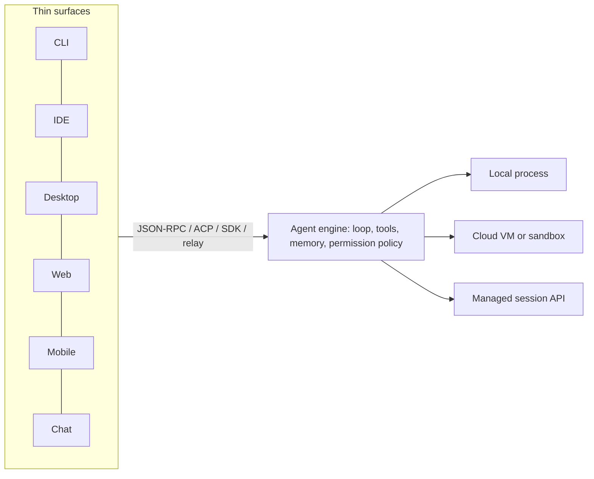

# Developer harnesses from the labs: Anthropic, OpenAI, Google, GitHub, Amazon, and the rest

*Research program: agent harnesses. Written 2026-09-08. Status: verified with notes.*

## What this document answers

- What each first-party developer harness (Claude Code and its family, Codex, Antigravity/Gemini CLI/Jules, Copilot, Kiro, Grok Build, Mistral Vibe, Meta's Muse Code) actually is in September 2026, mapped onto the seven anatomy parts.
- How each is extended (MCP, skills, hooks, plugins, marketplaces), priced, licensed, and where the vendor says it is going.
- Whether the labs are converging on "one runtime, many surfaces", tested against primary evidence rather than marketing.
- What all of this supports or contradicts in the program thesis.

A note on sourcing: this session's network proxy blocked most vendor blogs (openai.com, anthropic.com, claude.com, github.blog, aws.amazon.com, kiro.dev, x.ai, mistral.ai) and the press. Facts from those pages come from search-result excerpts and are labelled "via search excerpt". Facts marked "primary" were read directly from vendor documentation or repositories.

## TL;DR

- **Every lab now ships one agent engine behind many fronts.** Anthropic's docs say it outright: "Each surface connects to the same underlying Claude Code engine" (terminal, VS Code, JetBrains, desktop, web, mobile, Slack, Chrome, Remote Control, Telegram/Discord/iMessage channels) [1]. GitHub's Copilot SDK talks JSON-RPC to "the same engine behind Copilot CLI" [38]. Codex is one Rust core (`app-server`, `exec`, `sandboxing`, `code-mode` crates) under a CLI, IDE extensions, a desktop app and a cloud service [22][23]. Kiro's open-source "Crew" drives `kiro-cli` over the Agent Client Protocol [42]. Convergence on "one runtime, many surfaces" is real, and the runtime is CLI-shaped.
- **The CLI is no longer the front door, but it is the substrate.** In 2026 every lab added a desktop app (Codex app Feb 2026, Claude Desktop "Code" tab, Antigravity 2.0 desktop May 2026, GitHub Copilot app preview June 2026, Kiro IDE), cloud sessions, mobile monitoring, and chat entry points. The engine those surfaces drive is still the terminal agent.
- **The thickest new harness parts are infrastructure, not prompts.** Anthropic launched Managed Agents (April 8, 2026), a hosted "pre-built, configurable agent harness" billed at tokens plus $0.08 per session-hour [14][15][16]. OpenAI added sandbox agents to the Agents SDK (April 2026) [26][27]. Sandboxes, credential vaults, checkpointing, scheduling and webhooks are where the labs spent the year.
- **Permissions are becoming model-driven.** Claude Code's default mode on Pro/Max/Team is now "auto", where "a second model, the classifier, reviews actions instead of you", with hard-coded blocks for `curl | bash`, production deploys, force pushes and secret exfiltration [5]. This is the clearest case of a harness part being absorbed into a model.
- **Openness is receding at the labs.** Google is retiring Gemini CLI (Apache-2.0) for consumer tiers on June 18, 2026 in favour of a closed-source Go "Antigravity CLI" [31]. Amazon's open-source Q Developer CLI became "Kiro CLI, a closed-source product" [41]. Copilot CLI ships under a proprietary licence [37]. Codex CLI (Apache-2.0), Mistral Vibe (Apache-2.0), KiroCrew (Apache-2.0), Grok Build (Apache-2.0 since July 2026 [44]) and the Copilot SDK (MIT) are the exceptions.
- **Platform risk for third-party harnesses is now demonstrated, not hypothetical.** On April 4, 2026 Anthropic stopped Pro/Max subscriptions from being used through third-party harnesses such as OpenClaw, later reinstating access with conditions (via search excerpt) [21]; the Agent SDK docs state that third parties may not offer claude.ai login or rate limits and may not brand products as "Claude Code" [13].
- **Visual, non-technical agent builders from the labs have a poor record.** OpenAI's AgentKit "Agent Builder" (launched Oct 2025) was marked for wind-down on June 3, 2026: it and the Evals product are unavailable from November 30, 2026 (Evals read-only from October 31); ChatKit survives and users are pointed to the code-first Agents SDK or ChatGPT "Workspace Agents" (via search excerpts, including OpenAI's own developer-community deprecation notice) [28].
- **Newcomers copy the same shape.** xAI's Grok Build (May 2026), Mistral Vibe, and Meta's Muse Code (Aug 2026) all arrived as terminal agents in the Claude Code/Codex template rather than a new shape; Grok Build and Vibe document plan mode, subagents and MCP, while Muse Code's public material describes a sandboxed terminal agent with parallel "Workflows" and its MCP and plan-mode support is unverified [44][45][46].

## How to read a lab harness

Analogy first: a lab harness is like a database server with many clients. There is one process that knows how to plan, call tools and stop (the engine). `psql`, a GUI, an ORM and a web console are all thin clients that speak its protocol. When the vendor says "desktop app" or "Slack integration", ask which of the two they mean: a new client, or a new place the engine runs.

Precisely, the seven parts split across three layers in every lab product this year:

```
 Surface layer      CLI | IDE ext | desktop app | web | mobile | chat | browser ext | SDK
                       \      |         |         |      |       |        |         /
 Engine layer        agent loop + tools + context/memory + permission policy
                     (Claude Code engine, codex-rs app-server, Copilot CLI engine,
                      Antigravity CLI, kiro-cli, vibe)
                       /      |         |         |      |       |        |         \
 Runtime layer      local process | cloud VM/sandbox | managed API session | CI runner
```

The interesting design decisions live at the seams: how a session moves between runtimes (Anthropic's `--cloud`/`--teleport` [3]), how a chat message reaches a local engine (Anthropic's channels are MCP servers that push events [7]), and how permissions differ per runtime (cloud sessions have no `bypassPermissions` and no LSP plugins [3][10][12]).

## Anthropic

### Products and surfaces (Sep 2026)

Claude Code is at v2.1.265 (Sep 8, 2026) [2]. The overview page lists the terminal CLI, VS Code and Cursor extension, JetBrains plugin, desktop app (macOS, Windows x64/ARM64, Linux beta), web at claude.ai/code, the iOS/Android apps, Slack (`@Claude` spawns a cloud session), Chrome (via the Claude in Chrome extension), GitHub Actions and GitLab CI, GitHub Code Review, Remote Control (drive a local session from phone or browser), Dispatch (message a task from your phone; it lives in the Cowork tab), and Channels (Telegram, Discord, iMessage and webhooks pushed into a running session) [1][7][9][10]. The desktop app has three tabs: Chat, Cowork and Code [10].

Cowork, the non-developer sibling, launched as a research preview on January 12, 2026 and went GA on April 9, 2026 (secondary sources, via search excerpts) [20]; on July 7, 2026 it began rolling out in beta on web and mobile, Max plan first, with "sessions running in the cloud on every surface" so "scheduled tasks run with no device online" (Anthropic help center, via search excerpt) [19]. Claims that Cowork reuses the Claude Code runtime come from secondary write-ups, but Claude Code's own documentation now corroborates them directly: the skills reference states that "in Cowork and cloud sessions, Claude Code loads the skills enabled for your claude.ai account" and describes how Claude Code rewrites skill bodies "in a Cowork session on your desktop", and the desktop reference explains what Claude Code does with admin-console settings "in a Cowork session on this machine" (including a `requireCoworkFullVmSandbox` desktop setting) [10]; the older indirect evidence (same desktop app, Dispatch spawns Code sessions, Cowork available in the Chrome side panel) still stands [10][19].

Managed Agents launched in public beta on April 8, 2026 [16]. Anthropic's docs call it a "pre-built, configurable agent harness that runs in managed infrastructure" with four concepts: agent (model, prompt, tools, MCP servers, skills), environment (Anthropic cloud sandbox or self-hosted), session, and events [14]. The Agent SDK docs position it as "a separate product from the Agent SDK. Anthropic runs the agent and the sandbox." [13] Anthropic's launch post claims internal testing improved "outcome task success by up to 10 points over a standard prompting loop" (vendor claim, via search excerpt) [17], and its engineering write-up frames the architecture as "decoupling the brain from the hands", the loop separated from the sandbox that executes tools (title only; page unreachable) [18].

### Seven parts

| Part | Claude Code family, with sources |
|---|---|
| Loop | Plan mode, then act; `-p` headless with JSON output; steering and interrupts on every surface; Remote Control keeps subagent and workflow progress in sync across devices [1][9]. Agent SDK exposes the same loop in Python/TypeScript [13]. |
| Tools | Built-in file, shell, web search/fetch; MCP; LSP via plugins (not in cloud sessions); Chrome browser tools; desktop computer use (research preview, macOS/Windows, Pro/Max only, off by default, per-app access tiers) [1][10][11][12]. |
| Context and memory | `CLAUDE.md`; "auto memory" saved across sessions without the user writing anything; `/compact` and auto-compaction; subagents as context isolation; `/skill-doctor` shows unused skills and their context cost; Fable 5.1 default with 1M context [1][2][3]. Managed Agents added memory stores (Apr 23, 2026) and "dreams" for memory reorganisation (research preview, May 6, 2026) [16]. |
| Permissions and safety | Modes: `default` (manual), `acceptEdits`, `plan`, `auto`, `dontAsk`, `bypassPermissions`. Auto mode is the built-in starting mode on Pro/Max/Team; a classifier model reviews actions, blocks a fixed list by default (download-and-execute, prod deploys, IAM grants, force push, discarding uncommitted work, secret exfiltration), drops blanket `Bash(*)` allow rules, and falls back to prompting after 3 consecutive or 20 total blocks [5]. Bash sandbox: macOS Seatbelt; Linux bubblewrap plus a socat network proxy and optional seccomp; an "unsandboxed retry" escape hatch that goes through normal permissions [6]. Cloud sessions run in isolated VMs with git credentials held outside the sandbox by a proxy [3]. |
| Runtime | Local process; Anthropic-managed cloud VMs (research preview; no separate compute charge; VM reclaimed after inactivity, conversation restored on reopen); self-hosted environments; SSH and WSL sessions from desktop; Remote Control is outbound-HTTPS only [3][9][10]. Managed Agents: hosted sessions billed per running hour, self-hosted sandboxes (May 19, 2026), also on AWS [14][15][16]. |
| Surface | See above; `claude --cloud`, `--teleport`, `/desktop` handoffs; Desktop "Continue in" pushes a local session to the web with a generated summary [3][10]. |
| Orchestration | Subagents; agent teams (experimental, lead plus peers with a shared task list); background agents (agent view); dynamic workflows: Claude writes a JavaScript script using `agent()`, `pipeline()`, `parallel()`, run by a separate runtime with up to 16 concurrent and 1,000 agents per run, bundled `/deep-research`, "ultracode" effort level (research preview May 28, 2026) [4][16]. Routines run in the cloud on cron (minimum hourly), API trigger or GitHub events, autonomously "with no permission-mode picker and no approval prompts" [8]. Managed Agents: multi-agent orchestration and "Outcomes" (May 6, 2026), scheduled deployments (June 9, 2026), `ant apply` infrastructure-as-code (Sep 3, 2026) [16]. |

### Extensibility, pricing, openness, roadmap

Plugins bundle skills, agents, hooks, MCP servers, LSP servers, workflows and channels. The official marketplace is auto-added; a community marketplace (`anthropics/claude-plugins-community`) runs automated validation with plugins pinned to commit SHAs; organisations can add their own and restrict others [12]. Hooks now include `PreModelSwitch`/`PostModelSwitch` and `PermissionRequest` [2][4]. Skills follow the SKILL.md format and load into the SDK "same as Claude Code" [13].

Pricing: subscriptions (Pro, Max, Team, Enterprise) or API. Cloud sessions "share rate limits with all other Claude and Claude Code usage" with "no separate compute charge" [3]; routines have a daily run cap and can spill into metered "usage credits" [8]. API: Fable 5.1 at $10/$50 per MTok with 1M context, Opus 5 at $5/$25, Sonnet 5 at $2/$10; Managed Agents adds $0.08 per session-hour while `running` [15]. Consumer plan prices were not re-verified (claude.com blocked).

Openness: Claude Code itself is not open source; the Agent SDK packages are on GitHub under Anthropic's Commercial Terms, with branding rules ("Claude Code" is not permitted for third-party products) and a note that third parties may not offer claude.ai login or rate limits "unless previously approved" [13]. The sandbox runtime is published as `@anthropic-ai/sandbox-runtime` [6]. Channel plugins are open in `claude-plugins-official` [7].

Roadmap signals: Managed Agents shipping monthly (memory, dreams, self-hosted sandboxes, MCP tunnels, scheduled deployments, session budgets, `ant apply`) [16]; computer use left beta and browser use launched on the API on Aug 19, 2026 (on Google Cloud Aug 20) [16]; channels, routines, cloud sessions and workflows all still carry "research preview" labels [3][4][7][8].

Notable design choices: a second model as the permission system; workflows that move the orchestration plan out of the model's context and into a rerunnable script; chat surfaces implemented as MCP servers pushing into a local session rather than as separate bots [4][5][7].

## OpenAI

### Products and surfaces

Codex spans the open-source CLI, IDE extensions (VS Code, Cursor, Windsurf), the Codex desktop app, and Codex cloud at chatgpt.com/codex [22]. The desktop app launched for macOS on February 2, 2026 and Windows on March 4, 2026, "designed to effortlessly manage multiple agents at once, run work in parallel, and collaborate with agents over long-running tasks" (via search excerpt) [24]. On April 16, 2026 "Codex for (almost) everything" added background computer use ("use all of the apps on your computer by seeing, clicking, and typing with its own cursor"; macOS-only at launch), an in-app browser, image generation, a memory preview, 90+ plugins that "combine skills, app integrations, and MCP servers", and automations; Codex was included in ChatGPT Free and Go "for a limited time" (via search excerpt; unverified as part of the April 16 post, since the excerpts place the Free/Go promotion at the February and March app launches [24]) [25]. Slack, GitHub and Linear integrations and cloud features are tied to Business/Enterprise plans, with Plus including the web app, CLI, IDE, iOS and cloud code review (secondary pricing summaries) [30].

The Agents SDK (MIT, ~29k stars, provider-agnostic) got "native sandbox execution and a model-native harness" on April 15, 2026, Python first, with subagents and "code mode" announced as coming (via search excerpt; TechCrunch) [26]. The repository now documents "Sandbox Agents" that "perform work over long time horizons" with UnixLocal, Docker and hosted sandbox clients [27]. AgentKit (Oct 2025: Agent Builder, ChatKit, Connector Registry, Evals) is partially unwound: OpenAI announced on June 3, 2026 that Agent Builder and Evals are unavailable from November 30, 2026 (Evals read-only from October 31), with ChatKit continuing and users pointed to the Agents SDK or Workspace Agents in ChatGPT (OpenAI developer-community deprecation notice and several secondary reports, via search excerpts) [28]. OpenAI's February 2026 "Harness engineering" essay describes a five-month internal project of roughly one million lines shipped with no hand-written code (via search excerpt; InfoQ) [29].

### Seven parts

| Part | Codex, with sources |
|---|---|
| Loop | Interactive TUI, `codex exec` headless, cloud tasks, app threads with "thread automations that resume across days or weeks" (secondary) [22][25]. |
| Tools | Shell and file tools; MCP; skills; connectors and "app integrations" via plugins; computer use and in-app browser in the desktop app [22][25]. Crates `skills`, `connectors`, `codex-mcp`, `code-mode` exist in the Rust workspace [23]. |
| Context and memory | `AGENTS.md`; memory preview that "remember[s] useful context from previous experience, including personal preferences, corrections" (via search excerpt) [25]; crates `message-history`, `context-fragments`, `agent-graph-store` [23]. |
| Permissions and safety | Approval policy plus OS sandbox: on Linux bubblewrap is default with a read-only root, unshared user/PID (and network) namespaces, `PR_SET_NO_NEW_PRIVS` and a seccomp network filter, Landlock kept as a legacy fallback [23]; execution-policy rules decide which commands skip approval (docs stub points to developers.openai.com, unfetched) [22]. `codex-rs/protocol/src/protocol.rs` (Sep 2026) defines four sandbox policies, `read-only`, `workspace-write` (extra writable roots, network off by default), `external-sandbox` (already inside an outer sandbox, full disk access) and `danger-full-access`, and four approval policies, `untrusted` (approval unless an execpolicy rule allows the command), `on-request` (the default; "the model decides when to ask"; `on-failure` survives only as an alias), `granular` (per-category switches for sandbox escalation, execpolicy prompts, skill scripts, `request_permissions` and MCP elicitations) and `never`; macOS Seatbelt lives in `sandboxing/src/seatbelt.rs` and a `windows-sandbox-service` crate exists [23]. |
| Runtime | Local; Codex cloud containers; desktop app with background computer use; `app-server-daemon` crate suggests a long-lived local service [23][25]. Agents SDK sandboxes for developers' own deployments [27]. |
| Surface | CLI, IDE, desktop app, web, iOS, Slack, GitHub, Linear [22][30]. |
| Orchestration | Parallel agents and worktrees in the app (secondary), automations, `agent-roles` and `agent-identity` crates; Agents SDK handoffs and agents-as-tools, subagents "coming soon" [23][26][27]. |

### Extensibility, pricing, openness, roadmap

Extensibility: AGENTS.md, MCP, skills (SKILL.md), lifecycle hooks (an `allow_managed_hooks_only` setting is visible in config docs), plugins with 90+ in the app, execution-policy rules [22][25]. Pricing: the ChatGPT ladder (Free, Go $8, Plus $20, Pro $100/$200, Business $20 per user; one secondary source says $25) with token-based credits replacing per-message pricing on April 2, 2026 (secondary pricing pages and OpenAI's help-center rate card, via search excerpts) [30]. Openness: the CLI and core are Apache-2.0 and Rust, ~122k stars; the Agents SDK is MIT; the app, cloud and IDE clients are closed [22][27]. Roadmap: subagents and code mode in the SDK, TypeScript parity, and more of "almost everything" in the app [25][26].

Notable design choices: a single Rust core with an `app-server` JSON-RPC layer and separate `exec-server` and sandbox crates, so every client is thin [23]; the decision to kill a visual builder and keep the code-first SDK [28].

## Google

Gemini CLI (Apache-2.0, ~107k stars) is being folded into Antigravity. Google's May 19, 2026 announcement in the repo says free, AI Pro and AI Ultra access to Gemini CLI (and to the Gemini Code Assist IDE extensions and GitHub integration on those tiers) ends June 18, 2026, replaced by Antigravity CLI, "built in Go", which "is not open-source"; Skills, Hooks, Subagents and Extensions (renamed "Antigravity plugins") carry over; Code Assist Standard/Enterprise licences, Google Cloud projects and paid API keys keep Gemini CLI. The thread drew 299 downvotes to 6 upvotes [31]. Oddly, the repository README still advertises the free tier with no deprecation notice as of this fetch [32].

Antigravity 2.0, announced at I/O on May 19, 2026, comprises an updated standalone desktop app (the IDE surface; whether the original Antigravity IDE survives as a separate product is unverified), the new Go CLI, an SDK, a Managed Agents tier inside the Gemini API and an enterprise deployment path (TechCrunch, The Next Web and MarkTechPost, via search excerpts), with multi-agent orchestration, custom subagent workflows, scheduled background tasks and voice input in the desktop app; Google added a $100/month AI Ultra tier at 5x Pro limits and cut the top tier from $250 to $200 (TechCrunch, via search excerpt) [33]. Jules remains a separate asynchronous GitHub-repo agent; a "Jules V2" was reported at I/O 2026, and Google describes Jules and Antigravity as "experiments that examine the same technology from different angles" (secondary) [34]. Gemini Code Assist continues for enterprise licences [31].

Seven parts in brief: loop with plan/subagents; tools via MCP and plugins; context via GEMINI.md-style instruction files and hooks (2025 docs, not re-verified); permissions via approval prompts and a sandbox (2025 docs, not re-verified); runtime local plus Antigravity's background orchestration "without locking up your terminal session" (via search excerpt) [31]; surfaces IDE, desktop app, CLI, SDK, and Jules on the web and GitHub; orchestration through Antigravity's agent manager and scheduled tasks [33]. Pricing runs through Google AI Pro/Ultra subscriptions or Code Assist licences. Openness: Gemini CLI open, Antigravity closed. Roadmap: consolidation on the Antigravity platform.

## GitHub

GitHub's harness has four fronts. The Copilot coding agent (docs now call it the "cloud agent") takes issues and returns pull requests, with a model picker, self-review, built-in security scanning, custom agents and CLI handoff (via search excerpt) [35][36]. Custom agents are Markdown "agent profiles" with YAML frontmatter that specify prompts, tools and MCP servers; prompts are capped at 30,000 characters, and an agents page at github.com/copilot/agents acts as a control panel [36]. Copilot CLI reached general availability on February 25, 2026 (the CLI changelog links GitHub's GA changelog post of that date and bumped the version to 1.0 the following week; a trade-press report dated it to early March) [37][39]; its changelog is at v1.0.83 (Sep 4, 2026) and lists custom agents with ordered model lists and a "model-policy: required" enforcement, skills, hooks, MCP with the GitHub MCP server bundled, plugins, session restore after crashes, an experimental "Autopilot" mode, and `claude-fable-5.1` support [37]. The Copilot SDK (MIT, GA; Python, TypeScript, Go, .NET, Java, Rust) embeds "the same engine behind Copilot CLI" over JSON-RPC, bundling the CLI for Node, Python and .NET [38]. Agent HQ, announced at Universe in October 2025 and in public preview in February 2026, runs Claude, Codex and Copilot "from a single interface" inside GitHub, GitHub Mobile and VS Code for Pro+ and Enterprise (via search excerpt) [35]. A GitHub Copilot desktop app entered technical preview in June 2026, reported as a Build announcement (unverified: the conference tie-in rests on a single excerpt), as "a desktop workspace for managing AI agents" (Help Net Security, via search excerpt) [40].

Seven parts: loop in the cloud agent (issue to PR) and in the CLI (plan, execute, autopilot); tools via MCP with GitHub's server as default; context via `.github/agents` profiles, repository instructions and CLI sessions that "remember across sessions" (secondary) [35][37]; permissions in the cloud agent rely on GitHub's PR review and a firewalled Actions runner (2025 docs, not re-verified), and in the CLI on "preview before execution" approvals [37]; runtime is GitHub-hosted for the cloud agent and local for the CLI; surfaces are github.com, mobile, VS Code, CLI, the new desktop app and the SDK; orchestration through custom agents, sub-agent orchestration in the SDK, and Agent HQ's mission control [36][38]. Pricing rides Copilot seats and premium requests (not re-verified), and GitHub's `copilot-billing-preview` repository (March 2026) describes a transition to "the new usage-based billing model" [37]. Openness: CLI source is visible but under a proprietary "GitHub Copilot CLI License" that forbids modification and standalone redistribution [37]; the SDK is MIT [38]. Roadmap: Agent HQ as a multi-vendor control plane, CLI support for Agent HQ "coming soon" [35].

The distinctive choice: GitHub is the only lab betting on **one surface, many runtimes**, hosting Anthropic's and OpenAI's agents next to its own.

## Amazon

Amazon Q Developer is being retired: its IDE plugins and paid subscriptions reach end of support on April 30, 2027, with new sign-ups closed from May 15, 2026; Kiro is the successor (AWS blog and AWS docs, via search excerpts) [41]. The formerly open-source Q Developer CLI repository now states it "is no longer being actively maintained" and that the product "is now available as Kiro CLI, a closed-source product" [41]. Kiro's public tracker describes five surfaces: IDE, CLI (terminal and headless), Web ("multi-repository tasks in cloud sandboxes", cloud sessions in preview), Mobile (task monitoring and PR review), and Crew, "an open-source persistent workspace with scheduling" [42]. KiroCrew (Apache-2.0, Python, ~3.7k stars) "drives `kiro-cli` over the Agent Client Protocol", persists sessions, memory, schedules and checkpoints across restarts, turns corrections into "durable lessons", and is reachable from a desktop app, web dashboard, CLI, and Slack, Discord, Telegram, Teams, Webex, WeCom and WeChat [42].

Seven parts: loop is spec-driven (requirements, design, tasks, then implementation) [42][43]; tools via MCP and "Powers", bundles of MCP tools, steering files and hooks distributed through GitHub repositories to avoid "MCP context overload" [42]; context via steering files, specs and skills; permissions via hooks and trust prompts (kiro.dev unreachable, not verified); runtime local IDE/CLI, cloud sandboxes for Web, and Crew's persistent gateway; surfaces as listed; orchestration via custom agents, parallel agents and Crew scheduling [42]. Pricing per secondary sources: free tier with 50 credits, then $20, $40, $100 and $200 per user per month, with add-on credits at $0.04 [43]. Openness: IDE and CLI closed; Crew and Powers open. Roadmap: Q Developer sunset, cloud sessions out of preview.

Kiro is the first lab product to ship an OpenClaw-style always-on personal agent (Crew) as open source, on top of a closed CLI engine.

## Other labs

**xAI, Grok Build.** A terminal-native agent with a plan-first loop, up to eight parallel subagents in isolated git worktrees, MCP support, headless mode and editor embedding over the Agent Client Protocol, and a dedicated `grok-build-0.1` model at $0.20 per million input tokens (vendor figures via search excerpt; unverified); early access for SuperGrok Heavy (about $300/month) is reported from May 14, 2026 (unverified), and the early beta opened to SuperGrok and X Premium+ on May 25, 2026 [44]. Secondary write-ups repeat a "local-first, nothing transmits to xAI's servers" claim that cannot be literally true for a hosted model; treat as marketing. Grok Build was open-sourced in July 2026: `xai-org/grok-build` (Rust, Apache-2.0, repository created July 14, 2026, about 26.6k stars) holds the agent runtime, tools, TUI and extension system, synced from the company's monorepo; the company now styles itself "SpaceXAI" on the repository and on x.ai (primary) [44].

**Mistral, Vibe.** Mistral Vibe CLI is Apache-2.0 and Python, with plan mode (read-only exploration), subagents, MCP, pre/post tool hooks, skills following the Agent Skills specification, AGENTS.md, a programmatic `--prompt` mode with approval controls, and IDE integration through the Agent Client Protocol [45]. It runs on the open-weight Devstral 2 family (Devstral Small 2 is 24B, Apache-2.0) and is self-hostable; Mistral has since rebranded its assistant as "Mistral Vibe (formerly Le Chat)" and reports a Vibe 2.0 with remote agents that keep running after the terminal closes (via search excerpt; the announcement and rebrand dates are unverified, though the repository changelog dates CLI v2.0.0, which added subagents and replaced modes with agents, to January 27, 2026, and v2.25.0 of September 3, 2026 dropped Devstral Small from the default model list) [45].

**Meta, Muse Code.** CNBC reported on August 5, 2026 that Meta released a preview of Muse Code, "built around a coding harness" for its Muse Spark 1.2 model, pay-as-you-go at $1.25/$4.25 per million tokens (via search excerpt; several secondary write-ups corroborate the price, add a cheaper "Contributor" tier at $0.10/$0.20 whose traffic Meta uses to improve its models, and report Muse Spark 1.3 rolling out from September 2, 2026) [46]. Muse Code is a terminal agent (a `muse` binary for macOS and Linux with a Linux sandbox and a "Workflows" feature that fans a job out across parallel agents) and is not open source: the only public repository, `meta-models/muse-code-sdk` (MIT, TypeScript, "Developer Preview"), drives sessions over the "Muse Session Protocol" against a `muse` host binary "that is not part of this repository" (primary) [46]. Reports that Meta is also building an agent framework called "Harness", and that its internal DevMate platform produces about half of Meta's diffs on Claude, come from weak secondary sources and are unverified [47].

## Comparison table

| | Anthropic (Claude Code family) | OpenAI (Codex) | Google (Antigravity) | GitHub (Copilot) | Amazon (Kiro) | xAI / Mistral / Meta |
|---|---|---|---|---|---|---|
| Engine | Claude Code engine; Agent SDK; Managed Agents (hosted) | codex-rs core with app-server | Antigravity CLI (Go, closed); Gemini CLI (open, enterprise only) | Copilot CLI engine; Copilot SDK | kiro-cli (closed) | Grok Build; Vibe (open); Muse Code |
| Surfaces | CLI, VS Code, JetBrains, desktop, web, mobile, Slack, Chrome, Telegram/Discord/iMessage, Remote Control | CLI, IDE, desktop app, web, iOS, Slack, GitHub | IDE, desktop app, CLI, SDK, Jules (web/GitHub) | github.com, mobile, VS Code, CLI, desktop app (preview), SDK | IDE, CLI, web, mobile, Crew (chat apps) | CLI (all three); Vibe and Grok Build in editors via ACP |
| Cloud/background runtime | Cloud sessions, routines, Managed Agents, self-hosted envs | Codex cloud, automations, Agents SDK sandboxes | Antigravity background agents, Jules | Cloud agent on GitHub infra | Web cloud sandboxes (preview), Crew gateway | Vibe remote agents (reported) |
| Permissions | 6 modes; classifier-driven auto mode; OS sandbox; cloud VM isolation | Approval policy + execpolicy; bubblewrap/seccomp; Seatbelt | Prompts + sandbox (not re-verified) | PR review; CLI approvals; autopilot (experimental) | Hooks, trust prompts (not verified) | Approval prompts; Vibe plan mode |
| Orchestration | Subagents, agent teams, dynamic workflows (1,000 agents/run), routines, Managed Agents multiagent | Parallel agents, automations, SDK handoffs; subagents coming | Agent manager, subagent workflows, scheduling | Custom agents, SDK sub-agents, Agent HQ | Parallel agents, Crew scheduling | Grok Build 8 subagents; Vibe subagents |
| Extensibility | MCP, skills, hooks, plugins, official/community/team marketplaces | AGENTS.md, MCP, skills, hooks, 90+ plugins | Skills, hooks, subagents, plugins | MCP, custom agents, skills, hooks, plugins | MCP, Powers, hooks, steering, skills | MCP, skills, hooks (Vibe) |
| Pricing | Subscription + usage credits; API tokens; $0.08/session-hour managed | ChatGPT tiers + credits; API | AI Pro/Ultra tiers; Code Assist | Copilot seats + premium requests | Credits, $20 to $200 tiers (secondary) | SuperGrok tiers; Mistral API/self-host; Meta PAYG |
| Open source | No (SDK source under commercial terms) | CLI/core Apache-2.0; SDK MIT | Gemini CLI yes; Antigravity no | CLI proprietary; SDK MIT | IDE/CLI no; Crew, Powers yes | Vibe yes; Grok Build yes (Apache-2.0, Jul 2026); Muse Code no (MIT SDK only) |

## Test: are the labs converging on "one runtime, many surfaces"?

Verdict: yes on the runtime, with two important qualifications.

Evidence for. Anthropic's statement that every surface "connects to the same underlying Claude Code engine, so your repo's CLAUDE.md files, settings, and MCP servers work across all of them" is primary and explicit [1]; the Agent SDK is "the same tools, agent loop, and context management that power Claude Code" [13]; cloud environments are shared by web, terminal, Slack, routines, mobile and desktop [3]. OpenAI's workspace contains `app-server`, `app-server-protocol`, `app-server-client` and `app-server-daemon` crates next to `exec`, `sandboxing` and `code-mode`, which is the anatomy of one headless engine serving many clients [23]. GitHub's SDK is literally the CLI engine over JSON-RPC [38]. Amazon's Crew is a chat-and-scheduling shell over `kiro-cli` via ACP [42]. Google collapsed a separate CLI into the Antigravity platform [31][33]. The protocol pattern is the same everywhere: a daemon-like agent process plus thin clients, the way a language server serves many editors.



Qualification one: "one runtime" is not one runtime across execution locations. Feature sets differ by where the engine runs: no LSP plugins, no `/plugin`, no `bypassPermissions` and agent teams off by default in Anthropic's cloud sessions [3][10][12]; Chrome and routines unavailable through Bedrock/Vertex/Foundry logins [8][11]; Managed Agents is a separate product from the SDK with its own billing and no ZDR eligibility [13][14]. The engine is shared; the harness around it forks at the runtime seam.

Qualification two: GitHub is converging on the inverse, one surface for many runtimes (Agent HQ) [35], and Copilot CLI defaults to a Claude model [37]. Cross-vendor runtimes exist; cross-vendor engines do not. Nobody shares an engine with a rival, and the two most-used open engines (Codex, Gemini CLI) are respectively the exception and the retreating case.

## What this means for the thesis

**Supports.**
- The harness is where the labs' 2026 effort went: managed sandboxes, credential vaults, checkpointing, scheduling, webhooks, classifier-based permissions, memory stores and multi-agent runtimes, not new prompting tricks [4][5][14][16][27]. If the thesis says "the harness is the bottleneck", the labs' roadmaps agree.
- No lab treats the CLI as the default surface any more. Each added a desktop app, cloud sessions, mobile monitoring and chat entry points within twelve months, and Anthropic and OpenAI both shipped non-developer packaging (Cowork; "Codex for almost everything" with computer use) [10][19][25].
- Non-technical operation is still unsolved by the labs. AgentKit's visual Agent Builder lasted about eight months (secondary) [28]; Cowork's web/mobile rollout is beta [19]; Claude's computer use is a research preview limited to Pro/Max [10]. The gap the thesis points at is open.

**Contradicts.**
- The thesis conflates surface with runtime. The CLI-shaped engine is the substrate everywhere; the surfaces are thin. "Neither a CLI nor a desktop app can be the default" is true of surfaces and false of engines. A startup harness that ignores this ends up rebuilding an engine the labs give away (Codex, Vibe) or rent (Managed Agents at $0.08 per hour plus tokens) [15][22][45].
- The labs are reimagining the harness themselves, quickly, and closing it as they go: Antigravity CLI closed, Kiro CLI closed, Copilot CLI proprietary, Anthropic's subscription lockout for third-party harnesses and its "no claude.ai login for SDK products" rule [13][21][31][37][41]. Building on lab engines carries demonstrated platform risk; building around them means competing with the lab's own surfaces.
- "Better models need less harness" is visible inside the harnesses: auto mode replaces allow-lists with a model, dynamic workflows let the model write the orchestration, Managed Agents "dreams" let the model reorganise its own memory [4][5][16]. The parts that thickened are infrastructural (sandboxes, durability, identity), which are commodities the labs and clouds are best placed to own.

**Nuance.**
- What is genuinely unclaimed is the cross-vendor, cross-runtime layer: GitHub's Agent HQ is the only first-party attempt, and it is bound to GitHub's repository model [35]. Anthropic's channels, OpenAI's plugins and Kiro's Crew each solve "reach the engine from chat" for their own engine only [7][25][42].
- Every lab harness still assumes a repository and a developer's identity (routines act "as you", cloud agents push branches, Copilot needs a repo) [8][36]. The non-technical user has no equivalent of the repo as the unit of work; Cowork's files-and-connectors model is the first answer, and it is months old.

## Open questions and unverified claims

- Cowork's launch dates (Jan 12 preview, Apr 9 GA, Jul 7 web/mobile beta) are confirmed only by multiple independent secondary sources and search excerpts, since Anthropic's own pages were unreachable [19][20]; the reuse of the Claude Code runtime is now corroborated by Claude Code's skills and desktop documentation [10].
- The OpenClaw subscription ban of April 4, 2026 is corroborated by several outlets, but the terms of the later reinstatement ("with a catch") were not readable [21].
- Codex desktop dates (Feb 2, Mar 4), the April 16 feature list and the April 2 credit switch are each corroborated by several independent search excerpts (TechCrunch, 9to5Mac, SD Times, TechRepublic, OpenAI's help-center rate card); the pricing tiers still rest on third-party pricing pages, and the attribution of the Free/Go offer to the April 16 post is unverified [24][25][30].
- AgentKit's Agent Builder and Evals wind-down (announced June 3, 2026; unavailable from Nov 30, 2026) is corroborated by OpenAI's developer-community deprecation notice and at least four secondary sites [28].
- Antigravity 2.0 components and the $100/$200 Ultra pricing are corroborated by several independent press excerpts (TechCrunch, The Next Web, MarkTechPost, gHacks, The New Stack); Google's own posts were unreachable, and whether the Antigravity IDE remains a product distinct from the desktop app is unverified [33]. Gemini CLI's README still shows no deprecation notice despite the May 19 announcement [31][32].
- Copilot coding agent runtime (GitHub Actions) and Copilot pricing were not re-verified for 2026; Copilot CLI GA is dated February 25, 2026 by the CLI's own changelog [37][39], and the desktop app's Build tie-in is unverified [40].
- Kiro pricing tiers are corroborated by three independent secondary sources and the Q Developer end date (Apr 30, 2027) by AWS blog and AWS docs excerpts; kiro.dev, aws.amazon.com and docs.aws.amazon.com were unreachable [41][43].
- Grok Build is open source (Apache-2.0) and Muse Code is a closed terminal agent with an MIT SDK; Grok Build's May 14 early-access date, its `grok-build-0.1` pricing and the "local-first" claim remain unverified; Meta's "Harness" framework and DevMate figures are from weak sources [44][46][47].
- Mistral Vibe CLI v2.0.0 is dated January 27, 2026 by the repository changelog [45]; the "Vibe 2.0" remote-agents announcement and the Le Chat rebrand remain undated (unverified).

## Sources

1. Claude Code overview, https://code.claude.com/docs/en/overview, Sep 2026 (primary)
2. Claude Code changelog, https://code.claude.com/docs/en/changelog, Sep 2026 (primary)
3. Use Claude Code on the web, https://code.claude.com/docs/en/claude-code-on-the-web, Sep 2026 (primary)
4. Orchestrate subagents at scale with dynamic workflows, https://code.claude.com/docs/en/workflows, Sep 2026 (primary)
5. Choose a permission mode, https://code.claude.com/docs/en/permission-modes, Sep 2026 (primary)
6. Configure the sandboxed Bash tool, https://code.claude.com/docs/en/sandboxing, Sep 2026 (primary)
7. Push events into a running session with channels, https://code.claude.com/docs/en/channels, Sep 2026 (primary)
8. Automate work with routines, https://code.claude.com/docs/en/routines, Sep 2026 (primary)
9. Remote Control, https://code.claude.com/docs/en/remote-control, Sep 2026 (primary)
10. Desktop application, https://code.claude.com/docs/en/desktop, Sep 2026 (primary)
11. Use Claude Code with Chrome, https://code.claude.com/docs/en/chrome, Sep 2026 (primary)
12. Discover and install prebuilt plugins through marketplaces, https://code.claude.com/docs/en/discover-plugins, Sep 2026 (primary)
13. Agent SDK overview, https://code.claude.com/docs/en/agent-sdk/overview, Sep 2026 (primary)
14. Claude Managed Agents overview, https://platform.claude.com/docs/en/managed-agents/overview, Sep 2026 (primary)
15. Claude Platform pricing, https://platform.claude.com/docs/en/about-claude/pricing, Sep 2026 (primary)
16. Claude Platform release notes, https://platform.claude.com/docs/en/release-notes/overview, Sep 2026 (primary)
17. Claude Managed Agents: get to production 10x faster, https://claude.com/blog/claude-managed-agents, Apr 2026 (via search excerpt)
18. Scaling Managed Agents: Decoupling the brain from the hands, https://www.anthropic.com/engineering/managed-agents, 2026 (title only; unreachable)
19. Claude Cowork on web and mobile, https://claude.com/blog/cowork-web-mobile and https://support.claude.com/en/articles/15520349-use-claude-cowork-on-web-desktop-and-mobile, Jul 2026 (via search excerpt)
20. Claude Cowork guides (secondary), https://techsy.io/en/blog/claude-cowork-guide and https://pasqualepillitteri.it/en/news/755/anthropic-managed-agents-cowork-ga-april-9-2026, 2026
21. Anthropic cuts off Claude subscriptions for OpenClaw and third-party agents; later reinstatement, https://venturebeat.com/technology/anthropic-cuts-off-the-ability-to-use-claude-subscriptions-with-openclaw-and and https://venturebeat.com/technology/anthropic-reinstates-openclaw-and-third-party-agent-usage-on-claude-subscriptions-with-a-catch, Apr 2026 (via search excerpt)
22. openai/codex repository, https://github.com/openai/codex, Sep 2026 (primary)
23. codex-rs workspace and Linux sandbox README, https://github.com/openai/codex/tree/main/codex-rs and https://github.com/openai/codex/blob/main/codex-rs/linux-sandbox/README.md, Sep 2026 (primary); protocol definitions, https://github.com/openai/codex/blob/main/codex-rs/protocol/src/protocol.rs, Sep 2026 (primary)
24. Introducing the Codex app, https://openai.com/index/introducing-the-codex-app/, Feb 2026 (via search excerpt)
25. Codex for (almost) everything, https://openai.com/index/codex-for-almost-everything/, Apr 2026 (via search excerpt)
26. The next evolution of the Agents SDK, https://openai.com/index/the-next-evolution-of-the-agents-sdk/, Apr 2026 (via search excerpt); TechCrunch, https://techcrunch.com/2026/04/15/openai-updates-its-agents-sdk-to-help-enterprises-build-safer-more-capable-agents/, Apr 2026
27. openai/openai-agents-python repository, https://github.com/openai/openai-agents-python, Sep 2026 (primary)
28. Introducing AgentKit, https://openai.com/index/introducing-agentkit/, Oct 2025; deprecation reports, https://montanalabs.ai/news/openai-s-agentkit-and-the-eight-month-lifespan-of-agent-builder/ and https://mcp.directory/blog/openai-agentkit-deprecation-2026, Jun 2026 (secondary); Deprecation notice: Agent Builder, https://community.openai.com/t/deprecation-notice-agent-builder/1382650, Jun 2026 (OpenAI developer community, via search excerpt)
29. Harness engineering: leveraging Codex in an agent-first world, https://openai.com/index/harness-engineering/, Feb 2026; InfoQ summary, https://www.infoq.com/news/2026/02/openai-harness-engineering-codex/, Feb 2026 (via search excerpt)
30. Codex pricing summaries (secondary), https://www.morphllm.com/codex-pricing and https://www.cloudzero.com/blog/openai-codex-pricing/, 2026
31. Transitioning Gemini CLI to Antigravity CLI, https://github.com/google-gemini/gemini-cli/discussions/27274, May 2026 (primary)
32. google-gemini/gemini-cli repository README, https://github.com/google-gemini/gemini-cli, Sep 2026 (primary)
33. Google launches Antigravity 2.0 at I/O 2026, https://techcrunch.com/2026/05/19/google-launches-antigravity-2-0-with-an-updated-desktop-app-and-cli-tool-at-io-2026/, May 2026 (via search excerpt)
34. Jules and Antigravity comparisons (secondary), https://www.morphllm.com/comparisons/jules-google-coding-agent and https://codex.danielvaughan.com/2026/05/20/post-google-io-coding-agent-landscape-codex-antigravity-jules-claude-grok/, May 2026
35. Pick your agent: use Claude and Codex on Agent HQ, https://github.blog/news-insights/company-news/pick-your-agent-use-claude-and-codex-on-agent-hq/, Feb 2026 (via search excerpt)
36. GitHub Docs: custom agents and agent management, https://docs.github.com/en/copilot/concepts/agents/cloud-agent/about-custom-agents and https://docs.github.com/en/copilot/reference/custom-agents-configuration, 2026 (via search excerpt)
37. github/copilot-cli repository, licence and changelog, https://github.com/github/copilot-cli, https://github.com/github/copilot-cli/blob/main/LICENSE.md, https://raw.githubusercontent.com/github/copilot-cli/main/changelog.md, Sep 2026 (primary); github/copilot-billing-preview, https://github.com/github/copilot-billing-preview, Mar 2026 (primary, repository description)
38. github/copilot-sdk repository, https://github.com/github/copilot-sdk, Sep 2026 (primary)
39. GitHub Copilot CLI reaches general availability, https://visualstudiomagazine.com/articles/2026/03/02/github-copilot-cli-reaches-general-availability-bringing-agentic-coding-to-the-terminal.aspx, Mar 2026 (via search excerpt)
40. GitHub Copilot app launches as desktop home for AI coding agents, https://www.helpnetsecurity.com/2026/06/08/github-copilot-app-ai-coding-agents/, Jun 2026 (via search excerpt)
41. Amazon Q Developer end-of-support announcement, https://aws.amazon.com/blogs/devops/amazon-q-developer-end-of-support-announcement/, 2026 (via search excerpt); aws/amazon-q-developer-cli repository notice, https://github.com/aws/amazon-q-developer-cli, Sep 2026 (primary)
42. Kiro GitHub organisation, tracker and KiroCrew, https://github.com/kirodotdev, https://github.com/kirodotdev/Kiro, https://github.com/kirodotdev/KiroCrew, Sep 2026 (primary)
43. Kiro pricing 2026 (secondary), https://aitoolpick.org/blog/kiro-pricing-2026/, 2026
44. Introducing Grok Build, https://x.ai/news/grok-build-cli, May 2026 (via search excerpt); DevOps.com, https://devops.com/xai-enters-the-coding-agent-race-with-grok-build/, May 2026; Grok Build review, https://www.buildfastwithai.com/blogs/grok-build-xai-cli-ai-agents-2026, 2026; xai-org/grok-build repository, https://github.com/xai-org/grok-build, Sep 2026 (primary); Grok Build is Now Open Source, https://x.ai/news/grok-build-open-source, Jul 2026 (title only, via search excerpt)
45. mistralai/mistral-vibe repository, https://github.com/mistralai/mistral-vibe, Sep 2026 (primary); Devstral 2 and Mistral Vibe CLI, https://mistral.ai/news/devstral-2-vibe-cli/, and Mistral Vibe 2.0, https://mistral.ai/news/mistral-vibe-2-0/ (via search excerpt, undated)
46. Meta debuts Muse Code, https://www.cnbc.com/2026/08/05/meta-debuts-muse-code-to-take-on-anthropic-and-openai-.html, Aug 2026 (via search excerpt); DevOps.com, https://devops.com/meta-launches-ai-coding-agent-to-challenge-openai-and-anthropic/, Aug 2026; meta-models/muse-code-sdk repository and changelog, https://github.com/meta-models/muse-code-sdk, Sep 2026 (primary)
47. Meta DevMate and "Harness" reports (weak secondary), https://medium.com/@wasowski.jarek/meta-devmate-agent-marketplace-architecture-multi-model-ai-coding-platform-c796815d3431 and https://www.kucoin.com/blog/en-meta-to-launch-harness-agent-framework-continues-open-source-model-releases, 2026 (unverified)

## Verification notes (2026-09-08)

Method: verification pass on 2026-09-08 using WebFetch on the reachable primary domains (code.claude.com, platform.claude.com, github.com, raw.githubusercontent.com), the GitHub API through the session's GitHub connector, and a first sweep of 15 web searches. The session's search allowance was then exhausted, so a planned second sweep did not run (see "Not re-checked"). "Secondary" below means two or more independent search-result excerpts agreed; no press or vendor blog page could be opened.

### Claims checked

| # | Claim in the document | Verdict | Evidence and action |
|---|---|---|---|
| 1 | Cowork research preview Jan 12, 2026 | confirmed (secondary) | VentureBeat, Aragon Research, BuildFastWithAI and Clickforest excerpts agree; no change. |
| 2 | Cowork GA Apr 9, 2026 | confirmed (secondary) | TestingCatalog, Vellum, AI Coachella Valley (2026-04-10) and Pasquale Pillitteri excerpts agree; no change. |
| 3 | Cowork web and mobile in July 2026 | confirmed (secondary), sharpened | claude.com blog title plus Digital Applied, Layer3 Labs and AIToolsReview excerpts: Jul 7, 2026, beta, Max plan first. Text updated. |
| 4 | Cowork reuses the Claude Code runtime | confirmed (primary) | code.claude.com skills page: "In Cowork and cloud sessions, Claude Code loads the skills enabled for your claude.ai account", plus a section on how Claude Code rewrites skill bodies "in a Cowork session on your desktop"; desktop page: "in a Cowork session on this machine, Claude Code never fetches admin-console settings" and a `requireCoworkFullVmSandbox` setting. Text upgraded from "indirect" to direct corroboration. |
| 5 | AgentKit: Agent Builder and Evals wind-down announced Jun 3, 2026, unavailable after Nov 30, 2026, ChatKit continues | confirmed (secondary, incl. OpenAI community notice) | OpenAI developer-community "Deprecation notice: Agent Builder", DEV Community, TheRouter, LinkLoot, Montana Labs and MCP.Directory excerpts agree; Evals read-only from Oct 31, 2026. Wording tightened ("unavailable from Nov 30"); source added. |
| 6 | Codex app for macOS Feb 2, 2026 | confirmed (secondary) | TechCrunch and 9to5Mac (both 2026-02-02), VentureBeat; no change. |
| 7 | Codex app for Windows Mar 4, 2026 | confirmed (secondary) | SD Times, TechRepublic, ITBrief, WinBuzzer (2026-03-05) excerpts agree; no change. |
| 8 | Apr 16, 2026 "Codex for (almost) everything" feature list | confirmed (secondary) | BuildFastWithAI, SmartScope and Digital Applied excerpts list computer use, in-app browser, image generation, memory, 90+ plugins and automations; added that computer use was macOS-only at launch. |
| 9 | Codex in ChatGPT Free and Go "for a limited time" as part of the Apr 16 post | unverified | Excerpts document the Free/Go promotion at the Feb 2 and Mar 4 app launches (with rate-limit doubling through Apr 2); none ties it to the Apr 16 post. Marked inline. |
| 10 | Credits replaced per-message Codex pricing on Apr 2, 2026 | confirmed (secondary, incl. OpenAI help-center rate card) | OpenAI help-center "Codex rate card", UI Bakery, CloudZero, lilting.ch and Verdent excerpts agree; extended to existing Enterprise plans Apr 23. Sourcing note added. |
| 11 | ChatGPT Business at $20 per user | unverified | Secondary sources conflict ($20 at lilting.ch, $25 at Automation Atlas). Marked inline. |
| 12 | Antigravity 2.0 comprises "a desktop app, the IDE, the CLI, an SDK and a managed agents API" | corrected | TechCrunch, The Next Web and MarkTechPost excerpts: updated desktop app, Go CLI, SDK, Managed Agents tier inside the Gemini API, enterprise deployment path; the IDE is the desktop app's surface and a separate surviving IDE is unverified. Text updated. |
| 13 | $100/month AI Ultra tier at 5x Pro; top tier cut from $250 to $200 | confirmed (secondary) | Yahoo Tech, gHacks, The New Stack, Dataconomy and WinBuzzer excerpts agree; no change. |
| 14 | Gemini CLI ends for free, AI Pro and AI Ultra on Jun 18, 2026; Antigravity CLI in Go, closed; 299 downvotes to 6 upvotes | confirmed (primary) | Discussion #27274 (May 19, 2026) read directly; added that the cut-off also covers Gemini Code Assist IDE extensions and GitHub integration on those tiers. |
| 15 | Gemini CLI README still advertises the free tier with no deprecation notice | confirmed (primary) | README on main still says "Free tier: 60 requests/min and 1,000 requests/day"; no mention of Antigravity. |
| 16 | Amazon Q Developer subscriptions end Apr 30, 2027 | confirmed (secondary), sharpened | AWS DevOps blog and AWS docs titles/excerpts, AWS News Feed, Enterprise DNA: IDE plugins and paid subscriptions reach end of support Apr 30, 2027; new sign-ups closed from May 15, 2026. Text updated. |
| 17 | Q Developer CLI repository says it is unmaintained and superseded by closed-source Kiro CLI | confirmed (primary) | README notice read directly; the old repo itself stays MIT/Apache-2.0. |
| 18 | Kiro pricing: free 50 credits, $20/$40/$100/$200 tiers, $0.04 per extra credit | confirmed (secondary) | Morphllm, Stackpick and Usagebar excerpts agree (1,000/2,000/5,000/10,000 included credits); tier names vary by source. No change. |
| 19 | Grok Build open-source status "unverified" | corrected | `xai-org/grok-build`: Rust, Apache-2.0, repository created Jul 14, 2026 (GitHub API), about 26.6k stars, README "synced periodically from the SpaceXAI monorepo"; excerpts date the announcement to Jul 15, 2026. Text, table, TL;DR and source [44] updated; the company now brands itself "SpaceXAI". |
| 20 | Grok Build early beta for SuperGrok and X Premium+ on May 25, 2026; up to eight subagents | confirmed (secondary) | x.ai announcement title, Tooldirectory, Codersera and Blockchain.News excerpts agree. |
| 21 | Grok Build early beta for SuperGrok Heavy on May 14, 2026 at $299/month | unverified | One excerpt mentions Heavy-tier early access ("roughly $300 a month, with a $99 introductory price"); none gives May 14. Price reworded to "about $300/month"; date marked inline. |
| 22 | `grok-build-0.1` model at $0.20 per million input tokens | unverified | Not found in the repository (code search); x.ai unreachable; single vendor excerpt. Marked inline. |
| 23 | Muse Code reported Aug 5, 2026 at $1.25/$4.25 per million tokens | confirmed (secondary) | CNBC (2026-08-05) and Engadget headlines; gHacks (Muse Spark 1.1, Jul 10), AI Weekly, Layer3 Labs and AiCybr excerpts agree on the price. Added the "Contributor" tier ($0.10/$0.20, traffic used for training) and Muse Spark 1.3 (Sep 2, 2026). |
| 24 | Muse Code surface and licence "unverified" | corrected | `meta-models/muse-code-sdk` (MIT, TypeScript, "Developer Preview") drives sessions over the "Muse Session Protocol" against a `muse` host binary "that is not part of this repository"; its changelog describes macOS Keychain sign-in, a Linux sandbox and a "Workflows" feature. Terminal agent, closed core, open SDK. Text and table updated. |
| 25 | Codex sandbox modes and approval policies ("2025 docs, not re-verified") | corrected | `codex-rs/protocol/src/protocol.rs` on main: `SandboxPolicy` = `danger-full-access`, `read-only`, `external-sandbox`, `workspace-write`; `AskForApproval` = `untrusted`, `on-request` (default; `on-failure` alias), `granular`, `never`. Seatbelt confirmed at `codex-rs/sandboxing/src/seatbelt.rs`; `windows-sandbox-service` crate present. Permissions row rewritten; source [23] extended. |
| 26 | Managed Agents billed at tokens plus $0.08 per session-hour while `running` | confirmed (primary) | platform.claude.com pricing page; idle, rescheduling and terminated time is not billed. |
| 27 | Managed Agents public beta Apr 8, 2026; memory Apr 23; multiagent, Outcomes and dreams May 6; self-hosted sandboxes May 19; scheduled deployments Jun 9; `ant apply` Sep 3 | confirmed (primary) | Platform release notes read directly. (One secondary Cowork source says Apr 9; the release notes say Apr 8.) |
| 28 | Managed Agents "pre-built, configurable agent harness", four concepts, not ZDR-eligible | confirmed (primary) | Managed Agents overview read directly (also not eligible for HIPAA BAA coverage). |
| 29 | Computer use and browser use toolsets GA on the API Aug 20, 2026 | corrected | Release notes: computer use out of beta and browser use launched Aug 19, 2026; Aug 20 is Google Cloud availability and Python SDK v1.0. Date fixed. |
| 30 | Claude Code at v2.1.263 (Sep 6, 2026) | corrected | Changelog now lists 2.1.265 (Sep 8, 2026); 2.1.263 was Sep 6. Updated. |
| 31 | Auto mode: default on Pro/Max/Team, classifier, default block list, `Bash(*)` dropped, 3 consecutive or 20 total blocks | confirmed (primary) | Permission-modes page read directly; the drop list also covers `PowerShell(*)`, wildcarded interpreters, `Agent` and `Monitor` allow rules. |
| 32 | API pricing: Fable 5.1 $10/$50 with 1M context, Opus 5 $5/$25, Sonnet 5 $2/$10 | confirmed (primary) | Pricing page; Sonnet 5's introductory price became standard on Aug 10, 2026. |
| 33 | Copilot CLI GA "in March 2026" | corrected | The CLI changelog (v0.0.419, Feb 27, 2026) says "Copilot CLI is now generally available", linking GitHub's changelog post dated 2026-02-25; the 1.0.0 bump followed in early March "to commemorate ... general availability last week". Date fixed. |
| 34 | Copilot CLI changelog at v1.0.83 (Sep 4, 2026) with ordered model lists, `model-policy: required`, autopilot, `claude-fable-5.1` | confirmed (primary) | Changelog read directly. |
| 35 | GitHub Copilot desktop app in technical preview "at Build in June 2026" | unverified | Only the Help Net Security excerpt (2026-06-08); Microsoft's Build pages are blocked. Marked inline. |
| 36 | Star counts (Codex ~122k, Gemini CLI ~107k, Agents SDK ~29k, KiroCrew ~3.7k) | confirmed (primary) | GitHub API on Sep 8, 2026: 122,544; 106,872; 29,276; 3,756. Licences as stated. |
| 37 | Codex crate names (`app-server*`, `exec`, `sandboxing`, `code-mode`, `skills`, `connectors`, `codex-mcp`, `message-history`, `context-fragments`, `agent-graph-store`, `agent-roles`, `agent-identity`) | confirmed (primary) | `codex-rs/Cargo.toml` workspace on main. |
| 38 | Mistral Vibe 2.0 and Le Chat rebrand "undated" | corrected in part | Repository CHANGELOG dates CLI v2.0.0 to Jan 27, 2026 (subagents; agents replace modes); the "Vibe 2.0" remote-agents announcement and the rebrand remain unverified. Also noted: v2.25.0 (Sep 3, 2026) removed Devstral Small from the default model list. |
| 39 | OpenClaw subscription cut-off of Apr 4, 2026 and later reinstatement | unverified (not re-checked) | Search allowance ran out before this could be re-checked; text unchanged and still labelled as an excerpt. |

Tally: 39 claims checked; 25 confirmed, 8 corrected, 6 unverified.

### Corrections made

1. Grok Build is open source: `xai-org/grok-build`, Rust, Apache-2.0, repository created Jul 14, 2026 (TL;DR, Other labs, comparison table, open questions, source [44]); the company brands itself "SpaceXAI".
2. Codex permissions row now reflects the current `protocol.rs` sandbox policies (`read-only`, `workspace-write`, `external-sandbox`, `danger-full-access`) and approval policies (`untrusted`, `on-request`, `granular`, `never`), with Seatbelt and a Windows sandbox service confirmed.
3. Copilot CLI GA moved from "March 2026" to Feb 25, 2026 (GitHub section, open questions).
4. Muse Code is a closed terminal agent (`muse` binary, macOS/Linux) with an MIT SDK; Contributor tier and Muse Spark 1.3 added (Other labs, table, open questions, source [46]).
5. Antigravity 2.0 component list corrected to desktop app, Go CLI, SDK, Managed Agents tier in the Gemini API and an enterprise path; the IDE is no longer listed as a separate component.
6. Computer use and browser use API dates moved from Aug 20 to Aug 19, 2026.
7. Claude Code version updated to v2.1.265 (Sep 8, 2026).
8. Mistral Vibe CLI v2.0.0 dated Jan 27, 2026; Devstral Small dropped from defaults in v2.25.0.
9. Cowork: web/mobile rollout dated Jul 7, 2026 (beta, Max first); runtime reuse now backed by Claude Code's own docs.
10. AgentKit wording: Agent Builder and Evals unavailable from Nov 30, 2026 (Evals read-only from Oct 31); OpenAI community notice added to source [28].
11. Amazon Q Developer: end of support scoped to IDE plugins and paid subscriptions, with sign-ups closed from May 15, 2026.
12. Smaller notes: computer use macOS-only at the Apr 16 Codex launch; Gemini CLI cut-off also covers Code Assist IDE extensions on consumer tiers; GitHub's usage-based billing transition noted from its `copilot-billing-preview` repository; ChatGPT Business seat price, the Free/Go attribution, Grok Build's May 14 date and model pricing, and the Copilot app's Build tie-in marked "(unverified)".

### Sources that could not be opened

- Blocked by the proxy when attempted on this pass: antigravity.google, en.wikipedia.org, news.microsoft.com, build.microsoft.com, docs.aws.amazon.com, meta-models.github.io; api.github.com returned nothing (star counts came from the GitHub connector instead).
- Not attempted because the proxy blocks them: openai.com, developers.openai.com, community.openai.com, help.openai.com, anthropic.com, claude.com, support.claude.com, github.blog, docs.github.com, aws.amazon.com, kiro.dev, x.ai, mistral.ai, and the press sites (TechCrunch, VentureBeat, CNBC, Engadget, gHacks, The New Stack). Facts from those sites rest on search-result excerpts, as labelled in the text.
- Search budget: 15 queries ran (Cowork x3, AgentKit, Codex app x2, Codex Apr 16, Codex credits, Antigravity 2.0, AI Ultra pricing, Q Developer, Kiro pricing, Grok Build, Muse Code, plus the Gemini CLI discussion by fetch). The allowance was then exhausted, so planned queries on the Cowork engine statement, OpenClaw, the Copilot desktop app and Build dates, Copilot CLI GA, Mistral Vibe 2.0 dates, the ChatGPT Business price, the Codex Free/Go offer, Agent HQ, Meta's "Harness" and DevMate, Jules V2 and the Agents SDK announcement did not run; reachable primary pages (code.claude.com, GitHub repositories and changelogs) filled in where they could.

### Not re-checked

Agent HQ dates and plan availability [35]; Copilot cloud-agent runtime and pricing [36]; the Agents SDK announcement of Apr 15, 2026 beyond the dated TechCrunch URL [26]; Jules V2 [34]; Meta's "Harness" framework and DevMate figures [47]; the OpenClaw reinstatement terms [21]; Kiro Crew and Powers details (read by the author as primary) [42]; Antigravity CLI plan requirements [31][33].

### Remaining doubts

- Cowork's dates are consistent across many secondary sources but no Anthropic page could be opened; Anthropic's release notes do confirm Managed Agents on Apr 8, not Apr 9 as one Cowork source says.
- Whether Google still ships the Antigravity IDE as a product separate from the 2.0 desktop app.
- Grok Build's early-access date and model pricing, and what the "SpaceXAI" branding implies for xAI's corporate status, which this document does not cover.
- Muse Code is described as a "preview" here and as a "beta" by other write-ups; the Contributor tier's data terms and the Spark 1.3 rollout post-date most excerpts.
- Codex's ChatGPT Business seat price ($20 or $25) and whether the Apr 16 post renewed the Free/Go offer.
- GitHub Copilot pricing is moving to usage-based billing, which the comparison table's "seats + premium requests" cell understates.
- Kiro's tier names (Pro, Pro+, Pro Max, Power) differ between secondary sources; only the prices and credit counts agree.
- Mistral Vibe's default model list no longer includes Devstral Small, so "runs on the open-weight Devstral 2 family" may be stale for the hosted default; self-hosting remains possible.
