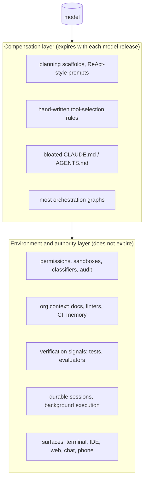

# What harness builders say: practitioner engineering writing, 2024–2026

*Research program: agent harnesses. Written 2026-09-08. Status: draft, pending verification.*

Sourcing note: the research proxy blocked anthropic.com, openai.com, cognition.ai, cursor.com, manus.im, simonwillison.net, latent.space and arxiv.org. Posts on those domains are cited by original URL but were read through search snippets and secondary summaries; quotes from them are marked "(via secondary)". Pages on code.claude.com, platform.claude.com and github.com were read directly.

## What this document answers

- What do the people who build harnesses (Anthropic, OpenAI, Cognition, Cursor, Manus, LangChain, and independent engineers such as Thorsten Ball, Simon Willison and Mitchell Hashimoto) say a harness is, and which design principles do they share?
- Where do they disagree, and has the disagreement moved between 2025 and 2026?
- Does the practitioner record support "harnesses thin out as models improve" (the Bitter Lesson applied to harnesses) or "the harness is the moat"?
- What does all of this imply for the thesis that the default harness must be reimagined for developers and for non-technical people?

## TL;DR

- The loop itself is agreed to be trivial. Thorsten Ball shipped a working code-editing agent in 315 lines in April 2025: "It's an LLM, a loop, and enough tokens" [33][34]. Nobody in the record disputes this.
- Everything else is contested, and the vocabulary shifted from "context engineering" (2025) to "harness engineering" (Feb–Mar 2026, coined by Mitchell Hashimoto and adopted days later by OpenAI) [37][38][21].
- Shared principles: keep the loop simple and start with one agent; treat the context window as the scarce resource; give the agent a real computer (filesystem, shell) rather than bespoke tools; close the loop with a verification signal the agent can read; use deterministic guardrails (hooks, linters, sandboxes) instead of prose instructions; keep a single writer when several agents act [1][22][15][28][29].
- Biggest reversal: Cognition said "don't build multi-agents" (June 2025) and then published "what's actually working" (April 2026): single-threaded writes, extra agents contribute "intelligence rather than actions", swarms are "mostly a distraction" [28][29][30].
- Evidence that the harness matters measurably: LangChain moved 52.8% to 66.5% on Terminal-Bench 2.0 with the same model [50]; Anthropic's own 2026 trends report says harness setup alone swings benchmarks by 5+ points [56]; Anthropic's April 2026 Claude Code postmortem traced a quality regression to harness-side changes, not the model [10].
- Evidence that harnesses thin out: Anthropic now writes that every harness component "assumes the model can't do something; those assumptions expire" and tells builders to "re-simplify on model upgrades" [8][9][11]; a Sept 2026 Stanford/Berkeley-affiliated paper argues the model is "eating the stack" [45].
- Both are true at once, because "the harness" is two layers: a compensation layer (planning scaffolds, prompt tricks, tool-selection crutches) that expires with each model release, and an environment/authority layer (permissions, sandboxes, memory, org context, verification signals, surfaces) that does not. The labs are productizing the second layer themselves: Claude Agent SDK (Sept 2025), Managed Agents (April 2026), Codex app-server "open agent harness" (Aug 2026) [5][12][23].

## 1. Vocabulary for a newcomer

Analogy: a language model is a brilliant contractor with no hands, no memory past the current conversation, and no keys to the building. The harness is the hands, the notebook, and the key ring. The loop is the daily stand-up: the contractor says what to do next, someone does it and reports back, and the contractor decides again.

Precisely: Simon Willison's definition, now the common one, is that an agent "runs tools in a loop to achieve a goal" (Sept 2025) [35]. Anthropic's docs describe Claude Code as "the agentic harness around Claude: it provides the tools, context management, and execution environment that turn a language model into a capable coding agent" [14]. A June 2026 arXiv paper names the necessary parts as "agent loop, tool interface, context management, and control mechanisms" [48], which maps onto this program's seven-part definition with runtime and surface folded into "control".

```
            ┌──────────────────────── harness ────────────────────────┐
 user ─────▶│ context assembly ─▶ model call ─▶ tool call ─▶ result ──┐│
            │        ▲   (system prompt, memory,   (permissions,      ││
            │        │    files, compaction)        sandbox, hooks)   ││
            │        └────────────────────────────────────────────────┘│
            │  stop when: no tool call / goal check passes / human says │
            └─────────────────────────────────────────────────────────────┘
```

The loop in pseudocode, essentially what Ball published and what the Claude Agent SDK and Codex SDK wrap:

```python
messages = [system_prompt, user_task]
while True:
    reply = model(messages, tools=TOOLS)          # model decides
    if not reply.tool_calls: return reply.text    # stopping rule
    for call in reply.tool_calls:
        if not permitted(call): call = ask_human(call)   # permissions
        messages.append(run(call))                # results feed back
    messages = compact_if_needed(messages)        # context management
```

Two terms recur. "Context engineering" (Manus, Anthropic, Cognition, mid-2025) is deciding what goes into the window each turn. "Harness engineering" (Hashimoto, OpenAI, early 2026) is the wider practice: "improving agent output by shaping the environment around it, [which] holds a chosen model and coding agent constant as a black box" [54].

## 2. The record: who said what, when

| Date | Source | One-line claim |
|---|---|---|
| Dec 2024 | Anthropic, Building effective agents [1] | Successful teams "weren't using complex frameworks... building with simple, composable patterns"; workflows (predefined code paths) vs agents (model directs its own process) |
| Apr 2025 | Thorsten Ball, How to build an agent [33] | Full code-editing agent in 315 lines; "There is no moat" [34] |
| Apr 2025 | OpenAI, A practical guide to building agents [22] | Start with a single agent; manager vs decentralized hand-off patterns; layered guardrails |
| Apr 2025 | Anthropic, Claude Code best practices (now docs) [15] | CLAUDE.md, explore-plan-code-commit, give Claude a way to verify |
| Jun 2025 | Anthropic, multi-agent research system [2] | Orchestrator-workers beat single Opus 4 by 90.2% on internal research eval; ~15x tokens; token use explains 80% of variance |
| Jun 2025 | Cognition, Don't build multi-agents [28] | Share full context; "actions carry implicit decisions"; parallel writers produce fragile output |
| Jul 2025 | Manus, Context engineering lessons [32] | KV-cache hit rate is "the single most important metric"; be the boat, not the pillar |
| Sep 2025 | Anthropic, Writing effective tools for agents [3] | Consolidate tools, namespace them, prefer search over list, evaluate tools with the model |
| Sep 2025 | Anthropic, Effective context engineering [4] | Find "the smallest set of high-signal tokens"; compaction, tool-result clearing, memory |
| Sep 2025 | Anthropic, Claude Agent SDK post [5] | Loop is "gather context, take action, verify work, repeat"; Claude Code SDK renamed Agent SDK |
| Oct 2025 | Anthropic, Agent Skills [6][19] | Progressive disclosure: ~100 tokens per skill until triggered; open spec Dec 2025 |
| Nov 2025 | Anthropic, Effective harnesses for long-running agents [7] | Initializer agent + coding agent; feature list, progress file, git as memory across context resets |
| Feb 2026 | Mitchell Hashimoto (via [37][38]) | "Harness engineering": every agent mistake becomes a permanent environmental fix |
| Feb–Mar 2026 | OpenAI, Harness engineering [21][27] | ~1M lines, zero written by hand, 5 months, ~1,500 PRs, 3 engineers growing to 7 |
| Mar 2026 | Anthropic, Harness design for long-running app development [8] | Planner / generator / evaluator; harness components encode expiring assumptions |
| Apr 2026 | Anthropic, Managed Agents [12] | Hosted "pre-built, configurable agent harness"; sessions, environments, events |
| Apr 2026 | Cognition, Multi-agents: what's actually working [29] | Single-threaded writes; three patterns; swarms are a distraction |
| Apr 2026 | Anthropic, April 23 postmortem [10] | Quality regression from reasoning-effort downgrade, caching bug, verbosity prompt (via [53]) |
| Aug 2026 | OpenAI, Codex as a platform [23] | Three tiers: `codex exec`, SDK, app-server (JSON-RPC threads, turns, events, approvals) |
| Sep 2026 | Patel, Zaharia et al., "Model eats the stack" [45] | Compensating layers get absorbed; what persists is "persistent semantic context" |

## 3. Principles practitioners agree on

Mapped to the seven harness parts.

**Loop: start simple, add structure only when measured.** Anthropic (Dec 2024): "the most successful implementations weren't using complex frameworks or specialized libraries. Instead, they were building with simple, composable patterns" (via secondary) [1]. OpenAI's April 2025 guide: begin with a single agent, add a manager or hand-offs only when one agent's tool list becomes unmanageable [22]. Ball's 315-line agent is the existence proof [33]. Boris Cherny, who leads Claude Code, called it "the thinnest possible wrapper over the model": "all the secret sauce, it's all in the model" (2025, via secondary) [57].

**Context and memory: the window is the scarce resource.** Anthropic's best-practices doc opens with it: "Most best practices are based on one constraint: Claude's context window fills up fast, and performance degrades as it fills" [15]. The Sept 2025 post gives the rule: find "the smallest set of high-signal tokens that maximize the likelihood of your desired outcome" (via secondary) [4]. Manus adds the economics: cached input tokens cost about a tenth of uncached ones, so stable prefixes and append-only context are cost controls, not style; they call the tuning process "Stochastic Graduate Descent" (July 2025, via secondary) [32]. Cognition's June 2025 rule is the same idea from the multi-agent side: "share context" in full, because "actions carry implicit decisions" a summary loses [28]. Skills institutionalize it: about 100 tokens per skill at startup, under 5k when triggered, bundled files nothing until read [19].

**Tools: give the agent a computer, then design the remaining tools like a product.** The Agent SDK post argues an agent "needs to be able to fetch and update its own context", which in practice means a filesystem and bash (Sept 2025) [5]. The tools post: consolidate related operations, namespace by domain, prefer `search_x` over `list_x`, and eval the tools with the model (Sept 2025) [3]. Claude Code's docs now recommend plain CLIs (`gh`, `aws`, `gcloud`) as "the most context-efficient way to interact with external services" [15]. LangChain's Terminal-Bench gains came partly from "enhanced tools and context injection" [50].

**Verification closes the loop.** The strongest cross-vendor agreement of 2026. Claude Code docs: "Give Claude a check it can run: tests, a build, a screenshot to compare. It's the difference between a session you watch and one you walk away from" [15]. Anthropic's long-running work makes it structural: a "Default-FAIL contract" where "every criterion starts `false`; the agent can't mark it passing without opening evidence first", and a "fresh-context evaluator" with no write tools that "grades the work from a context window that never saw the build" [11]. OpenAI replaced a weekly human "garbage collection" pass with background agents that scan for drift and open refactoring PRs (via secondary) [27]. LangChain's biggest lever was "system prompts emphasizing self-verification loops" plus middleware to detect "doom loops" [50]. Cognition's Code-Review-Loop is the same shape [29].

**Permissions and safety: deterministic beats advisory.** Hashimoto's founding observation: "Anytime you find an agent makes a mistake, you take the time to engineer a solution such that the agent never makes that mistake again" (Feb 2026, via secondary) [38]. OpenAI's post describes the practice at scale: custom linters and a structured `docs/` tree, after a large AGENTS.md "made things worse" and was cut to about 100 lines (via secondary) [27]. Anthropic draws the line explicitly: "Unlike CLAUDE.md instructions which are advisory, hooks are deterministic and guarantee the action happens" [15]. The newest move puts a second model in the permission path: Claude Code's auto mode has "a separate classifier model [that] reviews actions before they run, blocking anything that escalates beyond your request, targets unrecognized infrastructure, or appears driven by hostile content Claude read", and is now the default starting mode on paid plans [16].

**Runtime: durable state lives outside the context window.** Anthropic's Nov 2025 pattern: an initializer agent writes a feature list and progress file, then coding agents do one feature per session and commit to git so "the next session picks up cleanly" [7][11]. Managed Agents productizes this as an append-only event log per session plus a persistent sandbox [12]. OpenAI's app-server exposes "persistent threads, streamed events, and human-in-the-loop approvals" over JSON-RPC (Aug 2026, via secondary) [23].

**Orchestration: single writer.** Cognition (June 2025): parallel writers split the implicit judgments and "the deliverables become fragile" [28]. Anthropic's research post agrees from the other side: parallel subagents pay off for read-heavy, decomposable research, while many coding tasks are less parallelizable and agents coordinate poorly in real time (June 2025, paraphrase) [2]. By April 2026 Cognition's rule is explicit: "writes stay single-threaded and the additional agents contribute intelligence rather than actions" [29].

## 4. Where they disagree

| Question | Position A | Position B | State in Sept 2026 |
|---|---|---|---|
| Multi-agent | Anthropic: orchestrator-workers, 90.2% gain, 15x tokens [2] | Cognition: don't; context fragmentation [28] | Converged on map-reduce with a single writer and adversarial reviewers [29]; Anthropic ships "dynamic workflows" that move "the plan into code" so intermediate results never touch the main context [17] |
| Thin vs thick harness | Cherny: thinnest possible wrapper; ~80% of Claude Code written by Claude [57] | OpenAI: months of environment engineering (docs, linters, observability, background GC) [21][27] | Both hold. The thin part is the loop; the thick part is the environment. See section 5 |
| Frameworks | Anthropic Dec 2024: avoid frameworks, own the loop [1] | LangChain: harness as a layered product (`create_agent`, Deep Agents, middleware) [52][50] | Anthropic now sells its harness too (Agent SDK, Managed Agents) [13][12]; the argument has become "whose harness", not "whether" |
| Model-agnostic harness | Manus: be the boat riding the model tide, never train [32] | Cursor: rewired its long-running-agent harness around GPT-5.1/5.2 for instruction following, then shipped its own model, Composer 2 (Mar 2026) (via secondary) [40][39] | Academic support for coupling: "harness design and post-training cannot be treated as separable design choices" [46]; Co-Harness paper co-evolves harness and weights [47] |
| Who is in the loop | Human steers turn by turn (Claude Code interactive; Codex approvals) | Fowler/OpenAI: "humans on the loop" designing the environment, not inspecting outputs (via [53]) [55] | Cherny, 2026 (via secondary): "I don't prompt Claude anymore. I have loops running that prompt Claude... My job is to write loops" [43] |

**Multi-agent moved the most.** Walden Yan (April 2026): "A year ago, I'd tell people to not build multi-agents and to focus on context engineering fundamentals. Today, many sexy ideas are still impractical, but we've found some setups that actually work" [30]. The working shapes are Code-Review-Loop, "Smart Friend" (a second model consulted for judgment, not action) and "map-reduce-and-manage" [29]. Anthropic's dynamic workflows render the same shape as a JavaScript script with `agent()`, `parallel()` and `pipeline()` primitives, capped at 1,000 agents per run [17]. Anthropic's 90.2% figure was an internal eval with the caveat that token spend explained 80% of the variance; independent replications are commentary, not measurement [2].

**Thin vs thick is the disagreement that matters for the thesis.** Cherny's "thinnest possible wrapper" (2025) and OpenAI's five-month environment build (2026) describe different layers. Cherny means the loop and prompt. OpenAI means the repo, docs, linters, observability and merge process around the loop; the post's point is that its engineers stopped writing code and started writing the environment [21].

## 5. The Bitter Lesson debate: does the harness thin out, or is it the moat?

The Bitter Lesson (Sutton, 2019) says general methods that scale with compute beat hand-encoded human structure. Applied to harnesses: every planning scaffold, prompt trick and tool-selection crutch is human structure, so it should lose to the next model.

**Evidence for thinning.**

- Anthropic's March and April 2026 posts say it directly. The awesome-harness-engineering list summarizes the March post's key insight as "Every harness component assumes the model can't do something; those assumptions expire" [53][8]. The April post's three patterns are "build on known tools, remove assumptions as capabilities improve, set boundaries carefully" [9]. The companion repo instructs: "Re-simplify on model upgrades: After each model release, comment out harness pieces one at a time and see what's still load-bearing", because "newer models drift less and self-scope better" [11].
- Cherny is reported to have cut more than 80% of Claude Code's system prompt for a new model generation with no measurable loss on coding evals (2026, via secondary; not verified against a primary transcript) [57][44].
- Latent Space's March 2026 piece quotes Noam Brown on how reasoning models removed the "complex engineering scaffolding" earlier agent systems needed (via secondary) [37].
- Patel, Jha, Arabzadeh, Guestrin, Stoica and Zaharia (Sept 2026): "as models continue to improve, many system layers designed to compensate for model limitations will increasingly be absorbed by the model itself"; what remains worth building is "persistent semantic context" about the environment [45].
- Philipp Schmid's 2026 essay: "To survive the Bitter Lesson, our infrastructure (Harness) must be lightweight" (via secondary; date unverified) [41]. Hanchung Lee's May 2026 "hidden technical debt" essay argues a 2026 harness is "a 2026 artifact" and should be built so structure "can come out as easily as it went in" (via secondary; attribution of the quote not fully verified) [42].

**Evidence for the moat.**

- Harness swaps move scores by more than model swaps do, at least in the short run. LangChain: 52.8% to 66.5% on Terminal-Bench 2.0 with gpt-5.2-codex held constant, moving from roughly 30th to top five [50]. Anthropic's 2026 trends report: "harness setup alone can swing benchmarks by 5+ percentage points" (via [53]) [56]. A widely repeated "22 points from the harness, 1 point from the model" SWE-bench figure circulates without a locatable primary source; treat it as unverified [58].
- Harness changes can also break things silently. Anthropic's April 2026 postmortem attributed Claude Code quality complaints to "default reasoning-effort downgrade, a caching-optimization bug, and an overly aggressive verbosity-limiting system prompt" (via [53]) [10]. The model had not changed.
- Vendor claims of model substitution through harness work: LangChain says harness-only tuning brought Nemotron 3 Ultra "within one point of Opus 4.8 at roughly one-tenth the cost" (July 2026; vendor claim, single benchmark) [51].
- The labs are behaving as if the harness is valuable. Anthropic's Managed Agents sells "a pre-built, configurable agent harness that runs in managed infrastructure" at token prices plus a reported $0.08 per session-hour (April 2026; price via secondary) [12][59]. OpenAI's August 2026 post markets Codex as an "open agent harness" with three embedding tiers [23]. Cursor built a proprietary model to sit inside its harness rather than the reverse [39].
- Academic evidence that harness and weights are coupled, which is the opposite of "thin, interchangeable wrapper": "Performance improves monotonically with harness informativeness at zero-shot", and post-training under a minimal harness "suffers drastic performance drops under stronger tool environment shifts" [46].

**Synthesis (my reading, not any vendor's).** The two camps are describing two different layers, and the word "harness" hides the split.



The thinning evidence is all about the compensation layer. The moat evidence is mostly about the environment layer: LangChain's gains came from verification loops and doom-loop middleware, OpenAI's from docs, linters and observability, Anthropic's postmortem from caching and effort settings. Even the "model eats the stack" paper carves out "persistent semantic context" as the durable part [45]. Fowler's synthesis names the same three: context engineering, architectural constraints, entropy management (via [53]) [55].

The uncomfortable corollary for a startup is that the environment layer is where the labs are now investing (Managed Agents, app-server, auto-mode classifiers, Channels, Routines), and it is also where model-specific coupling lives.

## 6. What this means for the thesis

**Supports.**

- "The harness becomes the bottleneck" is now the stated position of both major labs, in their own words. OpenAI named the discipline; Anthropic publishes harness posts roughly quarterly and sells three harness products (Agent SDK, Managed Agents, Claude Code) [21][5][12]. Measured harness-only gains of 5 to 14 points on hard benchmarks exist [50][56].
- "Neither CLI nor desktop app is the default" is consistent with what the vendors are building. Claude Code's docs describe one engine behind terminal, VS Code, JetBrains, desktop, web, iOS/Android, Slack, Remote Control, Channels (Telegram, Discord, iMessage, webhooks), GitHub Actions and cloud Routines: "Each surface connects to the same underlying Claude Code engine" [18][14]. OpenAI's app-server exists precisely so Codex can be embedded anywhere [23]. The surface has been decoupled from the harness; the CLI is one client among many.
- The practitioner record says the human's job is moving from steering turns to designing environments and writing loops (Hashimoto, OpenAI, Fowler, Cherny) [38][21][55][43]. That is a different product than a chat box or a terminal, which supports "reimagine the default harness".

**Contradicts.**

- The loop is 300 lines and the labs prune scaffolding every model release. A startup whose value is in the compensation layer will be eaten within one or two model generations; Anthropic is telling its own customers to expect this [11][9].
- The labs are vertically integrating the environment layer and bundling it with the model. Managed Agents, the Agent SDK's branding rules, Codex app-server, and Cursor's in-house model all point to harness-plus-model as one product [12][13][23][39]. The record contains no example of an independent, model-agnostic harness winning on quality; the counterexample (Manus, the "boat") was built on other labs' models and its writing predates the 2026 shift.
- Harness quality is model-coupled (Cursor's rewiring, the Interplay paper, Anthropic's postmortem) [40][46][10]. A harness "for everyone" that abstracts over models may be structurally worse than each lab's own.
- Almost all of this writing is about coding agents by developers for developers. The practitioner record contains essentially nothing on harness design for non-technical users; Managed Agents and Skills are the closest, and both are developer- or admin-facing [12][19]. The thesis's second half is untested by this literature, not supported or contradicted.

**Nuance.**

- The defensible position implied by the record is the environment layer without the model coupling: org-level permissions and audit, cross-vendor memory and context, verification signals, and surfaces the labs have not prioritized. That is also where the record is thinnest, which is either an opportunity or a sign that nobody has found the product.
- "Default harness" may be the wrong frame. What practitioners describe converging on is a headless engine plus a protocol (Agent SDK, app-server, Managed Agents events) with many thin surfaces. A startup could own a surface or a protocol layer, but the record suggests owning the loop is not a business.

## 7. Open questions and unverified claims

- The OpenAI harness-engineering post's exact publication date and author were not verified (late Feb or early March 2026 inferred from Latent Space coverage on 3–4 March 2026) [21][37]. Its numbers (1M lines, ~1,500 PRs, 3 to 7 engineers, 5 months, 3.5 PRs per engineer per day) are from secondary summaries [27].
- Cherny's "removed more than 80% of the system prompt" and "my job is to write loops" quotes come from secondary write-ups of talks; no primary transcript was read [57][43][44].
- The "22 points harness vs 1 point model" SWE-bench claim has no locatable primary source [58].
- Cursor's posts (self-driving codebases; long-running agents preview; the GPT-5.x rewiring; Composer 2 on 19 March 2026) were read only via secondary summaries; dates are approximate [39][40].
- Managed Agents pricing ($0.08 per session-hour) and early customers (Notion, Rakuten, Sentry, Asana) are from secondary coverage of the April 2026 launch [59]; the docs page read directly confirms the product shape but not the price [12].
- The Anthropic April 23, 2026 postmortem, the April 2026 "3 patterns" post, the 2026 trends report, Fowler's essay and the LangChain Nemotron post were read only through the awesome-harness-engineering list's one-line summaries [53].
- Manus's claim of rebuilding its framework four times, and the December 2025 reports of Meta acquiring Manus's parent company, were not verified in this pass.
- Open question: is there any published case of a model-agnostic third-party harness matching a lab's first-party harness on a hard benchmark with the same model? None was found.
- Open question: what does harness engineering for non-developers look like? No practitioner post in scope addresses it.

## Sources

1. Anthropic, "Building effective agents", https://www.anthropic.com/engineering/building-effective-agents, Dec 2024.
2. Anthropic, "How we built our multi-agent research system", https://www.anthropic.com/engineering/multi-agent-research-system, Jun 2025.
3. Anthropic, "Writing effective tools for agents", https://www.anthropic.com/engineering/writing-effective-tools-for-agents, Sep 2025.
4. Anthropic, "Effective context engineering for AI agents", https://www.anthropic.com/engineering/effective-context-engineering-for-ai-agents, Sep 2025.
5. Anthropic, "Building agents with the Claude Agent SDK", https://claude.com/blog/building-agents-with-the-claude-agent-sdk, Sep 2025.
6. Anthropic, "Equipping agents for the real world with Agent Skills", https://www.anthropic.com/engineering/equipping-agents-for-the-real-world-with-agent-skills, Oct 2025.
7. Anthropic, "Effective harnesses for long-running agents", https://www.anthropic.com/engineering/effective-harnesses-for-long-running-agents, Nov 2025.
8. Anthropic, "Harness design for long-running application development", https://www.anthropic.com/engineering/harness-design-long-running-apps, Mar 2026.
9. Anthropic, "Agent harness design: 3 patterns for harnessing Claude's intelligence", https://claude.com/blog/harnessing-claudes-intelligence, Apr 2026.
10. Anthropic, "An update on recent Claude Code quality reports", https://www.anthropic.com/engineering/april-23-postmortem, Apr 2026.
11. anthropics/cwc-long-running-agents (README), https://github.com/anthropics/cwc-long-running-agents, 2026.
12. Anthropic, "Claude Managed Agents overview", https://platform.claude.com/docs/en/managed-agents/overview, read Sep 2026 (beta header `managed-agents-2026-04-01`).
13. Anthropic, "Agent SDK overview", https://code.claude.com/docs/en/agent-sdk/overview, read Sep 2026.
14. Anthropic, "How Claude Code works", https://code.claude.com/docs/en/how-claude-code-works, read Sep 2026.
15. Anthropic, "Best practices for Claude Code", https://code.claude.com/docs/en/best-practices, read Sep 2026 (originally the Apr 2025 blog post).
16. Anthropic, "Choose a permission mode", https://code.claude.com/docs/en/permission-modes, read Sep 2026.
17. Anthropic, "Orchestrate subagents at scale with dynamic workflows", https://code.claude.com/docs/en/workflows, read Sep 2026.
18. Anthropic, "Claude Code overview", https://code.claude.com/docs/en/overview, read Sep 2026.
19. Anthropic, "Agent Skills overview", https://platform.claude.com/docs/en/agents-and-tools/agent-skills/overview, read Sep 2026.
20. Anthropic cookbook, "Context engineering: memory, compaction, and tool clearing", https://platform.claude.com/cookbook/tool-use-context-engineering-context-engineering-tools, 2025.
21. OpenAI, "Harness engineering: leveraging Codex in an agent-first world", https://openai.com/index/harness-engineering/, Feb–Mar 2026 (date unverified).
22. OpenAI, "A practical guide to building agents", https://cdn.openai.com/business-guides-and-resources/a-practical-guide-to-building-agents.pdf, Apr 2025.
23. OpenAI Developers, "Codex as a platform: build on the open agent harness", https://developers.openai.com/blog/codex-as-a-platform, Aug 2026.
24. OpenAI, "Unrolling the Codex agent loop", https://openai.com/index/unrolling-the-codex-agent-loop/, 2026 (date unverified).
25. openai/codex repository (Apache-2.0), https://github.com/openai/codex, read Sep 2026.
26. The Deep View, "OpenAI's secret weapon underneath Codex" (Joe Gershenson quote), https://www.thedeepview.com/articles/openai-s-secret-weapon-underneath-codex, 2026.
27. The Neuron, "OpenAI's harness engineering playbook", https://www.theneuron.ai/explainer-articles/openais-harness-engineering-playbook-how-to-ship-1m-lines-of-code-without-writing-any/, 2026.
28. Cognition (Walden Yan), "Don't build multi-agents", https://cognition.ai/blog/dont-build-multi-agents, Jun 2025.
29. Cognition (Walden Yan), "Multi-agents: what's actually working", https://cognition.com/blog/multi-agents-working, Apr 2026.
30. Walden Yan on X, https://x.com/walden_yan/status/2047054554433462360, Apr 2026.
31. Latent Space, "The Age of Async Agents — Cognition's Walden Yan", https://www.latent.space/p/cognition, 2026.
32. Manus (Yichao "Peak" Ji), "Context engineering for AI agents: lessons from building Manus", https://manus.im/blog/Context-Engineering-for-AI-Agents-Lessons-from-Building-Manus, Jul 2025.
33. Thorsten Ball, "How to build an agent", https://ampcode.com/how-to-build-an-agent, Apr 2025.
34. Thorsten Ball on X ("315 lines... There is no moat"), https://x.com/thorstenball/status/1912178069336396186, Apr 2025.
35. Simon Willison, "Agents", https://simonwillison.net/2025/Sep/18/agents/, Sep 2025.
36. Simon Willison, "Writing about Agentic Engineering Patterns", https://simonwillison.net/2026/Feb/23/agentic-engineering-patterns/, Feb 2026.
37. Latent Space, "[AINews] Is Harness Engineering real?", https://www.latent.space/p/ainews-is-harness-engineering-real, Mar 2026.
38. Bloss0m, "Mitchell Hashimoto's six stages of AI adoption", https://www.bloss0m.com/en/blog/16-mitchell-hashimoto-harness-origin/, 2026 (secondary on Hashimoto's Feb 2026 post).
39. Cursor, "Towards self-driving codebases", https://cursor.com/blog/self-driving-codebases, 2026 (read via secondary).
40. Cursor via engineering.fyi, "Expanding our long-running agents research preview", https://www.engineering.fyi/article/expanding-our-long-running-agents-research-preview, 2026 (read via secondary).
41. Philipp Schmid, "The importance of Agent Harness in 2026", https://www.philschmid.de/agent-harness-2026, 2026.
42. Hanchung Lee, "Hidden Technical Debt of AI Systems: Agent Harness", https://leehanchung.github.io/blogs/2026/05/08/hidden-technical-debt-agent-harness/, May 2026.
43. Armin Ronacher, "The Coming Loop", https://lucumr.pocoo.org/2026/6/23/the-coming-loop/, Jun 2026 (read via search snippet).
44. Epsilla, "The end of programming: why harnesses will disappear and loops are the future", https://www.epsilla.com/blogs/2026-05-10-the-end-of-programming-why-harnesses-will-disappear-and-loop, May 2026 (read via search snippet).
45. Patel, Jha, Arabzadeh, Guestrin, Stoica, Zaharia, "What happens when the model eats the stack?", https://arxiv.org/abs/2609.03141, Sep 2026.
46. "The Interplay of Harness Design and Post-Training in LLM Agents", https://arxiv.org/abs/2606.25447, Jun 2026.
47. "Co-Harness: Co-Evolving Harnesses and Model Weights for LLM Agents", https://arxiv.org/abs/2607.22688, Jul 2026.
48. "What makes a harness a harness: necessary and sufficient conditions", https://arxiv.org/abs/2606.10106, Jun 2026.
49. "Architectural Design Decisions in AI Agent Harnesses", https://arxiv.org/abs/2604.18071, Apr 2026.
50. LangChain, "Improving Deep Agents with harness engineering", https://blog.langchain.com/improving-deep-agents-with-harness-engineering/, 2026 (read via secondary).
51. LangChain, "Tuning the harness, not the model: a Nemotron 3 Ultra playbook", https://blog.langchain.com/tuning-the-harness-not-the-model-a-nemotron-3-ultra-playbook, Jul 2026 (via [53]).
52. LangChain, "The anatomy of an agent harness", https://blog.langchain.com/the-anatomy-of-an-agent-harness/, 2026 (via [53]); langchain-ai/deepagents README, https://github.com/langchain-ai/deepagents, read Sep 2026.
53. ai-boost/awesome-harness-engineering, https://github.com/ai-boost/awesome-harness-engineering, read Sep 2026.
54. lopopolo/harness-engineering, https://github.com/lopopolo/harness-engineering, read Sep 2026.
55. Martin Fowler, "Harness Engineering", https://martinfowler.com/articles/exploring-gen-ai/harness-engineering.html, 2026 (via [53]).
56. Anthropic, "2026 Agentic Coding Trends Report", https://resources.anthropic.com/hubfs/2026%20Agentic%20Coding%20Trends%20Report.pdf, 2026 (via [53]).
57. Boris Cherny quotes: Latent Space podcast with Cherny and Cat Wu (2025), reported at https://www.threads.com/@artificialintelligence.co/post/DJrK0QqJsBh/ (2025) and https://polomodov.tech/en/book-cube/boris-cherny-we-cut-80-of-claude-code-s-prompt-4829/ (2026); secondary.
58. FutureAGI, "Coding agent harness benchmarks: why the harness changes the score", https://futureagi.com/blog/coding-agent-harness-benchmark/, 2026 (secondary; source of the circulating 22-vs-1 figure not established).
59. Modal, "Introducing Claude Managed Agents with Modal Sandboxes", https://modal.com/blog/introducing-claude-managed-agents-with-modal-sandboxes, Apr 2026; Pluto Security, "Inside Claude Managed Agents", https://pluto.security/blog/inside-claude-managed-agents/, 2026 (secondary on launch details and pricing).
