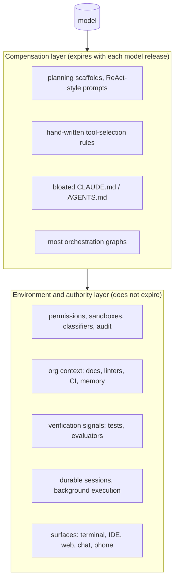

# What harness builders say: practitioner engineering writing, 2024–2026

*Research program: agent harnesses. Written 2026-09-08. Status: verified with notes.*

Sourcing note: the research proxy blocked anthropic.com, openai.com, cognition.ai, cursor.com, manus.im, simonwillison.net, latent.space and arxiv.org. Posts on those domains are cited by original URL but were read through search snippets and secondary summaries; quotes from them are marked "(via secondary)". Pages on code.claude.com, platform.claude.com and github.com were read directly.

## What this document answers

- What do the people who build harnesses (Anthropic, OpenAI, Cognition, Cursor, Manus, LangChain, and independent engineers such as Thorsten Ball, Simon Willison and Mitchell Hashimoto) say a harness is, and which design principles do they share?
- Where do they disagree, and has the disagreement moved between 2025 and 2026?
- Does the practitioner record support "harnesses thin out as models improve" (the Bitter Lesson applied to harnesses) or "the harness is the moat"?
- What does all of this imply for the thesis that the default harness must be reimagined for developers and for non-technical people?

## TL;DR

- The loop is agreed to be trivial. Thorsten Ball shipped a code-editing agent in 315 lines in April 2025: "It's an LLM, a loop, and enough tokens" [33][34].
- Everything else is contested. The vocabulary moved from "context engineering" (2025) to "harness engineering" (Feb 2026: named in Mitchell Hashimoto's Feb 5 post and adopted in OpenAI's Feb 11 post; Philipp Schmid's Jan 5 post already spoke of the "agent harness") [37][38][21][41].
- Shared principles: start with one simple loop; treat the context window as the scarce resource; give the agent a real computer (filesystem, shell); close the loop with a verification signal the agent can read; prefer deterministic guardrails (hooks, linters, sandboxes) to prose; keep a single writer when several agents act [1][22][15][28][29].
- Biggest reversal: Cognition's "don't build multi-agents" (June 2025) became "what's actually working" (April 2026): single-threaded writes, extra agents contribute "intelligence rather than actions", swarms are "mostly a distraction" [28][29][30].
- The harness matters measurably: LangChain went from 52.8% to 66.5% on Terminal-Bench 2.0 with the same model [50]; Anthropic's 2026 trends report says harness setup alone swings benchmarks by 5+ points [56]; Anthropic's April 2026 postmortem traced a Claude Code regression to harness-side changes, not the model [10].
- Harnesses also thin out: Anthropic now writes that every harness component "assumes the model can't do something; those assumptions expire" and tells builders to "re-simplify on model upgrades" [8][9][11]; a Sept 2026 paper argues the model is "eating the stack" [45].
- Both hold because "the harness" is two layers: a compensation layer (planning scaffolds, prompt tricks, tool-selection crutches) that expires with each model release, and an environment/authority layer (permissions, sandboxes, memory, org context, verification, surfaces) that does not. The labs are productizing the second layer themselves: Claude Agent SDK (Sept 2025), Managed Agents (April 2026), Codex app-server (positioned as the embedding tier in the Aug 2026 "Codex as a platform" post) [5][12][23].

## 1. Vocabulary for a newcomer

Analogy: a language model is a brilliant contractor with no hands, no memory past the current conversation, and no keys to the building. The harness is the hands, the notebook, and the key ring. The loop is the daily stand-up: the contractor says what to do next, someone does it and reports back, and the contractor decides again.

Precisely: Simon Willison's definition, now the common one, is that an agent "runs tools in a loop to achieve a goal" (Sept 2025) [35]; a coding agent "acts as a harness for an LLM" (Mar 16, 2026 guide page "How coding agents work", via secondary) [36]. Anthropic's docs describe Claude Code as "the agentic harness around Claude: it provides the tools, context management, and execution environment that turn a language model into a capable coding agent" [14]. A June 2026 arXiv paper names the necessary parts as an agent loop, a tool interface, context management and control mechanisms (paraphrase, via [53]'s summary) [48][49], which maps onto this program's seven-part definition with runtime and surface folded into "control".

```
            ┌──────────────────────── harness ────────────────────────┐
 user ─────▶│ context assembly ─▶ model call ─▶ tool call ─▶ result ──┐│
            │        ▲   (system prompt, memory,   (permissions,      ││
            │        │    files, compaction)        sandbox, hooks)   ││
            │        └────────────────────────────────────────────────┘│
            │  stop when: no tool call / goal check passes / human says │
            └─────────────────────────────────────────────────────────────┘
```

The loop in pseudocode, essentially what Ball published and what the Claude Agent SDK and Codex SDK wrap:

```python
messages = [system_prompt, user_task]
while True:
    reply = model(messages, tools=TOOLS)          # model decides
    if not reply.tool_calls: return reply.text    # stopping rule
    for call in reply.tool_calls:
        if not permitted(call): call = ask_human(call)   # permissions
        messages.append(run(call))                # results feed back
    messages = compact_if_needed(messages)        # context management
```

Two terms recur. "Context engineering" (Manus, Anthropic, Cognition, mid-2025) is deciding what goes into the window each turn. "Harness engineering" (Hashimoto, OpenAI, early 2026) is the wider practice: "improving agent output by shaping the environment around it, [which] holds a chosen model and coding agent constant as a black box" [54]. OpenAI's harness lead Joe Gershenson: "The harness is how the model interacts with the world and how we are able to express the model capabilities" (2026) [26].

## 2. The record: who said what, when

| Date | Source | One-line claim |
|---|---|---|
| Dec 2024 | Anthropic, Building effective agents [1] | Successful teams "weren't using complex frameworks... building with simple, composable patterns"; workflows (predefined code paths) vs agents (model directs its own process) |
| Apr 2025 | Thorsten Ball, How to build an agent [33] | Full code-editing agent in 315 lines; "There is no moat" [34] |
| Jun 2025 | Anthropic, multi-agent research system [2] | Orchestrator-workers beat single Opus 4 by 90.2% on internal research eval; ~15x tokens; token use explains 80% of variance |
| Jun 2025 | Cognition, Don't build multi-agents [28] | Share full context; "actions carry implicit decisions"; parallel writers produce fragile output |
| Jul 2025 | Manus, Context engineering lessons [32] | KV-cache hit rate is "the single most important metric"; be the boat, not the pillar |
| Sep 2025 | Anthropic, Effective context engineering [4] | Find "the smallest set of high-signal tokens"; compaction, tool-result clearing, memory |
| Nov 2025 | Anthropic, Effective harnesses for long-running agents [7] | Initializer agent + coding agent; feature list, progress file, git as memory across context resets |
| Feb 2026 | Mitchell Hashimoto (via [37][38]) | "Harness engineering": every agent mistake becomes a permanent environmental fix |
| Feb 2026 (11 Feb) | OpenAI (Ryan Lopopolo), Harness engineering [21][27] | ~1M lines, zero written by hand, 5 months, ~1,500 PRs, 3 engineers growing to 7 |
| Mar 2026 | Anthropic, Harness design for long-running app development [8] | Planner / generator / evaluator; harness components encode expiring assumptions |
| Apr 2026 | Anthropic, Managed Agents [12] | Hosted "pre-built, configurable agent harness"; sessions, environments, events |
| Apr 2026 | Cognition, Multi-agents: what's actually working [29] | Single-threaded writes; three patterns; swarms are a distraction |
| Aug 2026 | OpenAI, Codex as a platform [23][24][25] | Three tiers: `codex exec`, SDK, app-server (JSON-RPC threads, turns, events, approvals); CLI repo is Apache-2.0 |
| Sep 2026 | Patel, Zaharia et al., "Model eats the stack" [45] | Compensating layers get absorbed; what persists is "persistent semantic context" |

## 3. Principles practitioners agree on

Mapped to the seven harness parts.

**Loop: start simple, add structure only when measured.** Anthropic (Dec 2024): "the most successful implementations weren't using complex frameworks or specialized libraries. Instead, they were building with simple, composable patterns" (via secondary) [1]. OpenAI's April 2025 guide says the same: start with a single agent [22]. Ball's 315-line agent is the existence proof [33]. Boris Cherny, who leads Claude Code, called it "the thinnest possible wrapper over the model": "all the secret sauce, it's all in the model" (Latent Space, May 2025, via secondary) [57].

**Context and memory: the window is the scarce resource.** Anthropic's best-practices doc opens with it: "Most best practices are based on one constraint: Claude's context window fills up fast, and performance degrades as it fills" [15]. The design rule: find "the smallest possible set of high-signal tokens that maximize the likelihood of some desired outcome" (Sept 2025, verbatim via a GitHub mirror) [4][20]. Manus adds the economics: cached input tokens cost about a tenth of uncached ones, so stable prefixes and append-only context are cost controls (July 2025, via secondary) [32]. Cognition: "share context" in full, because "actions carry implicit decisions" a summary loses (June 2025) [28]. Skills institutionalize it: about 100 tokens per skill at startup, under 5k when triggered, bundled files nothing until read [6][19].

**Tools: give the agent a computer, then design the remaining tools like a product.** The Agent SDK post argues an agent "needs to be able to fetch and update its own context", which in practice means a filesystem and bash (Sept 2025) [5]. The tools post: consolidate related operations, namespace by domain, prefer `search_x` over `list_x`, and eval the tools with the model (Sept 2025) [3]. Claude Code's docs now recommend plain CLIs (`gh`, `aws`, `gcloud`) as "the most context-efficient way to interact with external services" [15].

**Verification closes the loop.** The strongest cross-vendor agreement of 2026. Claude Code docs: "Give Claude a check it can run: tests, a build, a screenshot to compare. It's the difference between a session you watch and one you walk away from" [15]. Anthropic's long-running work makes it structural: a "Default-FAIL contract" ("every criterion starts `false`; the agent can't mark it passing without opening evidence first") and a "fresh-context evaluator" that "grades the work from a context window that never saw the build" [11]. OpenAI replaced a weekly human cleanup pass ("every Friday (20% of the week)") with recurring background Codex tasks that "open targeted refactoring pull requests", which the post likens to garbage collection (verified against a GitHub mirror of the post) [21][27]. LangChain's biggest lever was "system prompts emphasizing self-verification loops" plus middleware to detect "doom loops" (wording from a secondary summary of the post) [50].

**Permissions and safety: deterministic beats advisory.** Hashimoto: "Anytime you find an agent makes a mistake, you take the time to engineer a solution such that the agent never makes that mistake again" (Feb 2026, via secondary) [38]. OpenAI at scale: custom linters and a structured `docs/` tree, after the "one big AGENTS.md" approach "failed in predictable ways" and was replaced by a "roughly 100 lines" map into the docs (verified against a GitHub mirror of the post) [21][27]. Anthropic: "Unlike CLAUDE.md instructions which are advisory, hooks are deterministic and guarantee the action happens" [15]. The newest move puts a second model in the permission path: Claude Code's auto mode has "a separate classifier model [that] reviews actions before they run, blocking anything that escalates beyond your request, targets unrecognized infrastructure, or appears driven by hostile content Claude read", now the built-in starting mode on Pro, Max and Team plans [16].

**Runtime: durable state lives outside the context window.** Anthropic's Nov 2025 pattern: an initializer agent writes a feature list and progress file; coding agents do one feature per session and commit to git so "the next session picks up cleanly" [7][11]. Managed Agents productizes this as an append-only event log per session plus a persistent sandbox [12]. OpenAI's app-server lets applications "create threads, start turns, receive events, and handle approval requests" through a documented client protocol (Aug 2026, verified against a GitHub mirror of the post) [23].

**Orchestration: single writer.** Cognition (June 2025): parallel writers split the implicit judgments, so "running multiple agents in collaboration only results in fragile systems" [28]. Anthropic's research post agrees from the other side: parallel subagents pay off for read-heavy, decomposable research, while many coding tasks are less parallelizable (June 2025, paraphrase) [2]. By April 2026 Cognition's rule is explicit: "writes stay single-threaded and the additional agents contribute intelligence rather than actions" [29][31].

## 4. Where they disagree

| Question | Position A | Position B | State in Sept 2026 |
|---|---|---|---|
| Multi-agent | Anthropic: orchestrator-workers, 90.2% gain, 15x tokens [2] | Cognition: don't; context fragmentation [28] | Converged on map-reduce with a single writer and adversarial reviewers [29]; Anthropic ships "dynamic workflows" that move "the plan into code" so intermediate results never touch the main context [17] |
| Thin vs thick harness | Cherny: thinnest possible wrapper; ~80% of Claude Code written by Claude [57] | OpenAI: months of environment engineering (docs, linters, observability, background GC) [21][27] | Both hold. The thin part is the loop; the thick part is the environment. See section 5 |
| Frameworks | Anthropic Dec 2024: avoid frameworks, own the loop [1] | LangChain: harness as a layered product (`create_agent`, Deep Agents, middleware) [52][50] | Anthropic now sells its harness too (Agent SDK, Managed Agents) [13][12]; the argument has become "whose harness", not "whether" |
| Model-agnostic harness | Manus: be the boat riding the model tide, never train [32] | Cursor: switched its long-running-agent harness to GPT-5.1/5.2 for their ability "to follow instructions precisely" (Feb 2026), then shipped its own model, Composer 2 (19 Mar 2026) (via GitHub mirrors and secondary) [40][39] | Coupling has academic support: harness design and post-training cannot be treated as separable design choices (paraphrase) [46][47] |
| Who is in the loop | Human steers turn by turn (Claude Code interactive; Codex approvals) | Böckeler (on martinfowler.com)/OpenAI: "humans on the loop" designing the environment, not inspecting outputs (via [53]) [55] | Cherny, June 2, 2026, Acquired Unplugged (via secondary transcripts): "I don't prompt Claude anymore. I have loops that are running. They're the ones that are prompting Claude and figuring out what to do. My job is to write loops" [43] |

**Multi-agent moved the most.** Walden Yan (April 22, 2026): "A year ago, I'd tell people to not build multi-agents and to focus on context engineering fundamentals. Today, many sexy ideas are still impractical, but we've found some setups that actually work" [30]. The working shapes are Code-Review-Loop, "Smart Friend" (a second model consulted for judgment, not action) and "map-reduce-and-manage" [29]. Anthropic's dynamic workflows render the same shape as a JavaScript script with `agent()`, `parallel()` and `pipeline()` primitives, capped at 1,000 agents per run [17]. Anthropic's 90.2% figure was an internal eval with the caveat that token spend explained 80% of the variance; independent replications are commentary, not measurement [2].

**Thin vs thick is the disagreement that matters for the thesis.** Cherny's "thinnest possible wrapper" (2025) and OpenAI's five-month environment build (2026) describe different layers. Cherny means the loop and prompt. OpenAI means the repo, docs, linters, observability and merge process around the loop; the post's point is that its engineers stopped writing code and started writing the environment [21].

## 5. The Bitter Lesson debate: does the harness thin out, or is it the moat?

The Bitter Lesson (Sutton, 2019) says general methods that scale with compute beat hand-encoded human structure. Applied to harnesses: every planning scaffold, prompt trick and tool-selection crutch is human structure, so it should lose to the next model.

**Evidence for thinning.**

- Anthropic says it directly. Its March 2026 post's key insight, as summarized by the awesome-harness-engineering list: "Every harness component assumes the model can't do something; those assumptions expire" [53][8]. The April 2, 2026 patterns, as the same list summarizes them (paraphrase): build on tools Claude already knows, remove harness assumptions as capabilities improve, and set UX/cost/safety boundaries carefully [9][53]. The companion repo: "Re-simplify on model upgrades: After each model release, comment out harness pieces one at a time and see what's still load-bearing", because "newer models drift less and self-scope better" [11].
- Cherny is reported to have cut about 80% of Claude Code's system prompt for Opus 5 with no measurable loss on the team's coding evals (YC Startup School, late July 2026, the day after Opus 5 shipped on July 24; an Anthropic engineer's July 24 post reposted by Cherny independently says "~80%"; via secondary; no primary transcript read) [57][44].
- Latent Space's March 2026 piece cites Noam Brown on reasoning models removing the scaffolding earlier agent systems needed (via secondary) [37].
- Patel, Jha, Arabzadeh, Guestrin, Stoica and Zaharia (Sept 2026): "many proposed system layers designed to compensate for model limitations on a given task will increasingly be subsumed by the model itself"; what remains is "persistent semantic context" about the environment [45].
- Philipp Schmid (Jan 5, 2026): "To survive the Bitter Lesson, our infrastructure (Harness) must be lightweight" (verbatim via GitHub mirrors) [41]. Hanchung Lee (May 2026) argues a 2026 harness is "a 2026 artifact" whose structure should "come out as easily as it went in" (unverified: no mirror or snippet of the post could be found) [42].

**Evidence for the moat.**

- Harness swaps move scores more than model swaps, at least short term. LangChain: 52.8% to 66.5% on Terminal-Bench 2.0 with gpt-5.2-codex held constant, roughly 30th to top five [50]. Anthropic's 2026 trends report: "harness setup alone can swing benchmarks by 5+ percentage points" (the quoted words are [53]'s one-line summary; the report PDF could not be opened, so its own wording is unverified) [56]. A widely repeated "22 points from the harness, 1 from the model" SWE-bench figure has no locatable primary source; treat it as unverified [58].
- Harness changes break things silently. Anthropic's April 23, 2026 postmortem attributed Claude Code quality complaints to "a default reasoning-effort downgrade, a caching-optimization bug [...], and an overly aggressive verbosity-limiting system prompt" (wording per [53]; secondary coverage dates the three changes to March 4 (default effort lowered from high to medium), March 26 (a cache-pruning bug that dropped thinking history every turn) and April 16 (a verbosity instruction, reverted April 20)) [10]. The model had not changed.
- LangChain claims harness-only tuning brought Nemotron 3 Ultra "within one point of Opus 4.8 on Deep Agents at roughly one-tenth the cost" (July 2026; wording per [53]'s summary; vendor claim, one benchmark) [51].
- The labs behave as if the harness is valuable. Managed Agents sells "a pre-built, configurable agent harness that runs in managed infrastructure" at token prices plus a reported $0.08 per session-hour (April 2026; price via secondary) [12][59]. OpenAI markets Codex as an "open agent harness" with three embedding tiers (Aug 2026) [23].
- Harness and weights are coupled, the opposite of an interchangeable wrapper: zero-shot performance improves monotonically with harness informativeness, and an agent post-trained under a minimal harness collapses under stronger tool-environment shifts (paraphrase; abstract not opened, substance confirmed via two secondary summaries) [46].

**Synthesis (my reading, not any vendor's).** The camps describe two layers, and the word "harness" hides the split.



The thinning evidence is about the compensation layer. The moat evidence is mostly about the environment layer: LangChain's gains came from verification loops and doom-loop middleware, OpenAI's from docs, linters and observability, Anthropic's postmortem from caching and effort settings. Even the "model eats the stack" paper carves out "persistent semantic context" as durable [45]. Birgitta Böckeler's martinfowler.com piece names the same three systems: context engineering, architectural constraints, entropy management (via [53]) [55].

The uncomfortable corollary for a startup: the environment layer is where the labs now invest (Managed Agents, app-server, auto-mode classifiers, Channels, Routines), and it is also where model-specific coupling lives.

## 6. What this means for the thesis

**Supports.**

- "The harness becomes the bottleneck" is now both major labs' stated position. OpenAI named the discipline; Anthropic publishes harness posts roughly quarterly and sells three harness products (Agent SDK, Managed Agents, Claude Code) [21][5][12]. Measured harness-only gains of 5 to 14 points on hard benchmarks exist [50][56].
- "Neither CLI nor desktop app is the default" matches what vendors are building. Claude Code's docs describe one engine behind terminal, VS Code, JetBrains, desktop, web, iOS/Android, Slack, Remote Control, Channels (Telegram, Discord, iMessage, webhooks), GitHub Actions and cloud Routines: "Each surface connects to the same underlying Claude Code engine" [18][14]. OpenAI's app-server exists so Codex can be embedded anywhere [23]. Surface and harness have been decoupled; the CLI is one client among many.
- The human's job is moving from steering turns to designing environments and writing loops (Hashimoto, OpenAI, Böckeler, Cherny) [38][21][55][43]. That is a different product from a chat box or a terminal.

**Contradicts.**

- The loop is 300 lines and the labs prune scaffolding every model release. A startup whose value is in the compensation layer will be eaten within one or two model generations; Anthropic tells its own customers to expect this [11][9].
- The labs are vertically integrating the environment layer with the model: Managed Agents, the Agent SDK's branding rules, Codex app-server, Cursor's in-house model [12][13][23][39]. The record contains no example of an independent, model-agnostic harness winning on quality; the counterexample (Manus, the "boat") predates the 2026 shift.
- Harness quality is model-coupled (Cursor's rewiring, the Interplay paper, Anthropic's postmortem) [40][46][10]. A harness "for everyone" that abstracts over models may be structurally worse than each lab's own.
- Almost all of this writing is about coding agents, by developers, for developers. It contains essentially nothing on harness design for non-technical users; Managed Agents and Skills are the closest and both are developer- or admin-facing [12][19]. The thesis's second half is untested by this literature, neither supported nor contradicted.

**Nuance.**

- The defensible position implied by the record is the environment layer without the model coupling: org-level permissions and audit, cross-vendor memory and context, verification signals, and surfaces the labs have not prioritized. That is also where the record is thinnest: either an opportunity or a sign nobody has found the product.
- "Default harness" may be the wrong frame. Practitioners describe convergence on a headless engine plus a protocol (Agent SDK, app-server, Managed Agents events) with many thin surfaces. A startup could own a surface or a protocol layer; the record suggests owning the loop is not a business.

## 7. Open questions and unverified claims

- The OpenAI harness-engineering post is by Ryan Lopopolo and dated February 11, 2026; its numbers (about a million lines, ~1,500 PRs, 3 engineers growing to 7, five months, 3.5 PRs per engineer per day, 0 lines written by hand) were verified verbatim against GitHub mirrors of the post [21][27]. The Latent Space piece is dated Mar 5, 2026 [37].
- Cherny's "about 80% of the system prompt" (YC Startup School, late July 2026) and "my job is to write loops" (Acquired Unplugged, June 2, 2026; also Sequoia AI Ascent 2026) come from secondary write-ups of talks; the loops wording is consistent across several transcripts, but no primary transcript was read [57][43][44].
- The "22 points harness vs 1 point model" SWE-bench claim has no locatable primary source [58].
- Cursor's posts were read via GitHub mirrors: "Towards self-driving codebases" (Feb 5, 2026) says GPT-5.1 and later GPT-5.2 "began showing better results for their ability to follow instructions precisely", so "we updated our harness to use OpenAI models"; "Expanding our long-running agents research preview" is dated Feb 12, 2026; Composer 2's 19 Mar 2026 date is from secondary summaries [39][40].
- Managed Agents pricing ($0.08 per session-hour) and early customers (Notion, Rakuten, Sentry, Asana) come from secondary launch coverage [59]; the docs page read directly confirms the product shape, not the price [12].
- The April 23, 2026 postmortem (its three causes corroborated by several secondary write-ups), the April 2, 2026 "3 patterns" post, the 2026 trends report, Böckeler's martinfowler.com essay and the LangChain Nemotron post were read only through the awesome-harness-engineering list's one-line summaries [53].
- Manus's claim ("we've rebuilt our agent framework four times") is verbatim in GitHub mirrors of the July 2025 post. Meta's roughly $2B acquisition of Manus was announced December 29, 2025 (TechCrunch), prohibited by China's regulator on April 27, 2026 and later unwound, per this program's landscape document.
- Open: is there any published case of a model-agnostic third-party harness matching a lab's first-party harness on a hard benchmark with the same model? None was found.
- Open: what does harness engineering for non-developers look like? No practitioner post in scope addresses it.

## Sources

1. Anthropic, "Building effective agents", https://www.anthropic.com/engineering/building-effective-agents, Dec 2024.
2. Anthropic, "How we built our multi-agent research system", https://www.anthropic.com/engineering/multi-agent-research-system, Jun 2025.
3. Anthropic, "Writing effective tools for agents", https://www.anthropic.com/engineering/writing-effective-tools-for-agents, Sep 2025.
4. Anthropic, "Effective context engineering for AI agents", https://www.anthropic.com/engineering/effective-context-engineering-for-ai-agents, Sep 2025.
5. Anthropic, "Building agents with the Claude Agent SDK", https://claude.com/blog/building-agents-with-the-claude-agent-sdk, Sep 2025.
6. Anthropic, "Equipping agents for the real world with Agent Skills", https://www.anthropic.com/engineering/equipping-agents-for-the-real-world-with-agent-skills, Oct 2025.
7. Anthropic, "Effective harnesses for long-running agents", https://www.anthropic.com/engineering/effective-harnesses-for-long-running-agents, Nov 2025.
8. Anthropic, "Harness design for long-running application development", https://www.anthropic.com/engineering/harness-design-long-running-apps, Mar 2026.
9. Anthropic, "Agent harness design: 3 patterns for harnessing Claude's intelligence", https://claude.com/blog/harnessing-claudes-intelligence, Apr 2026.
10. Anthropic, "An update on recent Claude Code quality reports", https://www.anthropic.com/engineering/april-23-postmortem, Apr 2026.
11. anthropics/cwc-long-running-agents (README), https://github.com/anthropics/cwc-long-running-agents, 2026.
12. Anthropic, "Claude Managed Agents overview", https://platform.claude.com/docs/en/managed-agents/overview, read Sep 2026 (beta header `managed-agents-2026-04-01`).
13. Anthropic, "Agent SDK overview", https://code.claude.com/docs/en/agent-sdk/overview, read Sep 2026.
14. Anthropic, "How Claude Code works", https://code.claude.com/docs/en/how-claude-code-works, read Sep 2026.
15. Anthropic, "Best practices for Claude Code", https://code.claude.com/docs/en/best-practices, read Sep 2026 (originally the Apr 2025 blog post).
16. Anthropic, "Choose a permission mode", https://code.claude.com/docs/en/permission-modes, read Sep 2026.
17. Anthropic, "Orchestrate subagents at scale with dynamic workflows", https://code.claude.com/docs/en/workflows, read Sep 2026.
18. Anthropic, "Claude Code overview", https://code.claude.com/docs/en/overview, read Sep 2026.
19. Anthropic, "Agent Skills overview", https://platform.claude.com/docs/en/agents-and-tools/agent-skills/overview, read Sep 2026.
20. Anthropic cookbook, "Context engineering: memory, compaction, and tool clearing", https://platform.claude.com/cookbook/tool-use-context-engineering-context-engineering-tools, 2025.
21. OpenAI (Ryan Lopopolo), "Harness engineering: leveraging Codex in an agent-first world", https://openai.com/index/harness-engineering/, Feb 11, 2026 (date, author and text verified via GitHub mirrors of the post).
22. OpenAI, "A practical guide to building agents", https://cdn.openai.com/business-guides-and-resources/a-practical-guide-to-building-agents.pdf, Apr 2025.
23. OpenAI Developers, "Codex as a platform: build on the open agent harness", https://developers.openai.com/blog/codex-as-a-platform, Aug 2026.
24. OpenAI, "Unrolling the Codex agent loop", https://openai.com/index/unrolling-the-codex-agent-loop/, 2026 (date unverified).
25. openai/codex repository (Apache-2.0), https://github.com/openai/codex, read Sep 2026.
26. The Deep View, "OpenAI's secret weapon underneath Codex" (Joe Gershenson quote), https://www.thedeepview.com/articles/openai-s-secret-weapon-underneath-codex, 2026.
27. The Neuron, "OpenAI's harness engineering playbook", https://www.theneuron.ai/explainer-articles/openais-harness-engineering-playbook-how-to-ship-1m-lines-of-code-without-writing-any/, 2026.
28. Cognition (Walden Yan), "Don't build multi-agents", https://cognition.ai/blog/dont-build-multi-agents, Jun 12, 2025.
29. Cognition (Walden Yan), "Multi-agents: what's actually working", https://cognition.com/blog/multi-agents-working, Apr 22, 2026.
30. Walden Yan on X, https://x.com/walden_yan/status/2047054554433462360, Apr 2026.
31. Latent Space, "The Age of Async Agents — Cognition's Walden Yan", https://www.latent.space/p/cognition, 2026.
32. Manus (Yichao "Peak" Ji), "Context engineering for AI agents: lessons from building Manus", https://manus.im/blog/Context-Engineering-for-AI-Agents-Lessons-from-Building-Manus, Jul 2025.
33. Thorsten Ball, "How to build an agent", https://ampcode.com/how-to-build-an-agent, Apr 2025.
34. Thorsten Ball on X ("315 lines... There is no moat"), https://x.com/thorstenball/status/1912178069336396186, Apr 2025.
35. Simon Willison, "Agents", https://simonwillison.net/2025/Sep/18/agents/, Sep 2025.
36. Simon Willison, "How coding agents work" (Agentic Engineering Patterns guide), https://simonwillison.net/guides/agentic-engineering-patterns/how-coding-agents-work/, Mar 16, 2026; the guide was announced in "Writing about Agentic Engineering Patterns", https://simonwillison.net/2026/Feb/23/agentic-engineering-patterns/, Feb 2026.
37. Latent Space (swyx), "[AINews] Is Harness Engineering real?", https://www.latent.space/p/ainews-is-harness-engineering-real, Mar 5, 2026.
38. Bloss0m, "Mitchell Hashimoto's six stages of AI adoption", https://www.bloss0m.com/en/blog/16-mitchell-hashimoto-harness-origin/, 2026 (secondary on Hashimoto's Feb 2026 post).
39. Cursor, "Towards self-driving codebases", https://cursor.com/blog/self-driving-codebases, Feb 5, 2026 (read via GitHub mirror).
40. Cursor via engineering.fyi, "Expanding our long-running agents research preview", https://www.engineering.fyi/article/expanding-our-long-running-agents-research-preview, Feb 12, 2026 (read via secondary; original at https://cursor.com/blog/long-running-agents).
41. Philipp Schmid, "The importance of Agent Harness in 2026", https://www.philschmid.de/agent-harness-2026, Jan 5, 2026 (read via GitHub mirrors).
42. Hanchung Lee, "Hidden Technical Debt of AI Systems: Agent Harness", https://leehanchung.github.io/blogs/2026/05/08/hidden-technical-debt-agent-harness/, May 2026.
43. Armin Ronacher, "The Coming Loop", https://lucumr.pocoo.org/2026/6/23/the-coming-loop/, Jun 2026 (read via search snippet).
44. Epsilla, "The end of programming: why harnesses will disappear and loops are the future", https://www.epsilla.com/blogs/2026-05-10-the-end-of-programming-why-harnesses-will-disappear-and-loop, May 2026 (read via search snippet).
45. Patel, Jha, Arabzadeh, Guestrin, Stoica, Zaharia, "What happens when the model eats the stack? Rethinking the research agenda for data agents to withstand the Bitter Lesson", https://arxiv.org/abs/2609.03141, Sep 2, 2026 (abstract read via a GitHub mirror).
46. "The Interplay of Harness Design and Post-Training in LLM Agents", https://arxiv.org/abs/2606.25447, Jun 2026.
47. "Co-Harness: Co-Evolving Harnesses and Model Weights for LLM Agents", https://arxiv.org/abs/2607.22688, Jul 2026.
48. Sanderson Oliveira de Macedo, "What makes a harness a harness: necessary and sufficient conditions for an agent harness", https://arxiv.org/abs/2606.10106, Jun 8, 2026 (abstract read via a GitHub mirror).
49. "Architectural Design Decisions in AI Agent Harnesses", https://arxiv.org/abs/2604.18071, Apr 2026.
50. LangChain, "Improving Deep Agents with harness engineering", https://blog.langchain.com/improving-deep-agents-with-harness-engineering/, 2026 (read via secondary).
51. LangChain, "Tuning the harness, not the model: a Nemotron 3 Ultra playbook", https://blog.langchain.com/tuning-the-harness-not-the-model-a-nemotron-3-ultra-playbook, Jul 2026 (via [53]).
52. LangChain, "The anatomy of an agent harness", https://blog.langchain.com/the-anatomy-of-an-agent-harness/, 2026 (via [53]); langchain-ai/deepagents README, https://github.com/langchain-ai/deepagents, read Sep 2026.
53. ai-boost/awesome-harness-engineering, https://github.com/ai-boost/awesome-harness-engineering, read Sep 2026.
54. lopopolo/harness-engineering, https://github.com/lopopolo/harness-engineering, read Sep 2026.
55. Birgitta Böckeler (Thoughtworks, on martinfowler.com), "Harness Engineering", https://martinfowler.com/articles/exploring-gen-ai/harness-engineering.html, 2026 (via [53]; the list credits Fowler, but the Exploring Gen AI memo "Harness Engineering - first thoughts", https://martinfowler.com/articles/exploring-gen-ai/harness-engineering-memo.html, Feb 17, 2026, and the April 2026 article "Harness engineering for coding agent users", https://martinfowler.com/articles/harness-engineering.html, are both by Böckeler; the list's URL matches neither exactly).
56. Anthropic, "2026 Agentic Coding Trends Report", https://resources.anthropic.com/hubfs/2026%20Agentic%20Coding%20Trends%20Report.pdf, 2026 (via [53]).
57. Boris Cherny quotes: Latent Space podcast with Cherny and Cat Wu (May 2025), reported at https://www.threads.com/@artificialintelligence.co/post/DJrK0QqJsBh/ (2025) and https://polomodov.tech/en/book-cube/boris-cherny-we-cut-80-of-claude-code-s-prompt-4829/ (2026); the 80% system-prompt claim is from his YC Startup School 2026 conversation with Diana Hu (late July 2026), also reported at https://www.dutchstartup.ai/en/tv/boris-cherny-just-told-us-to-delete-our-claude-md-files and https://www.barath.ai/learnings/boris-cherny-yc-startup-school-2026; secondary.
58. FutureAGI, "Coding agent harness benchmarks: why the harness changes the score", https://futureagi.com/blog/coding-agent-harness-benchmark/, 2026 (secondary; source of the circulating 22-vs-1 figure not established).
59. Modal, "Introducing Claude Managed Agents with Modal Sandboxes", https://modal.com/blog/introducing-claude-managed-agents-with-modal-sandboxes, Apr 2026; Pluto Security, "Inside Claude Managed Agents", https://pluto.security/blog/inside-claude-managed-agents/, 2026 (secondary on launch details and pricing).

## Verification notes (2026-09-08)

**Method.** The web-search budget was exhausted after nine queries, and the egress proxy blocked not only the listed domains but almost every secondary site as well (theneuron.ai, thedeepview.com, news.ycombinator.com, cognition.com, ampcode.com, langchain.com, modal.com, philschmid.de, vlad.build, barath.ai, and GitHub Pages sites such as zby.github.io and leehanchung.github.io). Verification therefore relied on (a) pages opened directly on code.claude.com and platform.claude.com; (b) raw READMEs and full-text mirrors of the blocked posts on github.com, found with GitHub code search (OpenAI's post, Cursor's, Cognition's, Manus's, Anthropic's 2024–2025 posts, the Codex-as-a-platform post, the awesome-harness-engineering list, cocodedk/loop-engineering's sourced Cherny timeline); and (c) the nine search-result snippets. X post dates were decoded from their status IDs. "Verbatim" below means the wording was matched against a full-text mirror or a live page, not against the original URL. Every "(via secondary)" marker in the body was kept.

**Verdicts: 19 confirmed, 16 corrected, 4 unverified.**

1. OpenAI "Harness engineering" post date and author. **Corrected.** Mirror text reads "By Ryan Lopopolo, Member of the Technical Staff / February 11, 2026"; the document had "late Feb or early Mar 2026, date unverified". Hashimoto's post is Feb 5, 2026, so "adopted days later" holds.
2. OpenAI headline numbers. **Confirmed** verbatim: "on the order of a million lines of code", "roughly 1,500 pull requests", "just three engineers", "3.5 PRs per engineer per day", "grown to now seven engineers", "Over the past five months", "0 lines of manually-written code".
3. OpenAI AGENTS.md wording. **Corrected.** The post never says a large AGENTS.md "made things worse"; it says the "one big AGENTS.md" approach "failed in predictable ways" and that "A short AGENTS.md (roughly 100 lines)" serves as a map into a docs/ tree.
4. OpenAI weekly human cleanup replaced by background agents. **Confirmed**: "Our team used to spend every Friday (20% of the week) cleaning up 'AI slop'"; "background Codex tasks that scan for deviations, update quality grades, and open targeted refactoring pull requests"; "This functions like garbage collection."
5. Cherny removed ~80% of the system prompt with no measurable eval loss. **Corrected** from "more than 80%" to "about 80%"; venue added (YC Startup School 2026 with Diana Hu, the day after Opus 5 shipped on July 24, 2026, per two secondary reports and a July 30 X post). An Anthropic engineer's July 24, 2026 X post, reposted by Cherny, says "We removed ~80% of the Claude Code system prompt for our newest models". "No measurable loss of quality on their coding evals" appears only in secondary write-ups.
6. "My job is to write loops". **Corrected** to the verbatim wording: "I don't prompt Claude anymore. I have loops that are running. They're the ones that are prompting Claude and figuring out what to do. My job is to write loops" (Acquired Unplugged presented by WorkOS, June 2, 2026; also Sequoia AI Ascent 2026), per cocodedk/loop-engineering's sourced timeline and the Medium write-up it cites.
7. "Thinnest possible wrapper" and episode date. **Confirmed** via three independent secondary mirrors ("All the secret sauce, it's all in the model. And this is the thinnest possible wrapper over the model"); the Latent Space episode "Claude Code: Anthropic's Agent in Your Terminal" aired May 7–8, 2025.
8. Share of Claude Code written by Claude. **Corrected** "~80%" to "80–90%" (the cited Threads post says "approximately 80-90%"; developing.dev quotes "like 80 or 90%"). Cherny said "100%" on Mar 7, 2026.
9. March 2026 "assumptions expire" insight. **Confirmed**: the list's sentence "Key insight: every harness component assumes the model can't do something; those assumptions expire" is verbatim [53].
10. April 2026 "3 patterns" post. **Corrected** to a paraphrase; the post is dated April 2, 2026 and the list's summary reads "build on tools Claude already knows, remove harness assumptions as capabilities improve, and set UX/cost/safety boundaries carefully", not the wording the document quoted.
11. April 23, 2026 postmortem's three causes. **Confirmed** (reasoning-effort default, caching bug, verbosity prompt) by the list and by four secondary write-ups; the quotation was **corrected** to the list's wording with an ellipsis, and the dates (Mar 4, Mar 26, Apr 16/20) were added from secondary coverage.
12. Trends report "harness setup alone can swing benchmarks by 5+ percentage points". **Unverified** as the report's own wording: it is the awesome list's summary sentence, and every other GitHub occurrence derives from that list; resources.anthropic.com could not be opened.
13. Cursor rewiring its long-running-agent harness. **Confirmed** via a mirror of "Towards self-driving codebases" (Feb 5, 2026): "GPT-5.1 (and later GPT-5.2) began showing better results for their ability to follow instructions precisely. This seemed like a good fit for long-running agents, so we updated our harness to use OpenAI models". "Expanding our long-running agents research preview" is dated Feb 12, 2026; Composer 2's March 19, 2026 date (built on Kimi K2.5) comes from a secondary comparison report.
14. Cognition's reversal. **Confirmed**: June 12, 2025 principles verbatim ("Share context, and share full agent traces, not just individual messages"; "Actions carry implicit decisions, and conflicting decisions carry bad results"); April 22, 2026 post verbatim ("writes stay single-threaded and the additional agents contribute intelligence rather than actions"; the unstructured-swarm approach "is mostly a distraction"; patterns Code-Review-Loop, Smart Friend, map-reduce-and-manage); Walden Yan's X post of April 22, 2026 verbatim. **Corrected**: "the deliverables become fragile" is not in the June 2025 post, whose wording is "only results in fragile systems".
15. LangChain 52.8% to 66.5%. **Confirmed** by several independent mirrors (Terminal-Bench 2.0, gpt-5.2-codex held constant, roughly 30th to top 5, +13.7 points; "reasoning sandwich" xhigh-high-xhigh). The phrases "self-verification loops" and "doom loops" come from a ZenML summary and mirrors of the post; the post's publication date was not established.
16. Hashimoto quotation and coinage. Quotation **confirmed** verbatim ("My AI Adoption Journey", Feb 5, 2026: "I've grown to calling this 'harness engineering.' It is the idea that anytime you find an agent makes a mistake, you take the time to engineer a solution such that the agent never makes that mistake again"). "Coined by" was **corrected** to "named in", since Hashimoto says he did not know of an accepted term and Schmid's Jan 5, 2026 post already used "agent harness".
17. Joe Gershenson quotation. **Confirmed** verbatim via a mirror of The Deep View article ("lead for harness engineering at OpenAI").
18. Thorsten Ball. **Confirmed**: "There isn't. It's an LLM, a loop, and enough tokens." (Changelog transcript mirror); "315 lines" and "There is no moat" per secondary notes on his April 15, 2025 X post.
19. Simon Willison. "runs tools in a loop to achieve a goal" **confirmed** (Sept 2025). **Corrected**: "acts as a harness for an LLM" is from the guide page "How coding agents work" (Mar 16, 2026), not the Feb 23, 2026 post; source [36] updated.
20. Anthropic, "Building effective agents" (Dec 19, 2024). **Confirmed** verbatim.
21. Anthropic multi-agent research post (Jun 13, 2025). **Confirmed** verbatim: 90.2%; "about 15× more tokens than chats"; "token usage by itself explains 80% of the variance"; "most coding tasks involve fewer truly parallelizable tasks than research".
22. Context-engineering quotation. **Corrected** to the verbatim "the smallest possible set of high-signal tokens that maximize the likelihood of some desired outcome".
23. Agent SDK "fetch and update its own context". **Confirmed** verbatim.
24. Manus. **Confirmed** verbatim: "the KV-cache hit rate is the single most important metric for a production-stage AI agent"; "cached input tokens cost 0.30 USD/MTok, while uncached ones cost 3 USD/MTok—a 10x difference"; "the boat, not the pillar stuck to the seabed"; "we've rebuilt our agent framework four times".
25. Claude Code docs quotations [14][15][16][17][18]. **Confirmed** verbatim on the live pages (harness definition; "Most best practices are based on one constraint..."; "Give Claude a check it can run..."; "Unlike CLAUDE.md instructions which are advisory, hooks are deterministic..."; "CLI tools are the most context-efficient way to interact with external services"; the classifier sentence; "Each surface connects to the same underlying Claude Code engine"; "A workflow moves the plan into code"; "1,000 agents total per run"). **Corrected**: auto mode is the starting mode "On Pro, Max, and Team plans", not "on paid plans".
26. Managed Agents. **Confirmed** on the live page ("Pre-built, configurable agent harness that runs in managed infrastructure"; beta header `managed-agents-2026-04-01`; persisted event history). The $0.08 per active session-hour price is confirmed by three independent GitHub sources; launch customers remain unverified (see 39).
27. Skills token costs. **Confirmed** on the live page ("~100 tokens per Skill"; "Under 5k tokens"; "None until accessed").
28. cwc-long-running-agents README quotations. **Confirmed** verbatim.
29. "Codex as a platform" (Aug 2026). **Confirmed** (title "build on the open agent harness"; tiers codex exec, SDK, app-server). **Corrected**: the quoted "persistent threads, streamed events, and human-in-the-loop approvals" is not in the post; replaced with its "create threads, start turns, receive events, and handle approval requests".
30. arXiv 2609.03141. **Confirmed** (full title, six authors, published Sept 2, 2026); the quotation was **corrected** to the abstract's wording ("many proposed system layers ... will increasingly be subsumed by the model itself"); "persistent semantic context" confirmed.
31. arXiv 2606.25447 quotations. **Unverified** verbatim (abstract not reachable); the substance is confirmed by two independent summaries, so the sentences were softened to a paraphrase.
32. arXiv 2607.22688, 2606.10106, 2604.18071. **Confirmed** to exist with the stated months (2606.10106: Sanderson Oliveira de Macedo, June 8, 2026, abstract read; its four-element list is [53]'s summary and is now marked as paraphrase).
33. Nemotron 3 Ultra claim. **Confirmed** as [53]'s wording (July 2026; "within one point of Opus 4.8 on Deep Agents at roughly one-tenth the cost ($4.48 vs $43.48)"); "on Deep Agents" restored.
34. Philipp Schmid. Quotation **confirmed** verbatim; date **corrected** to Jan 5, 2026.
35. Hanchung Lee quotations. **Unverified**: no mirror or snippet of the post was found; marked inline.
36. martinfowler.com attribution. **Corrected**: both martinfowler.com harness-engineering pieces are by Birgitta Böckeler ("Harness Engineering - first thoughts", Feb 17, 2026; "Harness engineering for coding agent users", April 2026, which contains the "humans on the loop" framing); the awesome list credits Fowler and its URL matches neither exactly. Which piece carries the "three systems" summary remains open.
37. Latent Space "Is Harness Engineering real?". **Confirmed** dated Mar 5, 2026 (swyx); the Noam Brown point is confirmed by two secondary research notes.
38. Meta's acquisition of Manus. **Confirmed** (announced Dec 29, 2025; prohibited by China's regulator Apr 27, 2026; later unwound) via this program's landscape document and its TechCrunch and CNBC citations.
39. Managed Agents launch customers (Notion, Rakuten, Sentry, Asana). **Unverified** (modal.com and pluto.security could not be opened).

**Corrections made in the body:** status line; TL;DR vocabulary bullet and app-server phrasing; Willison date/source and the "necessary parts" paraphrase; OpenAI row of the timeline; the five verbatim fixes (context-engineering quotation, Cognition "fragile systems", Cherny loops quotation, "model eats the stack" quotation, Codex app-server quotation); the AGENTS.md and garbage-collection sentences; auto-mode plan wording; the Cursor and Fowler/Böckeler table cells; the "3 patterns", 80%-prompt, Schmid/Lee, trends-report, postmortem, Nemotron and Interplay bullets; section 7 bullets on OpenAI, Cherny, Cursor, the list-only sources and Manus/Meta; sources [21][28][29][36][37][39][40][41][45][48][55][57].

**Sources that could not be opened:** openai.com, developers.openai.com, anthropic.com and resources.anthropic.com, claude.com/blog, cognition.ai and cognition.com, cursor.com, manus.im, simonwillison.net, latent.space, arxiv.org, mitchellh.com, lucumr.pocoo.org, martinfowler.com, blog.langchain.com and langchain.com, theneuron.ai, thedeepview.com, news.ycombinator.com, ampcode.com, modal.com, pluto.security, philschmid.de, leehanchung.github.io, zby.github.io, vlad.build, barath.ai, x.com, epsilla.com, futureagi.com, engineering.fyi. Opened directly: code.claude.com, platform.claude.com, github.com and raw.githubusercontent.com.

**Remaining doubts.** (1) The "no measurable eval loss" half of the 80%-prompt claim rests on secondary write-ups of a talk. (2) Whether the trends report itself uses the "5+ percentage points" wording. (3) The LangChain post's date and whether "self-verification loops" is its own phrase. (4) Which martinfowler.com piece the awesome list summarizes. (5) Composer 2's exact release date (19 Mar 2026) is from a secondary comparison report. (6) The Interplay paper's exact sentences. (7) Ronacher's "The Coming Loop" [43] and Epsilla [44] were not opened; the loops quotation was verified through other transcripts. (8) The "22 points harness vs 1 point model" figure [58] remains without a primary source. (9) The HN thread on the OpenAI post (item 48416264, 295 points) appears in a June 8, 2026 front-page dump, which suggests a later resubmission; it does not affect the Feb 11 publication date.
