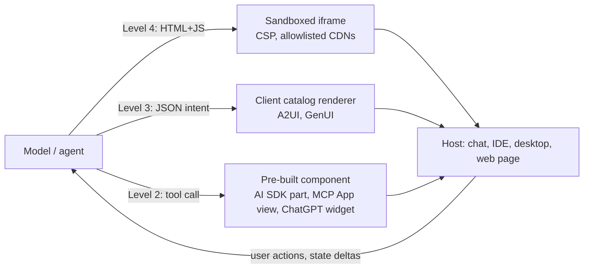

# Browser workspaces with generated UI: when the agent builds its own interface

*Research program: agent harnesses. Written 2026-09-08. Status: verified with notes.*

Sourcing note. This session's egress proxy allowed github.com, code.claude.com, platform.claude.com, npm's registry and blog.modelcontextprotocol.io, and blocked anthropic.com, claude.com, openai.com, developers.openai.com, blog.google, research.google, arxiv.org, notion.com, manus.im, figma.com, lovable.dev, replit.com, tryshortcut.ai, paradigmai.com and the press. The web-search budget was already exhausted when the task began. Facts marked "primary" were read directly. Facts marked "sibling doc" come from other documents in this corpus that cite the original source (`docs/01-primer/history.md`, `docs/02-landscape/*.md`, `docs/04-research/academic.md`, `docs/07-strategy/value-capture.md`). Facts marked "unverified" rest on the author's prior knowledge only. A verification and refresh pass on 2026-09-08 re-checked the highest-stakes claims against reachable primaries (code.claude.com, platform.claude.com, GitHub, the npm registry, blog.modelcontextprotocol.io, microsoft.com) and against search snippets where pages were blocked; corrections are marked in place and the findings are in "Verification notes (2026-09-08)" at the end.

## What this document answers

- What "the agent builds its own interface" means in practice, and the four distinct mechanisms that phrase now covers (generated code, declarative UI, pre-built widgets, and "UI on demand" app builders).
- What shipped by September 2026 across Claude artifacts, Cowork and Claude Design; ChatGPT canvas and apps; Google's generative UI; MCP Apps, AG-UI, A2UI and the Vercel AI SDK; v0, Lovable, Bolt and Replit; Manus; Notion Agents; spreadsheet agents; and canvas agents (tldraw, Figma Make).
- When an agent should build an interface versus use a fixed one, judged on consistency, trust and verification affordances, maturity and cost.
- A verdict for developers and one for non-technical users, and what the evidence does to the program's thesis.

## TL;DR

- **Generated UI is real and shipping as an output surface, not as a control surface.** Google reports raters preferred generated interactive pages over markdown 83% of the time, "when ignoring generation speed" (Apr 2026 paper; sibling doc) [15]. Claude Code now publishes live pages from a terminal session (beta June 2026; connector-backed live data, public links and editor roles July 2026, primary) [1][2]. The page runtime has since grown a shared realtime database, viewer presence and a page-side call to Claude (in-session capability roster, Sep 2026) [34], so a generated page can be a small stateful app. Nothing in the record lets a non-technical person *operate a long-running agent* through an interface the agent generated; the pages show results, tune parameters, hold shared state, and collect comments.
- **The industry split into two camps on safety.** Anthropic and OpenAI let the model write arbitrary HTML and JavaScript, then contain it (sandboxed `*.claudeusercontent.com` origin, strict CSP, four allowed CDNs; MCP Apps iframes with JSON-RPC over `postMessage`) [1][5][6]. Google's A2UI forbids generated code: agents emit declarative JSON against a client-owned component catalog, "safe like data, but expressive like code" [10]. The choice is between novelty with a blast-radius problem and consistency with an expressiveness ceiling.
- **The protocol layer converged fast.** MCP Apps, co-authored by Anthropic and OpenAI on the foundations of MCP-UI and the ChatGPT Apps SDK, reached a stable spec on Jan 26, 2026 and is supported by Claude, ChatGPT, VS Code, Goose and Postman (primary) [5][6][7]. AG-UI (CopilotKit, MIT, ~15.8k stars) and A2UI (Google-originated, Apache-2.0, ~16.3k stars, v1.0 release candidate) cover the developer-app side; A2UI can ride over AG-UI or A2A transports [9][10].
- **Maturity is uneven and mostly pre-1.0.** AG-UI's core package is at 0.0.59 on npm; A2UI is v0.9.1 with v1.0 as a release candidate and calls itself an "early public preview"; Flutter's GenUI SDK is "highly experimental"; Claude Design inside Claude Code is a "research preview" (Aug 17–21, 2026) [3][9][10][11]. The Vercel AI SDK is the exception: its `ai` package is at 7.0.93 with three maintained major lines [12].
- **Trust affordances exist but are thin.** Claude marks a public artifact `Content is user-generated and unverified.`, routes any live data call through the *viewer's* connectors after a per-viewer consent, and forbids public sharing of connector-backed pages; in auto mode "the classifier reviews the publish instead of prompting you, so Claude can publish a page without you seeing a prompt" [1]. MCP Apps' own launch post tells users to "proactively and thoroughly vet MCP servers before connecting them" [5].
- **"UI on demand" builders are where non-technical demand is proven, but the UI they build is the deliverable, not the harness.** Lovable reported $500M annualized revenue and "1 million new projects a week" (June 2026) and raised $400M at $13.3B (Aug 12, 2026); Replit Agent 4 (Mar 2026) produces "mobile apps, presentations, data visualisations" (sibling docs, secondary) [17][18][19]. Manus, the general agent with a visible cloud computer, reached ~$100M ARR and sold to Meta for more than $2B (Dec 30, 2025) before China ordered the deal unwound (Apr 27, 2026) [22][23].
- **Cost is measurable and non-trivial.** Anthropic's own docs: "a styled page is more token-intensive than the same content as terminal text" [1]. Google's preference result excludes latency [15]. Nobody publishes a cost-per-page number.
- **For the thesis:** the browser page has become a *second* surface attached to a CLI-shaped engine (Claude Code, Cowork, Codex), not a replacement default. The labs are building this surface themselves; a startup's opening is in the parts they leave thin: cross-vendor rendering (A2UI/AG-UI), verification and provenance on generated pages, and interfaces that steer agents rather than display their output.

## 1. Vocabulary for a newcomer

Analogy. A fixed interface is a printed form: the designer decided every field before you arrived. A generated interface is a clerk who draws a fresh form for your case, on the spot. The clerk can fit the form to you perfectly, or draw the wrong boxes, or draw something that looks like a form and is actually a trap. Everything in this document is about how much freedom to give the clerk and how the office checks the drawing.

Precisely, "the agent builds the interface" now means one of four things, in decreasing order of freedom:

```
 Freedom ▲   Level 4  Generated code      Model writes HTML/JS/CSS; host sandboxes it.
          │           (Claude artifacts, Gemini Dynamic View, MCP Apps views, tldraw make-real)
          │  Level 3  Declarative UI      Model emits JSON describing intent; client renders
          │           (A2UI, Flutter GenUI)  from its own trusted component catalog.
          │  Level 2  Templated widgets   Developer pre-builds components; model chooses
          │           (Vercel AI SDK tool parts, ChatGPT apps, ChatKit widgets, AG-UI)
          │  Level 1  Fixed UI + agent    Chat, canvas editor, spreadsheet; agent fills content
 Safety  ▼           (ChatGPT canvas, Cowork, Claude for Excel, Notion Agent)
```

Two more terms. A *host* is the application that displays the interface (claude.ai, ChatGPT, VS Code, your own React app). A *view* or *widget* is the piece the agent or tool supplies. The seam between them, what messages cross it and who is allowed to do what, is where every protocol below lives.



## 2. What shipped, by mechanism

### 2.1 Level 4: the model writes the page

**Claude artifacts (claude.ai).** Artifacts arrived with Claude 3.5 Sonnet in June 2024 as a side panel for code, documents and small apps (not fetched; unverified date) [26]. In June 2025 Anthropic let artifacts call Claude from inside the page, so a generated app could itself use the model, with usage counted against the *viewer's* subscription (not fetched; from memory, unverified) [27].

**Claude Code artifacts (June 2026).** The more important development for harness design is that the terminal agent got a browser surface. Anthropic's "What's new, week 25" (June 15–19, 2026) introduced artifacts as "a live, interactive page that Claude Code publishes from your session to a private URL on claude.ai, and it updates in place as the session keeps working," in beta on Team and Enterprise (primary) [2]; the reference page now lists Pro, Max, Team and Enterprise [1]. The design choices, all primary [1]:

- *Initiative.* "Claude may publish an artifact on its own when the output suits a page." Publishing goes through the permission mode; in auto mode "the classifier reviews the publish instead of prompting you."
- *Liveness.* The page "updates in place"; each publish is a version; the author picks which version viewers see.
- *Data.* A page can call MCP connectors "each time someone views it," but "the call uses the account of the person viewing the page, not the account of the person who published it," after a per-viewer consent. Actions with side effects "go through the account of whoever selects the control." Connector-backed pages "can't be shared to a public link on any plan."
- *Containment.* One self-contained page, no backend, no multiple routes; served from a sandboxed `*.claudeusercontent.com` origin under a strict CSP; scripts only from four CDNs (cdnjs, jsDelivr `/npm/`, Tailwind, jQuery); 16 MiB cap. The docs say a page "can't store data submitted through a form." The Artifact tool exposed in this very session advertises more: a per-artifact shared database, per-viewer private data under `data/users/me`, viewer identity, file assets, and letting the page ask Claude a question (in-session tool description, Sep 2026). Either the docs lag the feature or it is gated; unverified.
- *Collaboration.* Org-shared pages take comment threads; Claude reads and replies only to threads a person activates with "Send to Claude" or `@claude`; an unattended session auto-replies to at most 60 sent comments per hour.
- *Provenance.* A viewer outside the org sees the label `Content is user-generated and unverified.` instead of the author's name. Publishing, sharing and deleting are logged as `claude_artifact_*` audit events; a Compliance API lists and deletes artifacts.
- *Consistency.* "Claude applies a built-in design skill when it builds an artifact" and reads design tokens from `CLAUDE.md`, with the precedence "your design system as higher precedence than its own choices, and your prompt as higher precedence than both."
- *Cost.* "Generating an artifact uses output tokens like any other response, and a styled page is more token-intensive than the same content as terminal text."

The changelog also shows the same tool running inside Cowork: v2.1.257 "Fixed the Artifact tool's first call failing ... in some Cowork sessions" (primary) [4].

**Claude Design and `/design` (Aug 2026).** Week 34 (Aug 17–21, 2026) added `/design`, a research preview that "brings Claude Design's artboard workflow into the CLI and Claude Code Desktop, built on artifacts": Claude drafts editable artboards on one canvas, the user picks one and tweaks it, "then have Claude implement it" (primary) [3]. The skill description in this session describes the editor: click-to-select, a properties panel, inline text editing, undo/redo, Save publishes a new version, otherwise view-and-export to PNG or PDF. This is a Level 4 page whose *content* is a Level 1 editor: the agent generates a fixed, familiar tool. Claude Design's standalone launch date and pricing could not be verified (claude.com blocked).

**Cowork.** Cowork is the non-developer tab of the Claude desktop app (research preview for Max on macOS Jan 12, 2026; GA on all paid plans Apr 9, 2026; web and mobile beta Jul 7, 2026; sibling doc with Anthropic and press citations) [24]. The Claude Code docs describe the desktop app as three tabs, "Chat for conversations, Cowork for Dispatch and longer agentic work, and Code for software development," state that "Claude Code runs the same underlying engine everywhere," and say Cowork sessions "load the skills enabled for your claude.ai account" rather than local files (primary) [4][29][30]. Dispatch, a phone-driven conversation, routes bugs and PRs to Code sessions while "research, document editing, and spreadsheet work stay in Cowork" [4]. Cowork's interface is fixed (files, connectors, chat); its generated-UI power comes from the shared Artifact tool. The desktop Code tab also has a Browser pane where "Claude can start a dev server and open it in the Browser pane to verify its changes" after every edit, which is generated UI used as a *verification* surface for the agent itself [4].

**Google's generative UI.** Announced with Gemini 3 in Nov 2025 and shipped as "Dynamic View" in the Gemini app and AI Mode; the paper (Leviathan, Valevski et al., arXiv Apr 2026) describes prompting, tools and post-processing with no UI-specific training, releases the PAGEN set of expert-crafted pages, and reports generated HTML/CSS/JS preferred over markdown 83% of the time "when ignoring generation speed" (sibling doc; blog and arXiv blocked here) [15]. Google reportedly said at I/O in May 2026 that generative UI would become free in Search that summer (secondary) [15]. An independent Jan 2026 study of LLM-designed GUIs found good layouts but "challenges in meeting accessibility standards and providing interactive functionality" [16]. Google's Gemini app also has a fixed "Canvas" editor comparable to ChatGPT's (Mar 2025; not fetched).

**tldraw.** The original Level 4 demo was tldraw's "make real" (draw a sketch, get working HTML; forked from `draw-a-ui`, Nov 2023 from memory); the repository was archived on Feb 20, 2026 (primary) [13]. tldraw's SDK README now advertises "canvas primitives for building with LLMs," an "Agent starter kit: AI agents that read, interpret, and modify canvas content," and a "Chat starter kit: canvas-powered AI chat where users sketch, annotate, and mark up images" (primary) [14]. The agent template gives the model the viewport, selected shapes, a screenshot and simplified shape descriptions, and lets it create, edit, align and delete shapes, keep a task list and schedule follow-up work, with Claude recommended (primary) [14]. The canvas here is a *shared workspace* the agent edits rather than a page it generates.

### 2.2 Level 3: declarative UI against a catalog

**A2UI.** Google's answer to the sandbox problem: "agents send a declarative JSON format describing the intent of the UI. The client application then renders this using its own native component library" (primary) [10]. Announced in Dec 2025 (Google Developers Blog; not fetched, date from memory). Status on Sep 8, 2026: v0.9.1 stable, v1.0 release candidate, v0.8 legacy; the README says the spec and implementations "are functional but are still evolving" in an "early public preview"; renderers for Flutter (via the GenUI SDK), Lit, Web and Angular, with React, Jetpack Compose, SwiftUI and a REST transport on the roadmap; Apache-2.0; ~16.3k stars; interoperable with A2A and AG-UI [10]. Flutter's GenUI SDK, which uses A2UI v0.9 internally, is labelled "highly experimental" with the warning that "the API will change (sometimes drastically)" [11]. The trade is explicit: the agent can only ask for what the catalog contains.

### 2.3 Level 2: pre-built widgets the model chooses

**MCP Apps.** The Model Context Protocol's UI extension, announced Jan 26, 2026 as a joint Anthropic–OpenAI standard built on MCP-UI and the ChatGPT Apps SDK (primary) [5]. A tool declares `_meta.ui.resourceUri`; the server serves a bundled HTML app at a `ui://` resource; the host renders it in a sandboxed iframe and talks to it with JSON-RPC over `postMessage`. Security relies on "iframe sandboxing, pre-declared templates for host review, auditable JSON-RPC messages, and optional user consent for tool calls" [5]. Hosts: Claude web and desktop, Goose, VS Code Insiders, ChatGPT (the same week), with JetBrains, AWS Kiro and Antigravity planned [5]; the repository lists ChatGPT, Claude, VS Code, Goose, Postman, MCPJam, mcp-use and Alpic [6]. Spec version 2026-01-26 is marked stable; the npm package is at 2.0.0 after 19 releases; ~2.8k stars [6]. MCP-UI's own README says its packages are now "fully compliant with the MCP Apps specification" and notes ChatGPT still needs an Apps SDK adapter [7]. Note the layering: the *view* is Level 4 code, but the *host* only sees a pre-declared template, so from the host's side it behaves like a Level 2 widget.

**ChatGPT apps and the Apps SDK.** OpenAI launched apps in ChatGPT on Oct 6, 2025 with consumer partners such as Canva, Figma, Spotify and Zillow (announcement not fetched; names from memory) [28]; submissions were reviewed from Dec 2025 and selling digital goods was "not yet allowed" at launch (sibling doc) [25]. The example repository shows the shape: an MCP server plus a Vite-built UI bundle, `_meta.ui.resourceUri` for the widget, `widgetSessionId` to persist widget state across turns, and a `window.openai` bridge exposing `toolInput`, `toolOutput`, `displayMode`, `theme`, `widgetState`, `setWidgetState`, `callTool`, `requestDisplayMode`, `openExternal` and `sendFollowUpMessage` (primary) [8]. ChatKit, OpenAI's embeddable chat component (Apache-2.0), offers "rich interactive widgets rendered directly inside the chat" for developers' own apps (primary) [8]. The contrast case: AgentKit's visual Agent Builder, launched with ChatKit in Oct 2025, was slated for wind-down on June 3, 2026 (secondary, sibling doc) [24], evidence that a drag-and-drop *agent* builder failed where a *widget* SDK survived.

**AG-UI.** "An open, lightweight, event-based protocol that standardizes how AI agents connect to user-facing applications," maintained by CopilotKit, MIT, ~15.8k stars (primary) [9]. The agent emits a typed event stream over SSE, WebSockets or webhooks: run and step lifecycle, text deltas, tool-call start/args/end/result, `StateSnapshot` and `StateDelta` (RFC 6902 JSON Patch), messages and activity snapshots, reasoning events, and subagent start/finish/error for attribution [9]. Integrations listed: LangGraph and CrewAI as partners; Microsoft Agent Framework, Google ADK, AWS Strands, Mastra, Pydantic AI, Agno, LlamaIndex and AG2 first-party; Claude Agent SDK and Claude Managed Agents community-maintained [9]. The core npm package is 0.0.59, first published in April 2025 (registry timestamp). AG-UI does not generate UI; it makes agent state legible enough that a developer's fixed UI can render it, which is the precondition for a *control* surface.

**Vercel AI SDK.** The README describes "a set of hooks that help you build chatbots and generative user interfaces"; `useChat` works across Next.js, React, Svelte and Vue, and tool invocations stream as typed message parts with states such as `input-available` and `output-available` that the developer maps to components (primary) [12]. The `ai` package is at 7.0.93 with `ai-v5` (5.0.253) and `ai-v6` (6.0.277) still maintained [12]; AI SDK 7 was announced at Vercel Ship on June 17, 2026 (sibling doc, secondary) [19]. AI Elements adds "a component library built on top of shadcn/ui to help you build AI-native applications faster" [12]. The sketch below is the whole idea: the model does not draw anything; it picks a tool, and the developer already decided what that tool looks like.

```tsx
// Level 2 generative UI: tool parts mapped to components (Vercel AI SDK style)
const { messages } = useChat();
return messages.map(m => m.parts.map(part => {
  if (part.type === 'tool-getWeather') {
    if (part.state === 'input-available') return <Skeleton />;
    if (part.state === 'output-available') return <WeatherCard {...part.output} />;
  }
  if (part.type === 'text') return <Markdown>{part.text}</Markdown>;
}));
```

### 2.4 Level 1: fixed workspaces the agent fills

**ChatGPT canvas.** Launched Oct 2024 as a side-by-side editor for writing and code with inline edits and shortcuts; later versions render React and HTML previews (help page and announcement not fetched; unverified) [28]. It is a fixed tool with an agent inside it, the same shape as Cowork, Google's Canvas, and Claude's `/design` editor.

**Notion Agents.** Notion shipped an agent inside its workspace in Sept 2025 and custom agents later in 2025 (dates from memory; notion.com blocked). What is verifiable here is the API shape exposed to this session by Notion's MCP server: `search_agents` (favorites or workspace), `spawn_session` on a "published Custom Agent" addressed as `agent://<spaceId>/<agentId>`, `wait_session` and `send_message_to_session` (primary, tool schemas observed Sep 2026) [21]. Notion's agent generates pages and databases, which are Notion's fixed UI primitives; the agent never draws a new control, it fills existing ones. Notion was also named as a launch customer of Claude Managed Agents (Apr 2026; secondary, sibling doc) [24].

**Spreadsheets.** The spreadsheet is the most successful "generated UI" in computing history: every cell is state, every formula is provenance, and the user already knows how to verify it. Three products treat it as the agent's harness. Claude for Excel launched as a research preview in Oct 2025 as a sidebar that reads and edits workbooks with cell-level explanations (from memory; anthropic.com blocked; unverified). Anthropic's platform release notes confirm the adjacent capability: the Skills API gained support for `.xlsx`, `.pptx` and `.docx` on June 9, 2026 (primary) [31], and Dispatch keeps "spreadsheet work" in Cowork (primary) [4]. Shortcut markets an agent that lives inside Excel and claims to beat human competitors on Excel World Championship cases; Paradigm markets an AI-native spreadsheet in which agents fill cells (both sites blocked; claims and funding unverified). Microsoft's "Copilot Cowork" reached general availability with metered billing in June 2026 (secondary, sibling doc) [25]. The harness insight is that the grid makes the agent's work inspectable at cell granularity, which no generated HTML page currently offers.

**Manus.** Launched Mar 2025 as a cloud "computer" whose steps a general audience could watch; ~$100M ARR by Dec 2025; acquired by Meta for more than $2B on Dec 30, 2025; on Apr 27, 2026 China's foreign-investment review ordered the completed deal unwound, and later reports say Manus was separated from Meta by Aug 2026 (sibling doc, CNBC and legal-firm sources) [22][23]. Manus's surface is a fixed split view: chat on one side, the agent's browser, terminal and files on the other, plus generated deliverables such as slides and websites (from memory; manus.im blocked; unverified). It is the strongest evidence that non-technical users will pay for *watching* an agent work, and a warning that a harness company's exit is exposed to policy.

**Figma Make.** Announced at Config in May 2025 as prompt-to-prototype inside Figma, reportedly built on Claude (from memory; figma.com and help.figma.com blocked; unverified). It belongs with v0 and Lovable below: the agent generates an app, then a fixed design tool edits it.

### 2.5 "UI on demand": v0, Lovable, Bolt, Replit

These products generate whole applications, so they are the strongest existence proof that Level 4 generation works at scale. The numbers, all from sibling docs citing press and vendor posts: Lovable reported $500M annualized revenue and "1 million new projects a week" on June 9, 2026 and raised $400M at $13.3B on Aug 12, 2026 [17][19]; Replit Agent 4 (Mar 11, 2026) added parallel tasks, design control and "outputs beyond code: mobile apps, presentations, data visualisations," and Replit raised $400M at $9B (secondary) [18][19]; Bolt runs Node in the browser through WebContainers on an MIT base repository (~16.5k stars, primary) and reached ~$40M ARR in its first months (secondary) [20][19]; v0's Platform SDK lets other software call v0 to generate UI (`chats.create`, `getPreview`, `v0@canary`; primary) [12]. What they do not do is generate the *operator's* interface: each is a fixed workspace (chat, preview, file tree, deploy button) whose product is a generated app for someone else. Sibling analysis notes their models are undisclosed and their permission model is "platform-bounded" [19].

## 3. Evaluation

### 3.1 When should the agent build the interface?

| Task shape | Fixed UI (Level 1–2) | Generated UI (Level 3–4) | Evidence |
|---|---|---|---|
| Show a result that text conveys badly (diff walkthrough, dashboard, option comparison) | Fine if a widget exists | **Yes**: this is the documented sweet spot | Anthropic's artifact use cases; Google's 83% preference [1][15] |
| Tune parameters the user cannot name (easing curves, thresholds) | Poor | **Yes**: sliders bound to the thing being adjusted | Anthropic "Tune with interactive controls" pattern [1] |
| Approve an action with side effects | **Yes**: a known, audited control | Risky: the page acts "through the account of whoever selects the control" | Artifact connector rules [1]; MCP Apps consent model [5] |
| Steer a long-running agent (pause, redirect, reprioritize) | **Yes** (Codex app, Claude Desktop, Remote Control) | Not shipped by anyone; research measures page preference, not task control | Sibling academic doc [15][16] |
| Transactional flows (checkout, booking) | **Yes**: vendor-built widget in ChatGPT | No | Apps SDK design [8] |
| Collaborative editing over time | Fixed editor (canvas, spreadsheet, Notion) | Generated page that *hosts* a fixed editor (`/design`) | [3][21] |
| Reusable internal tool | Deploy real software | Explicitly out of scope: "For a hosted internal tool with a backend, deploy it on your own infrastructure instead" | [1] |

The rule the evidence supports: generate the *view*, keep the *controls* fixed. Every shipped system that lets a page take actions bounds them to a pre-declared list (MCP Apps templates, artifact connector declarations, A2UI catalogs).

### 3.2 Consistency versus novelty

Level 4 gives novelty and pays in consistency; Anthropic's answer is a design skill plus design tokens read from `CLAUDE.md`, so the model's taste yields to the project's system [1]. Level 3 gives consistency by construction (the client's own widgets) and pays in expressiveness; A2UI's roadmap is mostly *more renderers*, which is the tell that the catalog is the bottleneck [10]. Level 2 has neither problem because a human designed every component; it also cannot surprise anyone. The independent finding that LLM-designed GUIs struggle with accessibility and "interactive functionality" [16] applies to Level 4 only; Levels 2 and 3 inherit whatever accessibility the catalog has.

### 3.3 Trust and verification affordances

What exists, all primary unless noted:

- **Provenance labels.** `Content is user-generated and unverified.` on Claude artifacts viewed from outside the org [1]. No equivalent label is documented for ChatGPT widgets or Gemini Dynamic View in the sources reached.
- **Containment.** Sandboxed origins and CSP (Claude); sandboxed iframes with JSON-RPC (MCP Apps, ChatGPT); no code at all (A2UI). All three are in production or preview [1][5][10].
- **Consent and identity on data access.** Artifact connector calls run as the viewer, after a consent prompt, with credentials never visible to the page [1]. MCP Apps offers "optional user consent for tool calls" [5].
- **Versioning and audit.** Artifact versions, an audit log, retention policies and a Compliance API [1].
- **Human review loops.** Comments on artifacts with explicit activation before Claude may reply [1]; MCP Apps' "pre-declared templates for host review" [5].

What is missing: any affordance that shows *why* the page says what it says (cell-level provenance is the spreadsheet's advantage and no HTML surface copies it); any independent audit of generated pages for injection (a page can invoke a connector tool with side effects, so a poisoned data source that reaches the page's content is a live risk the docs do not discuss); and any evaluation of whether users can tell a correct generated dashboard from a plausible wrong one. Auto mode's classifier approving a publish "without you seeing a prompt" widens the blast radius from "what the agent ran" to "what the agent showed other people" [1].

### 3.4 Technical maturity

| System | Status on 2026-09-08 | Source |
|---|---|---|
| Claude Code artifacts | Beta June 2026; now on all paid plans; not on Bedrock, Vertex or Foundry; off by default in the Agent SDK | [1][2] |
| `/design` (Claude Design in Claude Code) | Research preview, Aug 2026 | [3] |
| Cowork | GA Apr 2026 (desktop); web and mobile beta Jul 2026 | [24] |
| Gemini Dynamic View | Shipped Nov 2025; paper Apr 2026 | [15] |
| MCP Apps | Spec 2026-01-26 stable; npm 2.0.0; eight hosts listed | [5][6] |
| ChatGPT Apps SDK / ChatKit | Live since Oct 2025; MCP Apps support Jan 2026; monetization status unverified | [5][8][25] |
| AG-UI | Production integrations across nine frameworks; core package 0.0.59 | [9] |
| A2UI | v0.9.1 stable, v1.0 RC, "early public preview" | [10] |
| Flutter GenUI | "Highly experimental" | [11] |
| Vercel AI SDK | 7.0.93; three major lines maintained | [12] |
| tldraw agent kit | Shipped starter kit; make-real archived Feb 2026; production licence required | [13][14] |

### 3.5 Cost

Three costs, only one quantified. *Tokens*: Anthropic says styled pages cost more output tokens than text, and that inline CSS, JavaScript and data-URI images are the main contributors; its advice is SVG over raster, no unneeded interactivity, and summarizing datasets [1]. *Latency*: Google's headline preference number explicitly ignores generation speed [15]. *Blast radius*: a generated page that other people open is a distribution event; Anthropic's answer is per-org toggles for artifacts, public sharing and connector calls, separately [1]. On the builder side, Replit bills by effort and Lovable by credits (sibling doc) [19]; neither publishes cost per generated screen.

## 4. Verdicts

**Developers.** Generated UI is now a standard second surface on the terminal engine, and it is worth using for exactly what the docs say: walkthroughs, dashboards, option comparisons, parameter tuning, and progress boards that a teammate can open instead of reading a transcript [1]. The Browser pane that lets the agent verify its own frontend is arguably the larger productivity change, because it closes the loop rather than decorating the output [4]. For developers *building* agent products, the protocol choice is settled enough to act on: MCP Apps for anything that should render inside Claude or ChatGPT; AG-UI plus the AI SDK for a product with its own front end; A2UI if the product spans native platforms and cannot run generated code. None of these replaces the terminal; each attaches to it.

**Non-technical users.** The evidence says they want to *see* the agent work (Manus, Cowork, Replit's non-code outputs) and will pay for generated deliverables (Lovable's revenue), but nothing shipped lets them *run* an agent through an interface it made for them. The surfaces that reach them are fixed: Cowork's files-and-connectors view, ChatGPT's canvas, Notion's pages, the spreadsheet grid. Generated pages are what they receive, with a label saying the content is unverified and no way to check it short of asking the agent again. The spreadsheet is the exception that shows what a verifiable generated surface would look like, and it is decades old.

## What this means for the thesis

**Supports.**
- The labs agree the harness needs a surface beyond the CLI and desktop app: Anthropic built a browser page generator into the CLI and made it the substrate of Claude Design; OpenAI made apps in ChatGPT; Google made pages the default answer format [1][3][5][15]. "Neither a CLI nor a desktop app is the default" is true for what people *look at*.
- Demand from non-developers is proven in dollars (Lovable, Replit, Manus) [17][18][22], and the harness parts those products lack (verification, permissions, steering) are visible gaps.
- The consistency-versus-safety split (generated code with sandboxes versus declarative catalogs) is unresolved, and the cross-vendor rendering layer (A2UI, AG-UI) is pre-1.0 and not owned by a lab [9][10]. That is a real opening.

**Contradicts.**
- Every generated-UI surface in this document is bolted onto a CLI-shaped engine or a fixed workspace. Cowork is "the same engine with a graphical interface" [30]; artifacts are a tool call from a terminal session [1]. The default *runtime* is not being reimagined; the display is.
- Generated UI is an output surface. No shipped product or study shows a generated interface used to control a long-running agent, and the one visual agent-builder from a lab (AgentKit's Agent Builder) was wound down within eight months (secondary) [24]. The thesis's stronger claim, that the harness itself should be built on the fly for the user, has no evidence here.
- The labs own the trusted host. Artifacts require a claude.ai login, run on Anthropic infrastructure, and are unavailable through Bedrock, Vertex and Foundry [1]; ChatGPT apps run inside ChatGPT. A startup's generated UI has to render inside someone else's sandbox or ship its own host.

**Nuance.**
- The technically honest position is "generate the view, fix the controls." A product that gave non-technical users a generated view *plus* fixed, auditable controls for steering and approval, with spreadsheet-grade provenance, would be new. Nobody in this document has built it.
- The spreadsheet vendors (Claude for Excel, Shortcut, Paradigm, Copilot Cowork) may be closer to the reimagined non-technical harness than any generated-page product, because the grid already solves verification. This document could not verify their current state.

## Open questions and unverified claims

- Claude artifacts' June 2024 origin, AI-powered artifacts (June 2025) and viewer-side billing: from memory, anthropic.com blocked [26][27].
- The in-session Artifact tool advertises a shared database and per-viewer private data; the public docs say a page has no backend. Which is current is unverified [1].
- Claude Design's standalone launch date, availability and pricing: unverified (claude.com blocked). Only its research preview inside Claude Code (Aug 17–21, 2026) is primary [3].
- ChatGPT canvas dates and features, Apps SDK launch partners, and the 2026 status of app monetization and the directory: from memory or sibling docs; openai.com blocked [25][28].
- Google generative UI facts (Nov 2025 launch, 83% preference, PAGEN, I/O 2026 statement) are taken from the sibling academic document, which cited the arXiv paper and blog; not re-read here [15]. A2UI's Dec 2025 announcement date is from memory.
- Manus's interface description, Notion Agent and custom-agent launch dates, Claude for Excel's Oct 2025 preview, Shortcut's Excel World Championship claim, Paradigm's product and funding, and Figma Make's May 2025 launch and Claude dependency are unverified; all sites blocked.
- Revenue figures for Lovable, Replit, Bolt, v0 and Manus are secondary (press) via sibling docs; Replit's ARR and v0's are flagged unverified there too [17][18][19].
- AG-UI's "first published April 2025" is derived from an npm registry timestamp (1746012988) and may reflect a republish rather than the first release [9].
- Open: does any host label generated pages as unverified other than Claude? Do any users detect wrong-but-plausible generated dashboards? What does a generated page cost in tokens at typical sizes? No source answers these.

## Sources

1. Claude Code docs, "Share session output as artifacts", https://code.claude.com/docs/en/artifacts, read Sep 2026 (primary)
2. Claude Code docs, "Week 25 · June 15–19, 2026", https://code.claude.com/docs/en/whats-new/2026-w25, Jun 2026 (primary)
3. Claude Code docs, "Week 34 · August 17–21, 2026" (`/design` research preview), https://code.claude.com/docs/en/whats-new/2026-w34, Aug 2026 (primary)
4. Claude Code docs, "Desktop application", https://code.claude.com/docs/en/desktop, read Sep 2026 (primary); anthropics/claude-code CHANGELOG.md v2.1.257 entry, https://github.com/anthropics/claude-code/blob/main/CHANGELOG.md, Sep 2026 (primary)
5. MCP blog, "MCP Apps: Bringing interactive UI to AI conversations", https://blog.modelcontextprotocol.io/posts/2026-01-26-mcp-apps/, Jan 26, 2026 (primary)
6. modelcontextprotocol/ext-apps repository and spec 2026-01-26, https://github.com/modelcontextprotocol/ext-apps, read Sep 2026 (primary); npm registry `@modelcontextprotocol/ext-apps` (2.0.0), https://registry.npmjs.org/@modelcontextprotocol/ext-apps, Sep 2026
7. MCP-UI-Org/mcp-ui repository, https://github.com/MCP-UI-Org/mcp-ui, read Sep 2026 (primary)
8. openai/openai-apps-sdk-examples, https://github.com/openai/openai-apps-sdk-examples, read Sep 2026 (primary); openai/chatkit-js, https://github.com/openai/chatkit-js, read Sep 2026 (primary)
9. ag-ui-protocol/ag-ui README and `docs/concepts/events.mdx`, https://github.com/ag-ui-protocol/ag-ui, read Sep 2026 (primary); npm registry `@ag-ui/core` (0.0.59), https://registry.npmjs.org/@ag-ui/core, Sep 2026
10. google/A2UI repository and specification folder, https://github.com/google/A2UI, read Sep 2026 (primary)
11. flutter/genui repository, https://github.com/flutter/genui, read Sep 2026 (primary)
12. vercel/ai README, https://github.com/vercel/ai, read Sep 2026 (primary); npm registry `ai` (7.0.93; tags ai-v5, ai-v6), https://registry.npmjs.org/ai, Sep 2026; vercel/ai-elements, https://github.com/vercel/ai-elements, read Sep 2026; vercel/v0-sdk, https://github.com/vercel/v0-sdk, read Sep 2026
13. tldraw/make-real (archived Feb 20, 2026), https://github.com/tldraw/make-real, read Sep 2026 (primary)
14. tldraw/tldraw README and `templates/agent`, https://github.com/tldraw/tldraw, https://github.com/tldraw/tldraw/tree/main/templates/agent, read Sep 2026 (primary)
15. Leviathan, Valevski et al., "Generative UI: LLMs are Effective UI Generators", https://arxiv.org/abs/2604.09577, Apr 2026; Google Research blog, https://research.google/blog/generative-ui-a-rich-custom-visual-interactive-user-experience-for-any-prompt/, Nov 2025; Search Engine Journal on I/O 2026 (secondary). All via `docs/04-research/academic.md`; not fetched here
16. "Qualitative Evaluation of LLM-Designed GUI", https://arxiv.org/abs/2601.22759, Jan 2026 (via `docs/04-research/academic.md`; not fetched)
17. TechCrunch, "Lovable says it has hit $500M in annualized revenue, with 1 million new projects a week", https://techcrunch.com/2026/06/09/lovable-says-it-has-hit-500m-in-annualized-revenue-with-1-million-new-projects-a-week/, Jun 2026 (via `docs/07-strategy/value-capture.md`); TechCrunch, "Lovable confirms new $13.3B valuation, raises another $400M", https://techcrunch.com/2026/08/12/lovable-confirms-new-13-3b-valuation-raises-another-400m/, Aug 2026 (via `docs/02-landscape/developer-harnesses-independent.md`)
18. Replit, "Live from Replit HQ: Agent 4 Launch Pt. 1", https://replit.com/blog/live-from-hq-agent4-launch-pt1, Mar 2026; Latent Space, "Replit Agent 4: The Knowledge Work Agent", https://www.latent.space/p/ainews-replit-agent-4-the-knowledge, Mar 2026 (both via sibling doc; not fetched)
19. `docs/02-landscape/developer-harnesses-independent.md` (this corpus), Sep 2026, for Replit, Bolt, v0 and AI SDK 7 figures and their sources (Sacra, Bloomberg, makeanapplike; secondary)
20. stackblitz/bolt.new repository, https://github.com/stackblitz/bolt.new, read Sep 2026 (primary)
21. Notion MCP server tool schemas (`notion-search-agents`, `notion-spawn-session`, `notion-wait-session`, `notion-send-message-to-session`), observed in this session, Sep 2026 (primary)
22. CNBC, "Meta acquires intelligent agent firm Manus", https://www.cnbc.com/2025/12/30/meta-acquires-singapore-ai-agent-firm-manus-china-butterfly-effect-monicai.html, Dec 30, 2025 (via `docs/01-primer/history.md`; not fetched)
23. CNBC, "Why China blocked the Meta–Manus deal", https://www.cnbc.com/2026/04/28/china-meta-manus-ai-deal.html, Apr 2026; O'Melveny, "China unwinds Meta's acquisition of Manus", https://www.omm.com/insights/alerts-publications/china-unwinds-meta-s-acquisition-of-manus-implications-for-cross-border-ai-transactions/, 2026 (via `docs/01-primer/history.md`; not fetched)
24. `docs/01-primer/history.md` and `docs/02-landscape/developer-harnesses-labs.md` (this corpus), Sep 2026, for Cowork dates (Simon Willison, Jan 12, 2026; Anthropic "Making Claude Cowork ready for enterprise", Apr 9, 2026; "Claude Cowork on web and mobile", Jul 7, 2026), AgentKit Agent Builder wind-down (secondary) and Managed Agents customers
25. `docs/07-strategy/value-capture.md` (this corpus), Sep 2026, citing OpenAI, "Introducing apps in ChatGPT and the new Apps SDK", https://openai.com/index/introducing-apps-in-chatgpt/, Oct 2025, and Neowin on Microsoft Copilot Cowork GA, Jun 2026 (secondary)
26. Anthropic, "Introducing Claude 3.5 Sonnet" (artifacts launch), https://www.anthropic.com/news/claude-3-5-sonnet, Jun 2024 (not fetched; unverified)
27. Anthropic, "Build and host AI-powered apps with Claude, no deployment needed", https://www.anthropic.com/news/claude-powered-artifacts, Jun 2025 (not fetched; unverified)
28. OpenAI, "Introducing canvas", https://openai.com/index/introducing-canvas/, Oct 2024 (not fetched; unverified); OpenAI Apps SDK docs, https://developers.openai.com/apps-sdk/ (blocked)
29. Claude Code docs, "Skills" ("Skills in Cowork and cloud sessions"), https://code.claude.com/docs/en/skills, read Sep 2026 (primary)
30. Claude Code docs, "Platforms and integrations", https://code.claude.com/docs/en/platforms, read Sep 2026 (primary)
31. Claude Platform release notes (Managed Agents Apr 8, 2026; Skills API xlsx/pptx/docx Jun 9, 2026; computer use out of beta Aug 19, 2026), https://platform.claude.com/docs/en/release-notes/overview, read Sep 2026 (primary)
