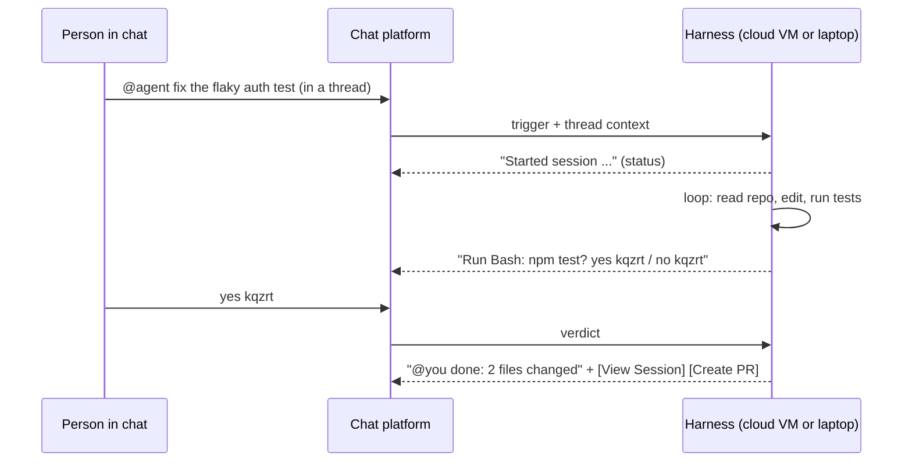

# Messaging Surfaces: The Agent as a Coworker You Message

*Research program: agent harnesses. Written 2026-09-08. Status: verified with notes.*

**Sourcing note.** The session's web-search budget was exhausted before this task began, and the network proxy blocked most vendor domains (anthropic.com, openai.com, slack.com, learn.microsoft.com, whatsapp.com, poke.com, the four email vendors, and the security-research sites). Numbered sources were read directly on 2026-09-08 from the reachable primary hosts: `code.claude.com`, GitHub (repositories, docs, issues, advisories, API search), and `microsoft.com` blogs. Claims marked **[unverified]** come from background knowledge and are listed again under "Open questions." A verification pass on 2026-09-08 (see "Verification notes" at the end) confirmed or corrected most of them; claims still marked **(unverified)** could be checked only against search snippets, or not at all.

## What this document answers

- Which agent tasks fit a messaging surface (Slack, Teams, WhatsApp, Telegram, iMessage, Discord, email) and which do not.
- How shipping products handle the asynchronous pattern, approvals inside chat, attachments and artifacts, identity, group contexts, and security (who may message the agent, injection via messages).
- What adoption evidence exists as of September 2026, and what it means for the thesis that the default harness must be reimagined for developers and for non-technical people.

## TL;DR

- **Every serious messaging integration is a thin client to a harness that lives elsewhere.** Claude in Slack spawns a cloud sandbox [1]; Claude Code "channels" push chat messages into a session on your laptop [3]; OpenClaw is a self-hosted gateway that owns the chat connections [12]. The chat carries triggers, context, status, approvals, and links. It does not run the loop.
- **The surface's value is context plus asynchrony.** Anthropic: use Slack "when context already exists in a Slack discussion, you want to kick off a task asynchronously, or you're collaborating with teammates who need visibility"; use the web "when you need to upload files, want real-time interaction during development, or are working on longer, more complex tasks" [1].
- **Approvals inside chat are text-grade.** Claude Code relays permission prompts to Telegram/Discord/iMessage and accepts `yes abcde` / `no abcde` [4]; OpenClaw routes exec approvals to a DM with numeric approver IDs and defaults to deny [16][20]. Nobody offers scoped, batched, or reversible approvals in chat.
- **Security is the weakest link, and the vendors say so.** "An ungated channel is a prompt injection vector" [4]; "Claude may follow directions from other messages in the context" [1]; "Everyone who can operate an agent can make it do anything that agent can do" [22]. Observed: ~900+ OpenClaw gateways exposed on Shodan (2026-01-25) [24]; a skill-registry malware wave (2026-01-31 to 02-03) [27]; at least 28 OpenClaw advisories published on 2026-06-30 alone, within roughly 650 published between 2026-01-31 and 2026-06-30, many of them authorization bypasses in message handling [23].
- **Identity is unresolved.** Per-user delegation (Claude Code in Slack) is being retired for organizations in favor of a shared identity (Claude Tag) [1][2]; self-hosted gateways run as one owner and call ownership "usability features, not security boundaries" [22].
- **Platform owners can switch the surface off.** Copilot left WhatsApp on 2026-01-15 because of "updates to WhatsApp's platform policies prohibiting all LLM chatbots" [37]; OpenAI's 1-800-ChatGPT left the same day for the same policy change [43]. DIY WhatsApp bridges use a reverse-engineered client [29] and report "account bans" [26].
- **Adoption is strong for developers, unproven for everyone else.** OpenClaw: 389,231 stars ten months after creation (2025-11-24) [12][40]; 562 GitHub repos match "claude code telegram bot" [40]. Microsoft 365 Copilot's "30 million paid seats" (2026-07-30) is Copilot, not agents addressed in Teams chat [36]. Meta AI reported 1 billion monthly users across Meta's apps in May 2025 [42]; Poke claimed about 100 million messages before Cognition acquired it on 2026-07-23 [47] (press figures, unverified); no Slack usage numbers could be verified.
- **Verdict:** messaging is an excellent secondary surface (dispatch, notify, approve, quick questions) and a plausible primary surface for narrow non-technical tasks, not a complete harness surface. This supports the thesis's premise (the harness is the bottleneck) and contradicts its strong form (chat as the default).

## 1. The concept, for engineers new to agents

**Analogy.** An agent on a messaging surface is a contractor you text. You send "fix the login bug," they work somewhere you cannot see, and they text back a question ("can I delete this table?") or a result ("PR is up"). The conversation is the contract, the status board, and the receipt. It is not the workshop.

**Precisely.** Of the seven harness parts, the messaging surface owns only part 6. The loop (1), tools (2), runtime (5), and orchestration (7) run in a vendor VM, on your laptop, or in a gateway. Context (3) is split: thread history is scraped as input, the transcript lives elsewhere. Permissions (4) are split too: the platform decides who can talk to the bot, the harness decides what the bot may do, and approvals come back as messages.

```
   Chat app (Slack / Telegram / iMessage / Teams)            Harness (somewhere else)
   +------------------------------------------+             +------------------------------+
   | @agent "fix the login bug in auth.ts"    | --trigger-->| Loop: model <-> tools         |
   | thread history (N messages, any author)  | --context-->| Runtime: cloud VM | laptop    |
   | "Claude wants to run Bash: rm -rf dist   | <-approval--| Permissions: relay prompt     |
   |  reply yes kqzrt / no kqzrt"             | --verdict-->|                              |
   | status posts ... "@you done"             | <--result---| Artifacts: PR, session URL    |
   | [View Session] [Create PR] [Change Repo] |             | Memory: transcript (not chat) |
   +------------------------------------------+             +------------------------------+
```

Four architectures ship today; where the harness lives decides durability, security, and who can use it.

| Architecture | Examples | Loop runs on | Durability | Who hosts security |
|---|---|---|---|---|
| Cloud-spawn | Claude Code in Slack, Claude Tag [1][2]; Codex cloud tasks from Slack [30] | Vendor sandbox per task | Survives closing the laptop [8] | Vendor |
| Local bridge | Claude Code channels [3]; Dispatch [6]; DIY bridges such as cc-connect [40] | Your machine | "Events only arrive while the session is open" [3] | You |
| Self-hosted gateway | OpenClaw, 20+ channels [12][13]; nanobot [40] | An always-on process you run | As durable as your box | You |
| Platform-native assistant | Meta AI in WhatsApp (1 billion monthly users across Meta's apps, May 2025 [42]); Copilot and ChatGPT on WhatsApp, both ended 2026-01-15 [37][43]; Microsoft 365 Copilot in Teams [35][36]; Slack's Agentforce and reimagined Slackbot (announced October 2025 [44]; 2026 rollout unverified) | Platform owner's cloud | Vendor-managed | Platform owner, who also sets policy |

## 2. Landscape, September 2026

| Product | Channels | Trigger | Output in chat | Approvals in chat | Identity | Status |
|---|---|---|---|---|---|---|
| Claude Code in Slack [1] | Slack channels only; "does not work in direct messages" | `@Claude`; routing "Code only" or "Code + Chat" | Status updates, summary, buttons: View Session, Create PR, Retry as Code, Change Repo | No; permission mode lives on the web session | "Each session runs under your own Claude account, using your connected repositories and your plan limits" | Retiring for Team/Enterprise in favor of Claude Tag; remains the path for Pro/Max |
| Claude Tag [2] | Slack | "Anyone in a channel can tag `@Claude` into a thread and assign it a task" | Threads, sessions, PRs | Admin-configured access | "your organization's shared identity" | Team and Enterprise |
| Claude Code channels [3][4] | Telegram, Discord, iMessage | Allowlisted sender's message is injected into the running local session | `reply`; Telegram also `react`, `edit_message` [11] | Yes: relay with five-letter ID | One owner via pairing; iMessage self-chat bypasses the gate | Research preview since v2.1.80 (2026-03-19), permission relay since v2.1.81 (2026-03-20) [10][54]; orgs must enable `channelsEnabled` |
| Dispatch [6][5] | Claude app | "You message Dispatch a task, and it decides how to handle it" | Push "when it finishes or needs your approval" | Yes, in the app; computer-use approvals expire after 30 minutes | Your account | Pro/Max only |
| Codex in Slack [30][31][45] | Slack | `@Codex` in a channel or thread; the task is dispatched to Codex Cloud, which picks the environment for the referenced GitHub repository and posts results back to the thread (issue 2026-09-03) | Thread replies and links to the cloud task; attachment text read via "the ChatGPT Slack app" truncated at 1,000 chars (issue 2026-08-21) | No; cloud task settings | Requester's ChatGPT account on Plus, Pro, Business, Edu or Enterprise per launch reports (unverified detail) | Launched 2025-10-06 with Codex GA [45]; Slack bugs filed 2026-04-30, 2026-08-21 and 2026-09-03; official docs unreachable |
| OpenClaw [12]-[20] | Discord, iMessage, Slack, Teams, Telegram, WhatsApp, Signal, Google Chat, Matrix, Zalo, "20+ more" | DMs pair by default; groups require a mention | 4,000-char chunks, media, inline buttons | Exec approvals to DM/channel/both; `askFallback` defaults to `deny` | One gateway owner; multi-operator sessions | MIT; "stewarded by the OpenClaw Foundation, an independent 501(c)(3)" |
| Microsoft Teams agents [32]-[35][56] | Personal, group, channel scopes | Mention or DM to a Copilot Studio / Agents SDK / Teams SDK bot; slash commands delivered privately in channels, group chats and meeting chats | Streaming (1:1 only, 2-minute cap), AI label, 20 citations max, feedback buttons, sensitivity labels; "targeted messages" visible to one user only | App-specific; a targeted reply can ask the user to approve before it is re-posted publicly | Entra app identity; Agent 365 governs agents (GA 2026-05-01, USD 15/user/month standalone) | GA; agents in Teams channels can call third-party MCP servers (public preview, Ignite 2025) |
| Poke [39][46][47] | iMessage (first third-party agent approved for Apple Messages for Business), SMS, Telegram, select WhatsApp markets (press reports, unopened) | Text it | Text | Unknown | Consumer account | Integrations are remote MCP servers; "Poke requires HTTPS"; acquired by Cognition on 2026-07-23 [47] |
| Email agents (Lindy, Fyxer, Superhuman, Shortwave) | Gmail/Outlook | Inbound mail, rules | Drafts, labels, replies | Draft = proposal, send = commit | Your mailbox | Features **(unverified)**; Grammarly acquired Superhuman (2025-07-01) and took its name (2025-10-29) [48] |

First-party products constrain scope hard (channels only, GitHub only, "One PR at a time" [1]); the multi-channel breadth lives entirely in the open-source layer.

Slack's own developer offering in 2026 runs the other way: a hosted Slack MCP server plus a skills plugin for Claude Code, Cursor and Codex lets a coding agent search, read and post in Slack under the user's OAuth grant, once "your Slack workspace admin must approve MCP integration" [55]. The agent lives in the developer's tool; Slack is a data source and an output, not the host.

## 3. Which tasks fit

Vendors reveal fit by what they route where. Dispatch sends "fixing bugs, updating dependencies, running tests, or opening pull requests" to a Code session, while "research, document editing, and spreadsheet work stay in Cowork" [6]: chat as router, not workbench. Anthropic's surface table gives Slack "PRs and reviews from team chat," channels "reacting to external events like CI failures or chat messages," and the web "long-running tasks that don't need much steering" [7]. Teams caps agent responses at two minutes, one stream per chat, 1:1 chats only [33].

| Fits chat | Fits poorly | Evidence |
|---|---|---|
| Kicking off a bounded task from the thread where the bug was reported | File upload, real-time iteration, long complex tasks | "When to use Slack vs. web" [1] |
| Notification and status | Diff review | Slack shows "status updates, completion summaries, and action buttons"; diffs are on the web [1] |
| One-shot approve/deny | Forms, undo | Verdicts are text or a button; nothing is reversible [4][20] |
| Quick questions against real files from a phone | Several people steering one session | Gateways run as one identity, "not security boundaries" [22] |
| Event-driven reactions (CI failure, alert) | Tasks needing files from Teams channels | "The webhook payload only includes an HTML stub, not the actual file bytes" [18] |
| Email triage and drafting | Anything on WhatsApp via unofficial clients | Policy bans and account bans [37][26][29] |

## 4. The asynchronous and background pattern

Trigger, spawn or wake, work out of sight, post status, notify on completion or on a question, hand back a link.



- **Cloud-spawn is durable.** "Sessions persist even if you close your browser, and you can monitor them from the Claude mobile app"; an unanswered question waits "up to environment expiry" [8]. Sessions started from Slack are auto-shared with the organization [1][8].
- **Local bridges are not.** "For an always-on setup you run Claude in a background process or persistent terminal" [3]; Dispatch and Remote Control need your machine "on with Claude Code or the Desktop app running" [5].
- **Event-driven work blurs the line.** Auto-fix PRs subscribes a cloud session to GitHub events; "Claude may reply to review comment threads on GitHub," posting "using your GitHub account ... labeled as coming from Claude Code," with a warning that such replies can trigger comment-driven automation like Atlantis [8]. GitHub comments are messages; the same identity and blast-radius questions apply.
- **Progress is a workaround, not a primitive.** Telegram's plugin uses `edit_message` "for progress updates" [11]; Teams "informative updates" are capped at 1,000 characters [33]; OpenClaw had to fix messages "buffered and delivered all at once after agent turn completes" (2026-02-14) [40]. Remote approval is still being hardened: Claude Code 2.1.259 (2026-09-02) "Fixed remote and scheduled sessions doing nothing after a connector-tool permission prompt was approved while the session was paused" [10].

## 5. Approvals inside chat

**Claude Code permission relay [4].** The terminal dialog opens and, if the channel declared the capability, the same prompt goes to the chat with a five-letter `request_id` ("without l, so it never reads as a 1 or I when typed on a phone"). Both stay live: "Claude Code applies whichever answer arrives first and closes the other." Verdicts are `allow` or `deny`; "Neither verdict affects future calls." Project trust and MCP consent dialogs "don't relay." Credentials in the preview are masked since v2.1.234, yet "Treat both fields as untrusted unless you control the client fleet." The governing rule: "Only declare the capability if your channel authenticates the sender, because anyone who can reply through your channel can approve or deny tool use in your session."

```ts
const PERMISSION_REPLY_RE = /^\s*(y|yes|n|no)\s+([a-km-z]{5})\s*$/i   // ID alphabet skips 'l'

async function onInbound(message) {
  if (!allowed.has(message.from.id)) return          // gate on the sender, not the room
  const m = PERMISSION_REPLY_RE.exec(message.text)
  if (m) {                                            // a verdict, not chat
    await mcp.notification({ method: 'notifications/claude/channel/permission',
      params: { request_id: m[2].toLowerCase(),
                behavior: m[1].toLowerCase().startsWith('y') ? 'allow' : 'deny' } })
    return
  }
  await mcp.notification({ method: 'notifications/claude/channel',
    params: { content: message.text, meta: { chat_id: String(message.chat.id) } } })
}
```

**OpenClaw exec approvals [20][16].** Host commands run only when policy, allowlist, and (optionally) a human agree; "the gateway broadcasts `exec.approval.requested` to operator clients." Telegram delivers prompts to `dm` (default), `channel`, or `both`, to numeric approver IDs. Grants are "Allow Once" or "Always Allow Here"; with no client available, "`askFallback` (defaulting to `deny`)"; approvals "can only tighten config-derived security/ask, never loosen them."

**Phone as approval surface [5].** Cloud sessions offer "Accept edits, Plan, and Auto"; Remote Control offers "Manual, Accept edits, and Plan"; "You can't select Bypass permissions from the app in either case." A deliberate blast-radius limit on the least-attentive surface.

**Missing everywhere:** batching ("approve these 12 writes"), scoping ("npm yes, rm no"), and undo. Teams' feedback buttons and AI label are attribution, not authorization [34]. The one new approval primitive is Teams' "targeted messages" (docs dated 2026-07-17): an agent answers a slash command privately inside a channel, group chat or meeting chat, and "explicit user consent is required before sharing it in a public conversation" [56]. It authorizes disclosure, not action.

## 6. Attachments and artifacts

| Platform | Inbound to the agent | Outbound | Limits |
|---|---|---|---|
| Slack (Claude) | Thread/channel text; "Use the web directly when you need to upload files" [1] | Summaries, buttons, links | "One PR at a time"; GitHub only [1] |
| Slack (Codex) | Slack messages; attachment text cut at 1,000 chars [30] | Messages | Open bug since 2026-08-21 |
| Telegram | Photos auto-download; "No message history — Bot API doesn't expose past messages" [11] | Auto-chunked text; files to 50 MB; fixed reaction set [11][38] | 20 MB down / 50 MB up on the standard Bot API [38] |
| Discord | Attachments, voice messages [17] | Components: 5 buttons per row, 25 select options, 5 modal fields; callbacks expire after 30 minutes [17] | Message Content Intent required [3] |
| iMessage | Attachments "off by default" [15]; reads `chat.db` with Full Disk Access [3] | AppleScript replies [3]; edit/unsend needs SIP disabled [15] | macOS only |
| Teams | DMs fine; channels deliver "an HTML stub," Graph permissions needed for bytes [18] | Streaming 1:1 only; 20 citations; 4,000-char hard cap [33][34][18] | 30-second webhook timeouts [18] |
| WhatsApp (OpenClaw) | Images, video, voice notes, documents to 50 MB [14] | Same | Unofficial client [29] |

The artifact pattern that works is "link out": in Slack "you'll see status updates, completion summaries, and action buttons"; on the web "the complete Claude Code session with full conversation history, all code changes, and file operations" [1].

## 7. Security

**Who may message the agent.** Every reachable design defaults closed for DMs and gates groups on mentions. Claude channels: "only IDs you've added can push messages, and everyone else is silently dropped"; org admins must enable `channelsEnabled` and can restrict `allowedChannelPlugins` [3]. Claude in Slack answers only in channels it was invited to, so "Admins can control who uses Claude Code by managing which channels Claude is invited to" [1]. OpenClaw: "DM-capable channels pair unknown senders by default" [12], with `pairing` for DMs and `allowlist` plus mention-gating for groups across WhatsApp, Telegram, Discord, Teams, and Slack [14]-[19].

**Injection via messages.** The docs are candid. Slack: "Claude is given access to the conversation context ... Claude may follow directions from other messages in the context, so users should make sure to only use Claude in trusted Slack conversations" [1]. Channels: "An ungated channel is a prompt injection vector ... Gate on the sender's identity, not the chat or room identity ... gating on the room would let anyone in an allowlisted group inject messages into the session" [4]. OpenClaw's threat model treats prompt injection as "out-of-scope for vulnerability reports absent boundary bypass," cites frontier-model attack success rates of "0.5-8.5%," wraps external content in random-boundary XML with a "security notice injection," and lists "no execution sandboxing for skills at runtime" as a critical gap [21]. Two precedents, confirmed through multiple independent reports because the primary write-ups sit behind the proxy: PromptArmor's Slack AI exfiltration (disclosed 2024-08-20), in which an instruction posted in a public channel was retrieved into a victim's Slack AI answer and turned a private-channel secret into a clickable exfiltration link; after 2024-08-14 uploaded files became a second carrier, and Slack deployed a patch [49]. And Aim Labs' zero-click "EchoLeak" against Microsoft 365 Copilot, CVE-2025-32711 (CVSS 9.3, disclosed June 2025): a crafted email evaded the injection classifier and used reference-style Markdown, auto-fetched images and a Teams proxy to exfiltrate whatever Copilot could read; Microsoft fixed it server-side before disclosure (fix month unverified) [50].

**Dated incidents in the self-hosted layer.**

- 2026-01-25: "~900+ Clawdbot instances are currently exposed on the internet (visible on Shodan port 18789)," with access to API keys, shell execution, browser control, email, calendar, and messaging; fixes within two days added a `doctor` exposure check and enforced loopback binding [24].
- 2026-01-31 to 02-03: malicious skills in ClawHub (a trojan via a fake "openclawcli" prerequisite, base64 payloads, "Malicious WhatsApp Skills," a "PDF Actions" campaign) [27]. The registry now does static/AST scanning, LLM review, VirusTotal checks, and requires 14-day-old GitHub accounts [21][28]; an issue search for malicious-skill reports returns 451 issues [27].
- 2026-06-30: at least 28 advisories in one day (the first three listing pages), High or Moderate: "Message mutations could skip requester authorization," "Discord guild actions could skip cross-provider requester authorization," "MCP loopback could expose owner-only tools to non-owner runs," "WhatsApp group IDs could satisfy elevated sender allowlists," "MS Teams message actions could miss requester authorization," "MS Teams outbound requests could leak Bot Framework tokens" [23]. The advisory list runs to about 650 entries between 2026-01-31 and 2026-06-30 (65 pages of ten), with earlier chat-boundary items such as "Slack integration hardening: prevent channel metadata from influencing system prompts" (2026-02-14) and "Non-owner command-authorized sender can change the owner-only `/send` session delivery policy" (2026-03-27); nothing newer had been published by 2026-09-08 [23]. The pattern is authorization bypass at the boundary between chat participants and the owner, the boundary a messaging surface creates.
- First-party relay hardening, same problem class: Claude Code 2.1.211 (2026-07-15) stopped tool inputs from visually altering relayed approval messages with "bidirectional-override, zero-width, and look-alike quote characters," and 2.1.234 (2026-08-17) relays permission previews "only to channel servers admitted by the inbound trust gate" and fixed credential masking that "can no longer hide commands, paths, or destinations from the approver" [10][54]. The approval message itself is an injection surface.

**Blast radius.** A messaging agent is usually one long-lived identity with broad credentials; "Session ownership, visibility in the sidebar, and presence indicators are usability features, not security boundaries" [22]. Anthropic's cloud keeps "git credentials and signing keys ... outside the sandbox" behind a proxy with "scoped credentials" [8], and Remote Control uses "multiple short-lived, narrowly scoped credentials" [9]. The DIY layer generally does neither.

## 8. Identity and group contexts

Three identity models coexist. **Per-user delegation:** Claude Code in Slack acts as you, on your repos, against your limits; "Users can only access repositories they've personally connected" [1]. Accountable, but two colleagues get two different `@Claude`s. **Shared organizational identity:** Claude Tag "runs `@Claude` in your team's channels as your organization's shared identity with admin-configured access" [2], on "organization-level environments only" [8]; Anthropic is migrating Team/Enterprise workspaces to it [1], a strong signal about what enterprises want. **Owner-and-guests:** OpenClaw distinguishes creators, owners, and participants, and "does not guess a profile from a sender ID" [22]; its Teams doc allowlists "stable AAD object IDs" because display names are mutable [18].

Group handling is the same two tools everywhere: require a mention, and bind a thread to a session (Discord threads "keep routing to the same session" [17]; Slack "session keys, reply threading" [19]; Claude in Slack gathers "context from all messages in that thread" [1]). No product distinguishes, inside a thread, the requester's instructions from bystanders' text. That is the open problem behind the Slack warning and the "gate on sender, not room" rule. The closest thing to a requester-scoped channel is Teams' targeted messages: a slash command in a channel, group chat or meeting chat is delivered privately to the agent, the reply is visible only to that user, and re-sharing it publicly needs the user's approval [56]. It scopes the request and the reply, not the context the agent reads.

## 9. Limits that do not go away

- **No rich UI.** Text, a few buttons, a select menu, a five-field modal [17], Adaptive Cards in Teams, links. Diff review and plan editing happen elsewhere by design [1][7].
- **Weak undo.** No product offers undo from chat; the only reversible boundary is a PR or an email draft. OpenClaw grants are "Allow Once" or "Always Allow Here" with no revoke-from-chat [20].
- **Text caps.** 1,000 characters for Teams updates and Slack attachment text [33][30]; 4,000-character chunks [14][18]; no history for Telegram bots [11].
- **Scope caps.** Channels only, GitHub only, one PR per session [1]; Teams streaming 1:1 and two minutes [33]; Dispatch Pro/Max only [6]; channels in research preview with allowlisted plugins only [3].
- **Platform policy risk.** WhatsApp's policy removed Copilot [37] and 1-800-ChatGPT [43] on 2026-01-15 (Copilot also left Telegram and Viber that day, keeping only GroupMe [37]); the remaining personal route is an unofficial client with ban risk [26][29], and OpenClaw's official-API request was "Closed as not planned" [26]. iMessage needs a Mac with Full Disk Access and Automation permission [3][15].
- **Self-hosting cost.** Node, a gateway daemon, bot tokens, and "security guides before connecting other users or exposing the Gateway remotely" [12]. A developer product, whatever the marketing says.

## 10. Adoption evidence

| Signal | Value | Date | Type |
|---|---|---|---|
| OpenClaw repository | 389,231 stars, 81,786 forks, 6,410 open issues (API count, which includes pull requests; the Issues tab shows about 4.1k); created 2025-11-24 | 2026-09-08 | Independent [40][12] |
| OpenClaw name churn | Warelay (repository created 2025-11-24) to Clawdis (December 2025) to Clawdbot (early January 2026) to Moltbot (2026-01-27, after Anthropic's trademark email) to OpenClaw (2026-01-29/30; the project's lore doc says "4am GMT" on the 30th) ("why changing names too frequently, this is affecting installation") | 2026-01-30 | Independent [25][51] |
| ClawHub malicious-skill reports | 451 matching issues | 2026-09-08 | Independent [27] |
| DIY bridges | cc-connect 15,407 stars (since 2026-02-28); nexu 3,265; claude-code-telegram 2,781 (2025-06-06); opentag 1,380 (2026-06-24); cyrus 798 | 2026-09-08 | Independent [40] |
| DIY breadth | 562 repos for "claude code telegram bot"; 230 for "codex slack"; Feishu/Lark, DingTalk, WeChat Work, LINE in the top results | 2026-09-08 | Independent [40] |
| Microsoft 365 Copilot | "surpassed 30 million paid seats, with net seat adds more than doubling quarter over quarter"; "Average weekly engagement with Copilot is now on par with Outlook and Teams" | 2026-07-30 | Vendor [36] |
| Agent 365 | GA; "USD15 per user per month" standalone or in E7 | 2026-05-01 | Vendor [35] |
| Copilot Cowork | GA; "more than half of the Fortune 500" used it during a three-month preview; usage-billed at USD 0.01 per Copilot Credit | 2026-06-16 | Vendor [52] |
| Copilot on WhatsApp | "has helped millions of people" since late 2024; shut 2026-01-15 | 2025-11-24 | Vendor [37] |
| Claude in Slack, Claude Tag, Codex in Slack | No usage numbers in reachable sources | — | — |
| Meta AI | 1 billion monthly active users across Meta's apps (Zuckerberg, annual shareholder meeting) | 2025-05-28 | Vendor claim, via press reports [42] |
| Poke | About 100 million messages in three months and "hundreds of thousands of users" at acquisition; USD 25M raised, last at a USD 300M valuation; Cognition paid a "low nine figures" | 2026-07-23 | Press reports, unopened (unverified) [46][47] |
| Slack Agentforce/Slackbot, the email agents | **Unverified** | — | — |

The measurable demand is developer demand, and it is large: developers built hundreds of bridges before vendors shipped any, and vendors then shipped exactly that (channels, Dispatch, Claude Tag, Codex in Slack) within months. The non-technical signal is either bundled (Copilot seats) or gone (WhatsApp assistants). The two most visible messaging-native agent efforts of 2025 were absorbed within a year: OpenClaw's creator joined OpenAI on 2026-02-15 and the project moved into a foundation [53][12], and Poke's maker was bought by Cognition, a coding-agent company, on 2026-07-23 [47].

## What this means for the thesis

**Supports.**

- The harness is where the work is. Every vendor decoupled the chat surface from loop, runtime, and permissions, and every hard problem observed here (identity, approvals, injection, durability, artifacts) is a harness problem the surface exposes but cannot solve. Anthropic ships six ways to reach one engine [7]: the harness is the product, surfaces are adapters.
- Neither CLI nor desktop is enough. The bridge explosion and OpenClaw's growth show developers refuse to be tethered to a terminal; Anthropic frames channels as filling "the gap" left by web, Slack, MCP, and Remote Control [3].
- Non-technical people are reachable only through surfaces they already use, and the biggest one has just been closed to general-purpose assistants [37]. A harness for them cannot assume a platform-native chat surface will exist.

**Contradicts.**

- Chat is not the default either. Vendors route real work off it ("use the web directly when...") [1], Dispatch keeps documents and spreadsheets out of Code [6], Teams caps agents at two minutes [33]. Replacing "CLI or desktop" with "chat app" would be wrong on the evidence.
- The largest adoption numbers belong to a bundled incumbent: 30 million paid Copilot seats [36] inside Teams and Outlook, governed by a USD 15 add-on [35]. Distribution, not harness design, explains them.
- The most successful reimagined harness here, OpenClaw, is a CLI-installed daemon whose threat model puts injection out of scope and runs skills unsandboxed [21]. Its adoption is developer adoption.

**Nuance.** What is winning is "many thin surfaces on one durable, identity-aware harness." The opportunity is the middle layer: a gateway that owns identity (per-user versus shared), scoped and reversible approvals, durable sessions, and artifact handoff, projected into whatever surface the person is in. That layer already has an MIT-licensed occupant with 389k stars and first-party versions from Anthropic and Microsoft, and the founders of the two messaging-native efforts now work for OpenAI and Cognition [53][47], so a startup would have to win on what they have not solved: safe multi-user operation, reversible actions, and onboarding without a terminal.

## Verdicts

**Developers.** Messaging is a strong secondary surface and should be designed as one: dispatch a bounded task from the thread where the bug was reported, get notified, approve a risky command from the phone, ask a quick question against real files. It is a poor primary surface: no diff review, no file upload in the Slack path, text-grade approvals, one PR per session. The self-hosted route buys breadth at the price of a security posture that produced ~900 exposed instances and a registry malware wave in its first three months [24][27]. Developers will keep two or three surfaces open and want the harness, not the chat app, to remember, authenticate, and undo.

**Non-technical users.** Chat is the only surface they will realistically adopt, and today's offerings fail them three ways: the platform-native assistants they could use were removed from WhatsApp [37][43]; the capable self-hosted options need a developer to install and secure; and no shipping design gives a non-expert a clear proposal, an understandable confirmation, an inspectable result, and a way to undo. Email agents come closest because draft-then-send is a native approval boundary, but their claims could not be verified here. The "coworker you message" exists for engineers and is still a promise for everyone else.

## Open questions and unverified claims

1. Slack's Agentforce and agentic Slackbot: announced at Dreamforce in October 2025, with Slackbot "scheduled to become generally available in early 2026" [44]; whether that shipped, and its identity, approvals, data access and adoption, remain (unverified).
2. Codex in Slack: launch (2025-10-06, with Codex GA) and mechanism are confirmed from launch reports and GitHub issues [45][30]; the official docs at developers.openai.com remain unreachable, so the approval and identity model is inferred (unverified).
3. WhatsApp: the 1-800-ChatGPT shutdown is confirmed [43] and Meta AI's 1 billion figure is confirmed as a May 2025 vendor claim [42]; WhatsApp's own policy text, any regulatory probes, and later Meta AI figures (aggregators claim about 1.2 billion in early 2026) remain (unverified).
4. Poke: channels, funding and the Cognition acquisition are confirmed only from press snippets [46][47]; the launch date (September 2025, with a wider public launch reported in March 2026), pricing and usage remain (unverified).
5. Email agents: the Grammarly acquisition (2025-07-01) and rebrand (2025-10-29) are confirmed [48]; Lindy, Fyxer, Shortwave and the current Superhuman product's features, approval models and numbers remain (unverified).
6. PromptArmor's Slack AI attack (2024-08-20) and EchoLeak, CVE-2025-32711 (June 2025): dates and mechanisms confirmed via multiple reports [49][50]; EchoLeak's fix month is (unverified).
7. OpenClaw governance: the founder joined OpenAI on 2026-02-15 and the foundation was announced alongside [53]; its 501(c)(3) status and donors are in the README [12]; the exact formation date is (unverified).
8. Real usage of first-party chat integrations (Claude in Slack, Claude Tag, channels, Dispatch, Codex in Slack): no numbers anywhere reachable; star counts measure interest, not sustained use.
9. Teams-native agent interaction: the Ignite 2025 post confirms "Agents in Teams Channels can work with third-party apps and agents via Model Context Protocol (MCP) servers" (public preview) and "Teams Mode for Microsoft 365 Copilot" (public preview) [56]; the Teams blog itself still returned HTTP 503 on 2026-09-08.

## Sources

1. Claude Code in Slack, Anthropic docs. https://code.claude.com/docs/en/slack (Sept 2026)
2. Claude Tag, Anthropic docs. https://code.claude.com/docs/en/claude-tag (Sept 2026)
3. Push events into a running session with channels, Anthropic docs. https://code.claude.com/docs/en/channels (Sept 2026)
4. Channels reference (sender gating, permission relay), Anthropic docs. https://code.claude.com/docs/en/channels-reference (Sept 2026)
5. Claude Code on mobile, Anthropic docs. https://code.claude.com/docs/en/mobile (Sept 2026)
6. Desktop application, "Sessions from Dispatch," Anthropic docs. https://code.claude.com/docs/en/desktop (Sept 2026)
7. Platforms and integrations, Anthropic docs. https://code.claude.com/docs/en/platforms (Sept 2026)
8. Use Claude Code on the web, Anthropic docs. https://code.claude.com/docs/en/claude-code-on-the-web (Sept 2026)
9. Security, Anthropic docs. https://code.claude.com/docs/en/security (Sept 2026)
10. Claude Code changelog, 2.1.238 to 2.1.263. https://code.claude.com/docs/en/changelog (Aug to Sept 2026)
11. Telegram channel plugin README, claude-plugins-official. https://github.com/anthropics/claude-plugins-official/tree/main/external_plugins/telegram (Sept 2026)
12. OpenClaw README. https://github.com/openclaw/openclaw (Sept 2026)
13. OpenClaw docs index. https://github.com/openclaw/openclaw/blob/main/docs/index.md (Sept 2026)
14. OpenClaw WhatsApp channel doc. https://github.com/openclaw/openclaw/blob/main/docs/channels/whatsapp.md (Sept 2026)
15. OpenClaw iMessage channel doc. https://github.com/openclaw/openclaw/blob/main/docs/channels/imessage.md (Sept 2026)
16. OpenClaw Telegram channel doc. https://github.com/openclaw/openclaw/blob/main/docs/channels/telegram.md (Sept 2026)
17. OpenClaw Discord channel doc. https://github.com/openclaw/openclaw/blob/main/docs/channels/discord.md (Sept 2026)
18. OpenClaw Microsoft Teams channel doc. https://github.com/openclaw/openclaw/blob/main/docs/channels/msteams.md (Sept 2026)
19. OpenClaw Slack channel doc. https://github.com/openclaw/openclaw/blob/main/docs/channels/slack.md (Sept 2026)
20. OpenClaw exec approvals doc. https://github.com/openclaw/openclaw/blob/main/docs/tools/exec-approvals.md (Sept 2026)
21. OpenClaw threat model, MITRE ATLAS, v1.0-draft. https://github.com/openclaw/openclaw/blob/main/docs/security/THREAT-MODEL-ATLAS.md (Sept 2026)
22. OpenClaw multi-user concepts doc. https://github.com/openclaw/openclaw/blob/main/docs/concepts/multi-user.md (Sept 2026)
23. OpenClaw security advisories, ten published 2026-06-30. https://github.com/openclaw/openclaw/security/advisories (June 2026)
24. OpenClaw issue #1971, "Security: Add mandatory authentication token for gateway API" (2026-01-25); follow-ups #2015, #2590. https://github.com/openclaw/openclaw/issues/1971 (Jan 2026)
25. OpenClaw issue #4738, "why changing names too frequently" (2026-01-30); #3545 (2026-01-28). https://github.com/openclaw/openclaw/issues/4738 (Jan 2026)
26. OpenClaw issue #23093, "Feature Request: WhatsApp Cloud API (official) as alternative to Baileys" (2026-02-22, closed as not planned). https://github.com/openclaw/openclaw/issues/23093 (Feb 2026)
27. ClawHub issues #81 (2026-01-31), #91 (2026-02-01), #108 to #113 (2026-02-02/03); issue-search count of 451 on 2026-09-08. https://github.com/openclaw/clawhub/issues/81 and https://github.com/openclaw/clawhub/issues/91 (Jan to Feb 2026)
28. ClawHub README. https://github.com/openclaw/clawhub (Sept 2026)
29. Baileys README, unofficial WhatsApp Web library disclaimer. https://github.com/WhiskeySockets/Baileys (Sept 2026)
30. openai/codex issue #39900, "Slack 'attachments' messages are truncated at 1,000 characters" (2026-08-21); #20526 (2026-04-30). https://github.com/openai/codex/issues/39900 (Aug 2026)
31. openai/codex README. https://github.com/openai/codex (Sept 2026)
32. Microsoft 365 Agents SDK README. https://github.com/microsoft/Agents (Sept 2026)
33. Streaming UX for bots, Microsoft Teams platform docs, ms.date 2026-08-24. https://github.com/MicrosoftDocs/msteams-docs/blob/main/msteams-platform/bots/streaming-ux.md (Aug 2026)
34. Bot messages with AI-generated content, Microsoft Teams platform docs, ms.date 2026-06-12. https://github.com/MicrosoftDocs/msteams-docs/blob/main/msteams-platform/bots/how-to/bot-messages-ai-generated-content.md (June 2026)
35. Microsoft Agent 365, now generally available, Microsoft Security Blog. https://www.microsoft.com/en-us/security/blog/2026/05/01/microsoft-agent-365-now-generally-available-expands-capabilities-and-integrations/ (May 2026)
36. The next measure of AI momentum is work transformed, Microsoft 365 Blog. https://www.microsoft.com/en-us/microsoft-365/blog/2026/07/30/the-next-measure-of-ai-momentum-is-work-transformed/ (July 2026)
37. Copilot is leaving WhatsApp and other messaging apps, Microsoft Copilot Blog. https://www.microsoft.com/en-us/microsoft-copilot/blog/2025/11/24/copilot-is-leaving-whatsapp-whats-next/ (Nov 2025)
38. Telegram Bot API server README, standard limits 20 MB download / 50 MB upload. https://github.com/tdlib/telegram-bot-api (Sept 2026)
39. Poke MCP integration examples, The Interaction Company. https://github.com/InteractionCo/poke-mcp-examples (Sept 2026)
40. GitHub repository and issue search via the GitHub API, 2026-09-08: openclaw/openclaw metadata; chenhg5/cc-connect; RichardAtCT/claude-code-telegram; nexu-io/nexu; amplifthq/opentag; cyrusagents/cyrus; HKUDS/nanobot; OpenClaw issue #16137 (2026-02-14). https://github.com/chenhg5/cc-connect and https://github.com/RichardAtCT/claude-code-telegram (Sept 2026)
41. Microsoft Teams SDK, formerly Teams AI Library. https://github.com/microsoft/teams-ai (Sept 2026)
42. Meta AI at 1 billion monthly active users: CNBC, 2025-05-28, https://www.cnbc.com/2025/05/28/zuckerberg-meta-ai-one-billion-monthly-users.html; TechCrunch, 2025-05-29. Search snippets only; not opened.
43. OpenAI, "Continuing your ChatGPT experience beyond WhatsApp," https://openai.com/index/chatgpt-whatsapp-transition/ (blocked); Engadget, "ChatGPT in WhatsApp will stop working in January"; Tempo, "OpenAI Says ChatGPT Will Stop Working on WhatsApp by January 2026." Search snippets only.
44. Slack, "Slack Unveils Innovations for the Agentic Era at Dreamforce," https://slack.com/blog/transformation/slack-dreamforce-innovations (blocked); TechCrunch, "Salesforce announces Agentforce 360," 2025-10-13; Salesforce Ben, "3 Slack Announcements from Dreamforce '25" (blocked). Search snippets only.
45. OpenAI, "Codex is now generally available," https://openai.com/index/codex-now-generally-available/ (blocked); InfoWorld, "OpenAI Codex adds SDK, admin tools, Slack integration" (blocked); openai/codex issue #42580, "Slack @Codex tasks fail silently before cloud runner starts" (2026-09-03), https://github.com/openai/codex/issues/42580 (opened Sept 2026).
46. Dealroom, "Poke raises $25M to deliver AI automation via text on iMessage, SMS and Telegram"; Tech Funding News, "Poke launches with $15M from General Catalyst"; Mezha, "Poke launches AI agents across iMessage, SMS and Telegram"; Startup Fortune, "Apple gives Poke a rare lane into iMessage for AI agents." Search snippets only; all blocked.
47. TechCrunch, "Why Cognition bought Poke," 2026-07-24, https://techcrunch.com/2026/07/24/why-cognition-bought-poke-ai-personality-is-becoming-a-competitive-advantage/ (blocked); Cognition on X, https://x.com/cognition/status/2080311229256540194 (post ID decodes to 2026-07-23 15:17 UTC). Search snippets only.
48. Grammarly, "Grammarly to Acquire Superhuman," 2025-07-01, https://www.grammarly.com/blog/company/grammarly-to-acquire-superhuman/ (blocked); TechCrunch, "Grammarly rebrands to Superhuman, launches a new AI assistant," 2025-10-29. Search snippets only.
49. PromptArmor, "Data Exfiltration from Slack AI via Indirect Prompt Injection," 2024-08-20, https://promptarmor.substack.com/p/slack-ai-data-exfiltration-from-private (blocked); The Register, 2024-08-21; Simon Willison, 2024-08-20; MITRE ATLAS case study AML.CS0035. Search snippets only.
50. EchoLeak, CVE-2025-32711: SOC Prime, https://socprime.com/blog/cve-2025-32711-zero-click-ai-vulnerability/ (blocked); Checkmarx; Hack The Box; arXiv 2509.10540 (blocked). Search snippets only.
51. OpenClaw lore doc (name history). https://github.com/openclaw/openclaw/blob/main/docs/start/lore.md (opened Sept 2026); Simon Willison, "Warelay -> OpenClaw," 2026-05-16, https://simonwillison.net/2026/May/16/openclaw-names/ (blocked; snippet).
52. Microsoft 365 Blog, "Copilot Cowork is now generally available," 2026-06-16. https://www.microsoft.com/en-us/microsoft-365/blog/2026/06/16/copilot-cowork-is-now-generally-available/ (June 2026)
53. Bloomberg, "OpenAI Hires OpenClaw AI Agent Developer," 2026-02-15; TechCrunch, "OpenClaw creator Peter Steinberger joins OpenAI," 2026-02-15, https://techcrunch.com/2026/02/15/openclaw-creator-peter-steinberger-joins-openai/; Forbes, "OpenAI Hires OpenClaw Creator Peter Steinberger And Sets Up Foundation," 2026-02-16. Search snippets only; all blocked.
54. npm registry, publish times for @anthropic-ai/claude-code versions 2.1.80 to 2.1.265. https://registry.npmjs.org/@anthropic-ai/claude-code (opened 2026-09-08)
55. Slack MCP and Skills Plugin README, slackapi. https://github.com/slackapi/slack-skills-plugin (opened 2026-09-08)
56. Microsoft 365 Blog, "Microsoft Ignite 2025: Copilot and agents built to power the Frontier Firm," 2025-11-18, https://www.microsoft.com/en-us/microsoft-365/blog/2025/11/18/microsoft-ignite-2025-copilot-and-agents-built-to-power-the-frontier-firm/ (opened); Microsoft Teams platform docs, agents-in-teams: targeted-messages.md (ms.date 2026-07-17), agent-slash-commands.md (2026-05-27), port-slack-bolt-javascript-app.md (2026-08-31). https://github.com/MicrosoftDocs/msteams-docs/tree/main/msteams-platform/agents-in-teams (opened Sept 2026)

## Verification notes (2026-09-08)

Method: twelve web searches were available before the session's search budget ran out (200 of 200 used); everything after that ran on direct fetches of reachable hosts (github.com, raw.githubusercontent.com, code.claude.com, microsoft.com, registry.npmjs.org). "Snippets" below means two or more independent search-result summaries whose underlying pages could not be opened. Edits were made in place; the structure of the draft is unchanged.

### Claims table

| # | Claim in the draft | Result | Evidence |
|---|---|---|---|
| 1 | 1-800-ChatGPT left WhatsApp on 2026-01-15 for the same WhatsApp policy change as Copilot | Confirmed | Snippets: OpenAI's "Continuing your ChatGPT experience beyond WhatsApp," Engadget, Tempo, WCCFTech, blockchain.news [43]; openai.com blocked |
| 2 | Copilot left WhatsApp on 2026-01-15; quote "prohibiting all LLM chatbots" | Confirmed, with an addition | Opened [37]. Exact sentence: "This change is due to recent updates to WhatsApp's platform policies prohibiting all LLM chatbots from the platform effective January 15th." The same post ends Copilot on Telegram and Viber; GroupMe stays |
| 3 | Codex in Slack launched around October 2025; "official docs unreachable" | Corrected (expanded) | Launched 2025-10-06 at DevDay with Codex GA: `@Codex` in a channel, cloud execution, Plus/Pro/Business/Edu/Enterprise (snippets: OpenAI, InfoWorld, Neowin, WinBuzzer) [45]. Mechanism confirmed from openai/codex issue #42580 (opened): dispatch to Codex Cloud, environment chosen from the referenced repository, results back to the thread |
| 4 | OpenClaw names: "Clawdbot to Moltbot to OpenClaw in late January 2026" | Corrected (expanded) | Lore doc (opened) [51]: Warelay, then Clawd/Clawdbot ("Nov 25, 2025 - Jan 27, 2026"), Moltbot on 2026-01-27 after Anthropic's trademark email, OpenClaw on 2026-01-30 "at 4am GMT." Snippets (Simon Willison, XDA, LumaDock) add Clawdis with a rebrand commit on 2025-12-03 and date OpenClaw to 2026-01-29 (US time). The program's Jan 2, 2026 date for Clawdbot is consistent with "early January" but was not independently dated |
| 5 | The creator moved to OpenAI in February 2026 | Confirmed | 2026-02-15, announced by Sam Altman on X (snippets: Bloomberg, TechCrunch, TNW, Deccan Herald; Forbes 2026-02-16) [53] |
| 6 | OpenClaw Foundation, an independent 501(c)(3) | Confirmed | README (opened) [12]: "stewarded by the OpenClaw Foundation, an independent 501(c)(3)"; "OpenAI is a donor, not an owner"; donors include the University of Michigan, OpenAI, Amazon, Red Hat; foundation announced with the OpenAI hire (Forbes snippet) |
| 7 | Grammarly acquired Superhuman in July 2025 | Confirmed | Announced 2025-07-01 (snippets: Grammarly blog, Superhuman blog, Reuters via TradeZero); Grammarly renamed itself Superhuman on 2025-10-29 (TechCrunch snippet) [48] |
| 8 | PromptArmor's Slack AI exfiltration, August 2024 | Confirmed | Disclosed 2024-08-20 (snippets: PromptArmor, Simon Willison 2024-08-20, The Register 2024-08-21, MITRE ATLAS AML.CS0035) [49] |
| 9 | EchoLeak, CVE-2025-32711, June 2025 | Confirmed | CVSS 9.3, Aim Labs, zero-click via email, disclosed June 2025 (snippets: SOC Prime, Checkmarx, Hack The Box, Rescana, arXiv 2509.10540) [50]; fix month left unverified (row 25) |
| 10 | Meta AI at about 1 billion monthly users (2025) | Confirmed | 2025-05-28, Zuckerberg at the annual shareholder meeting (snippets: CNBC, TechCrunch) [42] |
| 11 | Slack's Agentforce and agentic Slackbot announced around October 2025 | Confirmed | Dreamforce, October 2025: Agentforce 360, Slack as the "agentic OS," Slackbot "scheduled to become generally available in early 2026" (snippets: Slack blog, Salesforce Ben, CX Today, TechCrunch 2025-10-13) [44] |
| 12 | Poke on iMessage/WhatsApp/SMS | Corrected | iMessage (first third-party agent approved for Apple Messages for Business), SMS, Telegram and select WhatsApp markets (snippets: Dealroom, Mezha, Startup Fortune) [46]. Cognition acquisition announced 2026-07-23 (X post ID decodes to that date; TechCrunch 2026-07-24) [47], matching the program's other verified document |
| 13 | ~900+ Clawdbot instances on Shodan (2026-01-25) | Confirmed | Issue #1971 (opened) [24] |
| 14 | Ten OpenClaw advisories on 2026-06-30 | Corrected | At least 28 published that day (three full listing pages); about 650 advisories between 2026-01-31 and 2026-06-30 (65 pages of ten); none newer by 2026-09-08 [23] |
| 15 | OpenClaw at 389,231 stars and 6,410 open issues | Confirmed, with a note | Repository page shows 389.2k stars and 81.8k forks; the Issues tab shows about 4.1k because the API count includes pull requests [12] |
| 16 | Microsoft 365 Copilot "30 million paid seats"; engagement quote | Corrected (quote) | Opened [36]; seats confirmed; verbatim wording is "Average weekly engagement with Copilot is now on par with Outlook and Teams" |
| 17 | Agent 365 GA on 2026-05-01 at USD 15 per user per month | Confirmed | Opened [35]: "Agent 365 is now available in Microsoft 365 E7 or standalone at USD15 per user per month" |
| 18 | Claude Code 2.1.259 dated 2026-09-02 | Confirmed | npm registry publish time 2026-09-02T21:21Z [54] |
| 19 | Dispatch: Pro/Max only; 30-minute approval expiry | Confirmed | Opened [6]: "Dispatch requires a Pro or Max plan and is not available on Team or Enterprise plans"; "App approvals in those sessions expire after 30 minutes" |
| 20 | Telegram Bot API 20 MB download / 50 MB upload | Unverified | core.telegram.org blocked; the tdlib README only says local mode lifts the limits ("Download files without a size limit. Upload files up to 2000 MB") [38] |
| 21 | WhatsApp's policy text "prohibiting all LLM chatbots" | Unverified as WhatsApp's own wording | Confirmed only as Microsoft's paraphrase [37] plus press snippets; whatsapp.com pages not opened |
| 22 | Email agents' features and approval models | Unverified | lindy.ai, fyxer.com, superhuman.com, shortwave.com blocked; no search budget left |
| 23 | Poke's launch date (September 2025), pricing, usage | Unverified | Snippets disagree on the launch (one dates a public launch to March 2026); "about 100 million messages" and "hundreds of thousands of users" are press figures |
| 24 | Slackbot's 2026 general availability | Unverified | Only the October 2025 "early 2026" plan is sourced |
| 25 | EchoLeak's fix date | Unverified | Reports say Microsoft fixed it server-side before disclosure; one snippet misdates the patch, and MSRC, NVD and cve.org are blocked |

Counts: 14 confirmed (rows 1, 2, 5, 6, 7, 8, 9, 10, 11, 13, 15, 17, 18, 19), 5 corrected (rows 3, 4, 12, 14, 16), 6 unverified (rows 20 to 25).

### Refresh notes

Added, with sources:

- Claude Code channels timeline, from the changelog and npm publish dates [10][54]: `--channels` research preview in 2.1.80 (2026-03-19); permission relay in 2.1.81 (2026-03-20); `allowedChannelPlugins` managed setting in 2.1.84 (2026-03-25); console (API key) authentication with `channelsEnabled: true` in 2.1.128 (2026-05-04); approval-message anti-spoofing in 2.1.211 (2026-07-15); trust-gated relay and credential-masking fixes in 2.1.234 (2026-08-17); the channel protocol revision in the docs is dated 2026-07-28 [3]. Sections 2 and 7.
- Codex in Slack: launch date, plans and the Slack-to-Codex-Cloud mechanism, plus the 2026-09-03 issue [45]. Sections 2 and 10.
- Slack's hosted MCP server and skills plugin for Claude Code, Cursor and Codex, admin-approved per workspace [55]. Section 2.
- Teams: Ignite 2025 items (agents in Teams channels calling third-party MCP servers in public preview, Teams Mode for Copilot Chat in public preview, the Facilitator agent GA) and the 2026 Teams SDK docs on targeted messages and slash commands, including the approve-before-sharing flow [56]. Sections 2, 5 and 8.
- Copilot Cowork GA on 2026-06-16 with its preview adoption claim and credit pricing [52]. Section 10.
- Poke: channels, Apple Messages for Business, funding, and the Cognition acquisition [46][47]. Sections 2 and 10.
- OpenClaw: the full name timeline, the foundation, the founder's move to OpenAI, and the advisory volume [51][53][23]. Sections 7 and 10.
- WhatsApp: the 1-800-ChatGPT exit confirmed; Copilot also left Telegram and Viber [37][43]. TL;DR, sections 1 and 9.
- Email agents: Grammarly's acquisition of Superhuman and its rebrand [48]. Section 2.
- Security precedents: PromptArmor and EchoLeak details replaced the unverified placeholders [49][50]; Claude Code relay hardening added [10]. Section 7.
- TL;DR and the adoption table now carry the Meta AI and Poke figures and the corrected advisory count; the verdicts are unchanged, because nothing found reverses them. The one sharpening is in "What this means": the two messaging-native efforts of 2025 were absorbed by a model lab and a coding-agent company within a year.

Sources that could not be opened (egress blocked): openai.com and developers.openai.com; anthropic.com, claude.com and support.claude.com; slack.com, docs.slack.dev and salesforce.com; learn.microsoft.com, techcommunity.microsoft.com and msrc.microsoft.com (the Microsoft Teams blog on microsoft.com returned HTTP 503 twice); whatsapp.com and meta.com; poke.com and interaction.co; lindy.ai, fyxer.com, superhuman.com and shortwave.com; grammarly.com; promptarmor.com and its Substack; atlas.mitre.org, nvd.nist.gov, cve.org, arxiv.org and socprime.com; core.telegram.org; simonwillison.net, steipete.me, openclaw.ai and openclaw.org; and the press and aggregator sites (TechCrunch, Bloomberg, Forbes, The Register, CNBC, InfoWorld, Neowin, WCCFTech, Tempo, Engadget, Mezha, Dealroom, Startup Fortune, Tech Funding News, KuCoin, HyperAI, PANews, BigGo, CryptoRank, CX Today, diginomica, Salesforce Ben, The New Stack, XDA, LumaDock, openclaw.academy, eastondev.com, webwire.com, technobezz.com, chatarmin.com). The GitHub REST API refused this session (HTTP 403), so repository metadata comes from github.com pages and raw.githubusercontent.com.

Remaining doubts:

1. Whether Slackbot's personal-agent GA and Agentforce in Slack shipped in 2026 as planned, and on what identity and data-access model.
2. Codex in Slack's approval and identity model (inferred from issues, not docs), and when the Codex app's Slack plugin launched (it existed by 2026-04-30 per issue #20526).
3. WhatsApp's own policy text, any regulatory action on it, and Meta AI's 2026 user figures.
4. Poke's launch date, pricing, and the consumer product's status after the acquisition.
5. All four email agents' 2026 releases.
6. The exact size of the 2026-06-30 OpenClaw advisory batch beyond the first three listing pages, and whether anything was published after it outside GitHub.
7. EchoLeak's fix date and the Telegram Bot API limits, both blocked at the source.
