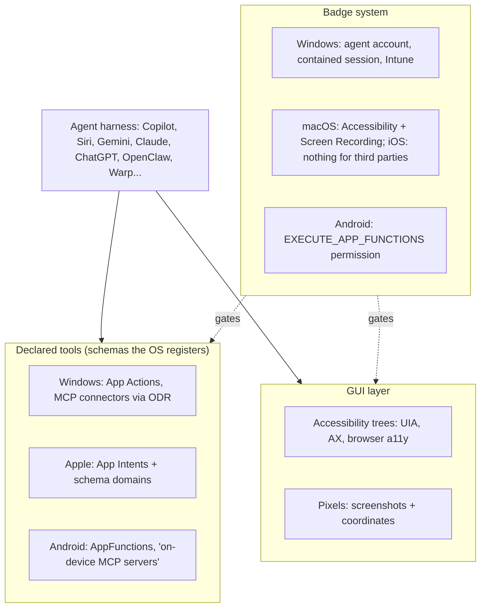

# The agent in the operating system: OS-level integration as a harness surface

*Research program: agent harnesses. Written 2026-09-08. Status: verified with notes.*

Sourcing note. The egress proxy allowed platform.claude.com, code.claude.com, github.com, raw.githubusercontent.com, www.microsoft.com and developer.android.com, and blocked learn.microsoft.com, support.microsoft.com, blogs.windows.com, apple.com, blog.google, openai.com, anthropic.com, claude.com, brave.com, arxiv.org and the press. Microsoft's Windows AI docs were read from their GitHub source mirror (MicrosoftDocs/windows-ai-docs), the same text Learn publishes. The search budget ran out two thirds of the way through. "Primary" means the page was read directly; "(via secondary)" means the claim rests on two or more search snippets from different outlets.

## What this document answers

- What "the agent woven into the OS" means on Windows, macOS, iOS, Android, Chrome/ChromeOS and in the browser-as-OS products, and what had shipped by September 2026.
- How each platform lets an agent see and act (declared tools, accessibility trees, pixels) and how it gates that access.
- Which security incidents happened, what the permission models do about them, and what the OS vendors keep versus leave open to third parties.
- A verdict for developers and one for non-technical users, and what the evidence does to the thesis.

## TL;DR

- **Every OS vendor is building the harness into the OS, and every one is at preview stage.** Windows' agent workspace and Copilot Actions are "experimental", off by default, with Microsoft's own cross-prompt-injection warning (Nov 2025, via secondary) [14]. Apple's rebuilt Siri, delayed from 2025, ships with iOS 27 in fall 2026 (via secondary) [20]. Android's AppFunctions is "an experimental preview"; its Gemini integration was "a private preview with trusted testers" as of May 2026 (primary) [21].
- **Integration is converging on MCP-shaped declared tools, not screen control.** Windows has an On-device Agent Registry for MCP servers [6]; Android apps "behave like on device MCP servers" [21]; Apple routes everything through App Intents and is deprecating SiriKit (via secondary) [20]. Pixels are the fallback everyone ships and nobody wants as default: Anthropic's routing order is connector, Bash, Claude in Chrome, then computer use [4][5].
- **The permission primitive is the product.** Windows runs contained MCP servers "in a separate Windows session using a separate agent user account", but consent is per host app: "any MCP server used in that session will have access to the user's files" [7]. Anthropic adds per-app, per-session approvals with fixed tiers on top of macOS's two blunt permissions [5].
- **Standalone AI surfaces lose to distribution.** Operator was folded into ChatGPT within six months (Jan–Jul 2025); Atlas shut down 292 days after launch (Oct 21, 2025 to Aug 9, 2026) and moved into the ChatGPT desktop app (via secondary) [28][30]. Microsoft's "agentic OS" post drew more than 700K views (a 1.5M figure circulates, unverified) and a locked reply thread (Nov 2025, via secondary) [16].
- **The incidents are structural.** Comet (Aug and Oct 2025), Atlas (Oct 2025), the Claude Chrome extension (fixed Feb 2026) and Microsoft Copilot (EchoLeak, Jun 2025; Copilot Personal, Aug 2026) were all injection or exfiltration paths through content the agent reads (via secondary) [31][32][33][45]. OpenAI's CISO: prompt injection is "a frontier, unsolved security problem" (Oct 2025) [31].
- **Vendors keep the assistant, the registry, identity and policy; they leave the GUI layer and cross-vendor orchestration open, for now.** Microsoft's Agent 365 registry inventories "more than 20 types of local agents" and Intune "can block execution methods for OpenClaw agents" (Jun 2026, primary) [12].
- **For the thesis:** supports "the harness is the bottleneck"; contradicts "a startup can define the default". The default OS-level harness will be Copilot, Siri or Gemini; third parties get tool slots, OS permissions and a browser extension.

## 1. Vocabulary for a newcomer

Analogy. The OS is an office building and the agent a contractor. You can hand over keys to rooms with labelled switches inside (declared tools: "send message", "create event"), or let the contractor walk the corridors and press whatever a human could (GUI control). The badge system decides which the contractor gets, for how long, and what is logged.

- **Declared tools**: functions an app registers with the OS in a schema. Apple's App Intents (iOS 16+, 2022) [18], Android's AppFunctions (Android 16+) [21], Windows' App Actions and MCP connectors [6][10]. Cheap and permissioned per function; only as complete as the developer made them.
- **Accessibility tree**: the structured UI description screen readers use (Windows UI Automation, macOS AX, the browser a11y tree). Text, not pixels; missing for some UI.
- **Pixel control**: screenshots in, mouse and keyboard out. Universal and slow. Anthropic's tool works in "screenshot pixel space" with 17 member tools [1]; OpenAI's CUA and Google's Gemini computer-use model do the same for browsers [26][29].
- **Agent account**: an OS identity and session the agent runs as, separate from the user's, bounding its blast radius [7].

## 2. What shipped, by platform

### 2.1 Windows: MCP in the OS, an agent account, a backlash

Windows is furthest along. Its On-device Agent Registry (ODR) is "a secure, manageable interface to discover and use agent connectors from local apps and remote servers" over MCP; connectors so far are Windows Settings, Visual Studio and VS Code GitHub Copilot, and a built-in File Explorer server with ten tools over "Documents, Desktop, Downloads, Music, Videos and Pictures" (primary, Oct–Dec 2025) [6][8]. Any packaged app can be a host: run `odr.exe list`, connect over stdio, call tools; package identity "is not enforced in the public preview", which needs build 26220.7262 or higher (Aug 2025) [9]. App Actions (Apr 2025) are the older, non-MCP registration of "an atomic unit of functionality" [10][48]; Agent Launchers let apps "register AI agents and make them discoverable across the system" [11].

Containment is the interesting part. Contained servers run "in a separate Windows session using a separate agent user account"; they cannot see user files, settings, registry, credentials or windows unless granted, and can reach the internet. But the grant is coarse: "any MCP server used in that session will have access to the user's files", per host app, not per server (primary, Nov 2025) [7]. Copilot Actions and the agent workspace, announced at Ignite on Nov 18, 2025 and pushed to Insiders in build 26220.7262 in the days before, sit on this behind an "experimental agentic features" toggle: off by default, admin-only, with Microsoft's own warning about cross-prompt injection (via secondary) [14][15].

The backlash was immediate. Windows president Pavan Davuluri's "agentic OS" post (Nov 10, 2025) drew more than 700K views and nearly 500 replies before he locked replies (the 1.5M-view and 484-reply figures are unverified); the complaints were reliability, performance and trust after Recall, and his Nov 15 follow-up conceded "we know we have work to do on the experience, both on the everyday usability, from inconsistent dialogs to power user experiences" (via secondary) [16][50]. Recall is the precedent: pulled in 2024, relaunched opt-in on Apr 25, 2025, then blocked at the app level by Signal (May 2025), Brave (Jul 23, 2025) and AdGuard (via secondary) [44]. Apps opting out of the OS's own screen capture measures how much trust an OS-level agent starts with.

Build 2026 (Jun 2, 2026) moved the model into enterprise infrastructure: a Microsoft Execution Container (MXC) SDK in early preview for "OS-level control over agent execution"; Windows 365 for Agents (GA) to run an agent "in a fully isolated, policy-governed Cloud PC"; the Agent 365 SDK (GA) and registry (preview) covering "more than 20 types of local agents, including coding agents, AI desktop applications", with Intune policies that "can be used to block common execution methods for OpenClaw agents" (primary) [12]. Build also shipped "Windows Development Skills" (GA: WinUI 3 skills and a WinApp CLI for coding agents) and an experimental, open-source "Intelligent Terminal" fork of Windows Terminal with a built-in agent pane (via secondary, corroborated by Microsoft's developer-docs mirror) [17]. Consumer status of Copilot Actions in Sept 2026 is unverified; secondary notes through Jul 2026 still describe the agent workspace as an Insider preview.

### 2.2 Apple: App Intents, Shortcuts, and a Siri that took three years

Apple's model is declared tools only. App Intents "make content and actions discoverable by Apple Intelligence and support system experiences like Siri, Spotlight, Shortcuts, and widgets", with "app schema domains" for well-known actions (primary) [18]. Only Apple's assistant consumes them: on iOS there is no accessibility or screen-control route for a third-party agent, so ChatGPT or Gemini on an iPhone can talk but cannot drive Mail. On macOS the route exists through the Accessibility and Screen Recording permissions, which is what Anthropic's computer use rides on [4].

The assistant slipped. The "more personalized Siri" (personal context, on-screen awareness, in-app actions) announced in June 2024 was delayed on Mar 7, 2025; at WWDC 2025 Federighi said the first architecture was too limited and Apple retargeted spring 2026 (via secondary) [19]. Apple and Google announced the model partnership on Jan 12, 2026, under which the next generation of Apple Foundation Models is based on Gemini models and cloud technology; the roughly $1B-a-year price and 1.2-trillion-parameter size are Bloomberg-reported figures from Nov 2025 (via secondary). WWDC 2026 (Jun 8) showed the rebuilt Siri on that custom Gemini model as a standalone app that takes actions inside apps and chains them across apps, with iOS 27 in fall 2026; SiriKit was deprecated with a two-to-three-year migration to App Intents (via secondary; thin) [20]. Whether an interim version shipped in iOS 26.4 is unverified: reports conflict, some saying iOS 26.4 (spring 2026) moved Siri's personal context and on-screen awareness onto Gemini, while Google's Apr 2026 statement still described "a more personalized Siri coming later in 2026" (unverified). The lesson: Apple spent two years on the loop and context parts while the tools part had existed since 2022.

### 2.3 Android and Chrome: AppFunctions, Gemini in the OS, auto browse

Android is the most MCP-literal. AppFunctions is "an Android platform API with an accompanying Jetpack library to simplify Android MCP integration"; apps "behave like on device MCP servers"; callers need `EXECUTE_APP_FUNCTIONS` and "can include agents, apps, and AI assistants like Gemini". It is "an experimental preview", and "as of May 2026, AppFunctions integration with Gemini is in a private preview with trusted testers" (primary, updated Sept 1, 2026) [21]; the library went from alpha01 (May 2025) to alpha11 (Aug 26, 2026) with no stable release [22]. Android 17 (released Jun 16, 2026, Pixel first) brought "Gemini Intelligence" cross-app actions to the Pixel 10 and Galaxy S26 series first, from late June 2026, with a "live view", take-over, and confirmation before purchases (via secondary; the three UX details are unverified) [23][24].

Chrome is Google's browser-as-OS. Auto browse reached desktop on Jan 28, 2026 for US AI Pro and Ultra subscribers: Gemini presents a plan first, the user can take over at any point, and use is capped per day, Ultra getting ten times Pro's allowance (the 20-and-200-a-day figures are unverified) (via secondary) [25]; Android followed in the US on Aug 18, 2026 (via secondary). Google calls auto browse Gemini 3-powered (via secondary) [25]; its public reference implementation for the computer-use models is screenshot-driven and drives Chrome through Playwright, launched with `gemini-2.5-computer-use-preview-10-2025` (Oct 2025) and now defaulting to `gemini-3.6-flash` (primary) [26]. ChromeOS is being succeeded by an Android-based desktop OS with Gemini at the system layer, unveiled with "Googlebook" laptops at the Android Show on May 12, 2026; Google said the OS had no official name yet, "Aluminium OS" being the leaked one (via secondary) [27].

### 2.4 The browser as the OS

| Product | Launched | Status Sept 2026 | Observation | Notable |
|---|---|---|---|---|
| OpenAI Operator | Jan 2025, research preview | Folded into ChatGPT agent Jul 17, 2025; site closed Aug 31, 2025; the agent mode itself reportedly removed in early Aug 2026 in favour of ChatGPT Work (via secondary) [28] | Screenshots (CUA) [29] | First consumer computer-use product; seven months as a surface |
| OpenAI Atlas | Oct 21, 2025, macOS only | Shutdown announced Jul 9, 2026, ended Aug 9, 2026; browser mode moved into ChatGPT desktop (via secondary) [30] | Chromium plus agent mode | Omnibox prompt injection disclosed Oct 24, 2025 [31] |
| Perplexity Comet | Jul 9, 2025 | Live (via secondary) [43] | Page content plus screenshots | Brave: hidden Reddit text made it fetch a one-time password (Aug 2025); "unseeable" injections in screenshots (Oct 2025) [32] |
| Google Gemini in Chrome | Jan 28, 2026 desktop | Live, capped per day [25] | Screenshots via computer-use model [26] | Plan first, user can take over |
| Anthropic Claude in Chrome | Aug 2025 pilot (1,000 Max users) | GA Aug 26, 2026 on all paid plans; per-action approval replaced by a per-action safety classifier (via secondary) [34] | DOM tools (`read_page`, `get_page_text`, `find`) plus screenshots [3] | Pilot cut injection success from 23.6% to 11.2%; GA post claims 0–0.3% (vendor figures, via secondary) [34]; origin-allowlist flaw fixed in extension v1.0.41 and the chained Arkose CAPTCHA XSS on Feb 19, 2026 [33] |
| Dia, Fellou, Opera Neon, Sigma | 2025–2026 | Live; Dia's maker, The Browser Company, sold to Atlassian (announced Sept 4, 2025, $610M; via secondary) [43] | Mixed | Browser Use, the open-source driver, has 113k GitHub stars [39] |

Two things stand out. The browser is where the labs reach non-technical users today because the logins are already there: Claude in Chrome "shares your browser's login state, so it can access any site you're already signed into" [3]. And the standalone agent browser is dead as a lab category: OpenAI's stated framing was consolidation, "evolving Atlas into ChatGPT for browser-based agentic work", folding the browser into the ChatGPT desktop app, a ChatGPT Chrome extension and ChatGPT Work rather than keeping a separate browser (via secondary) [30].

### 2.5 Desktop agents: labs, startups, bring-your-own-agent shells

Anthropic's computer use went from an Oct 2024 beta to a production toolset (`computer_toolset_20260801`). The docs still say to use "a dedicated virtual machine or container with minimal privileges" and warn that "instructions on webpages or contained in images might override your instructions", with a screenshot classifier that steers the model to ask for confirmation [1]. The consumer version lives in Claude Desktop (Cowork and Code tabs): a "research preview on macOS and Windows" for Pro and Max, off by default, with per-app, per-session approvals; fixed tiers ("View only: browsers, trading platforms; Click only: terminals, IDEs; Full control: everything else"); other windows hidden while it works; the terminal "excluded from screenshots"; a global `Esc` whose keypress "is consumed so prompt injection can't use it to dismiss dialogs"; and a machine-wide lock (primary) [4][5]. On macOS 15 or later, working in background windows is the default (Sept 2026, via secondary; help-center text read through a GitHub mirror) [35]. Screenshots are downscaled from 3456×2234 to about 1372×887 before the model sees them [4].

Startups occupy the gaps. Cua sells "open-source drivers, cross-OS fleets, and benchmarks" that drive desktop apps in the background on macOS, Windows and Linux (22.4k stars, MIT) [37]. Screenpipe captures the screen on meaningful events (app switches, clicks, typing pauses) rather than every second, prefers the accessibility tree and falls back to OCR, and feeds "Claude, Codex, Openclaw, Hermes" (21.5k stars; YC S26) [38]. Microsoft Research's UFO² calls itself a "Desktop AgentOS" and mixes "Windows UIA, Win32, WinCOM native control" with screenshots (Apr 2025) [36]. OpenClaw, an open-source assistant that "runs on your own computer and meets you in the channels you already use", has 389k stars; "tools run on the host for the main session unless you configure sandboxing" [40], hence Microsoft's Intune switch [12]. Warp open-sourced its terminal on Apr 28, 2026 as "an agentic development environment, born out of the terminal" (AGPL-3.0, MIT UI crates, 64.9k stars), running its own agent or "Claude Code, Codex, Gemini CLI, and others", with OpenAI as "founding sponsor" [41]. Raycast has turned its launcher into an agent host with MCP and "AI Extensions" (via secondary; thin) [42].

## 3. Accessibility APIs versus pixels

| Approach | Who uses it | Strengths | Weaknesses |
|---|---|---|---|
| Declared tools | App Intents, AppFunctions, Windows connectors and App Actions, MCP | Deterministic, permissioned per function, cheap in tokens, auditable | Coverage depends on app developers; vendor gates the callers (Apple: only Siri; Android: privileged permission, private preview) |
| Accessibility tree | Anthropic browser use: `read_page` returns refs like `[ref_2]` that "survive layout shifts" [2]; UFO² (UIA) [36]; Screenpipe [38] | Text not images; stable element references; works without vision | Missing for canvas, custom controls, cross-origin iframes [2]; trees are "not always available in real-world scenarios" and "do not consistently improve benign task performance" (RedTeamCUA, via secondary) [46] |
| Pixels | Anthropic computer use ("screenshots and coordinates alone") [1][2]; OpenAI CUA [29]; Gemini computer use [26]; Cua [37] | Universal; needs no cooperation from the app | Slow and costly (20+ images per request triggers stricter limits [1]); scaling errors; screenshot-borne injections (Comet's "unseeable" text) [32]; every screenshot is a privacy exposure, the Recall lesson [44] |
| Hybrid | Browser use tool (refs plus coordinates) [2]; UFO² [36]; Screenpipe (tree first, OCR fallback) [38] | Best of both where the tree exists | Two code paths, two attack surfaces |

The vendors have voted with their routing rules: Anthropic goes connector, Bash, Chrome, then screen, because computer use "is the broadest and slowest" [4]; Windows contains MCP servers first and confines GUI work to the agent workspace; Android and Apple allow declared tools only for third parties. Research points the same way (screen text versus screenshots, Apr 2026, via secondary) [46]. Pixels are the universal fallback, and the one every safety document tells you to put in a VM.

## 4. Permission models compared

| Platform | Unit of consent | Isolation | Kill switch and visibility | Default |
|---|---|---|---|---|
| Windows agent workspace | Per host app, per session; known folders [7][8] | Separate agent account and Windows session; server containment [7] | Logging; agent has its own desktop (via secondary) [15] | Off; admin toggle; "experimental" [14] |
| macOS, third-party agent | OS: app-wide Accessibility and Screen Recording, permanent; Anthropic adds per-app, per-session approvals and fixed tiers [4][5] | None from the OS; Anthropic hides other windows and excludes the terminal from screenshots [4] | `Esc` aborts and is consumed; notification while active [4] | Off; Pro and Max only |
| iOS | App Intents only, consumed by Siri and Shortcuts [18] | Full app sandbox | n/a | No third-party agent control |
| Android | `EXECUTE_APP_FUNCTIONS`, for privileged callers; Gemini private preview [21] | App sandbox | Live view, take over, confirm purchases (via secondary) [24] | Preview |
| Chrome (Gemini) | Per task, plan shown first; daily caps [25] | Browser profile | Take control any time [25] | Paid tiers |
| Claude in Chrome | Per-site permissions in the extension; per-action prompts in Claude Code with "allow all actions on that site for the session"; plan mode runs read-only calls and prompts for state changes [3] | A visible tab group in the user's own browser, sharing logins [3] | User handles logins and CAPTCHAs [3] | Off until `--chrome` or enabled |

The pattern: the OS gives a blunt, durable grant (an account, a permission, an allowlist); the harness on top invents finer, temporary grants (per app, per site, per session, per tier). The fine grants are where the design work is, and none are portable across platforms.

## 5. Security incidents

| Date | Incident | Path | Outcome |
|---|---|---|---|
| Jun 2025 | EchoLeak, Microsoft 365 Copilot (via secondary) [45] | Zero-click prompt injection by email | First "zero-click" agent exploit; patched |
| Aug 2025 | Comet: hidden Reddit text made the agent fetch a one-time password (Brave, via secondary) [32] | Indirect injection in page content; cross-site actions with the user's sessions | Reported Jul 25; Perplexity patched Jul 27, Brave found the fix incomplete. The "not applicable" triage was Perplexity's reply to LayerX's separate "CometJacking" URL-injection report (reported Aug 27, published Oct 4, 2025), not to Brave (via secondary) [32] |
| Oct 2025 | Comet and other AI browsers: "unseeable" injections in screenshots (Brave) [32] | Text invisible to humans, read by OCR or vision | Pixel input is an injection channel too |
| Oct 24, 2025 | Atlas omnibox: a prompt disguised as a URL treated as trusted user intent (NeuralTrust) [31] | Trust-boundary confusion between user text and web text | OpenAI CISO: "frontier, unsolved" [31] |
| Nov 2025 | Microsoft's own agent-workspace warning: cross-prompt injection, novel risks [14] | Design-time admission | Shipped off by default |
| Fixed by Feb 19, 2026 | Claude Chrome extension ("ShadowPrompt"): over-permissive origin allowlist (fixed in v1.0.41) chained with an Arkose Labs CAPTCHA XSS (fixed Feb 19, 2026); disclosed Dec 27, 2025 [33] | Zero-click injection via any website | Fixed before public reports (Mar 2026) |
| Aug 2026 | Microsoft Copilot Personal ("CoSnitch", CVE-2026-24301, Varonis): one click on a crafted link exfiltrates data from connected apps (via secondary) [45] | Connector scope abuse through an undocumented autorun URL parameter | Patched Aug 18, 2026 |

None needed a model jailbreak. All exploit the harness: what content the loop trusts, what the account can reach, what the user is asked to confirm. That is this document's strongest evidence for "the harness is the bottleneck".

## 6. What the OS vendors own and what they leave open

Own: the default assistant and its distribution (Copilot on the taskbar, Siri on the button, Gemini in the OS and in Chrome); the registry of declared tools and who may call it (Apple: only Siri; Android: a privileged permission and a private preview; Windows: any packaged host today, identity enforcement planned) [9][18][21]; the isolation primitive (agent account and MXC, macOS permissions, Android permissions) [7][12]; enterprise identity and policy reaching agents Microsoft does not host (Agent 365, Intune, Purview) [12][13]; and the screen (Recall, Click to Do, Visual Intelligence, Gemini screen awareness).

Open: the desktop GUI layer, where a third-party process can see and click under permanent OS permissions, which is the crack Anthropic, Cua, OpenClaw and UFO run through; tool provision, since any app can be a connector and Windows explicitly wants third-party agents as hosts [12]; cross-OS orchestration, screen memory and the fine-grained permission UX above the blunt OS grants; and developer surfaces (Warp's terminal, Raycast's launcher, the IDE).

The direction is toward less open: identity enforcement for ODR hosts, Intune switches for named open-source agents, Apple's App Intents-only rule. A startup on the open parts should assume the vendor claims the permission layer next.

## 7. Verdicts

**Developers.** OS-level integration is usable now and arrives through the CLI and desktop app, not instead of them: `claude --chrome`, the `computer-use` MCP server, Warp's bring-your-own-agent terminal, Cua's drivers. The OS is becoming a tool provider any harness can call; the loop, context and orchestration stay in the developer's harness. Build against declared tools first, accessibility second, pixels last, and expect the pixel path to need a VM.

**Non-technical users.** The only OS-level surface that reaches them by default is the vendor assistant, and each is a preview in Sept 2026: Copilot Actions off behind an admin toggle; Siri shipping this fall after a two-year slip; Gemini's app control in private preview and its Chrome agent rate-capped per day; Cowork computer use a research preview on paid plans. What they can use today is the browser inside a product they already have (Gemini in Chrome, ChatGPT desktop browser mode, Claude in Chrome). Trust, not capability, is the constraint: the Windows backlash and Recall show that "the OS does things for you" reads as "the OS watches you" until the permission model is visible and reversible.

## What this means for the thesis

Supports:

- The harness is the bottleneck. Every incident in Section 5 is a harness failure; every vendor's 2025–2026 work is permissions, isolation, registries and confirmation UX. Microsoft built an agent account, a container SDK and a cloud PC for agents because the model could already click.
- Neither the CLI nor the desktop app is the default for non-technical people. Vendors and labs are betting on the OS assistant plus the browser: Operator and Atlas were absorbed into ChatGPT's existing app; Claude's computer use ships inside Claude Desktop and Chrome.

Contradicts:

- The reimagined default is being built by the OS vendors, who own distribution, identity and the isolation primitive. A startup cannot add an agent account to Windows or a caller permission to Android; third parties get tool slots and a browser extension.
- Even OpenAI could not make a new surface stick. Distribution beat a better harness twice in a year.
- Declared-tool ecosystems grow at the pace of app developers, not model quality; the "on the fly" harness that makes its own tools is still pixel control with a VM around it.

Nuance:

- The OS layer is standardising on MCP-shaped tools, which are open. Value moves to the layer above the blunt OS grants: cross-platform permission UX, screen memory, orchestration of several agents across one person's devices, audit. That layer is open today, and Agent 365 shows Microsoft wants it.
- The thesis should read: "the default harness for non-technical people will be OS-shaped; the question is whose." The evidence says the vendor's, unless the vendor stumbles the way Apple did for two years.

## Open questions and unverified claims

1. Status of Copilot Actions and the agent workspace for general Windows 11 users in Sept 2026; evidence stops at the Nov 2025 Insider rollout and Build 2026.
2. WWDC 2026 details (naming, SiriKit timeline) rest on press coverage; the Gemini partnership itself was announced Jan 12, 2026 and the $1B figure is Bloomberg's; whether iOS 26.4 shipped an interim Siri is unknown (reports conflict).
3. Android 17 naming and devices, and the Aluminium OS story, come from secondary sources of uncertain quality.
4. The Claude in Chrome GA date (Aug 26, 2026) is confirmed by several secondary sources; the 23.6% to 11.2% and 0–0.3% figures are Anthropic's own numbers, read through mirrors of its posts.
5. Now confirmed (see verification notes): the Dia acquisition (Atlassian, announced Sept 4, 2025, $610M), the OSWorld human baseline (72.36%), the Oct 22, 2024 computer-use beta, the Comet launch day (Jul 9, 2025).
6. Build 2026 items: "Windows Development Skills" (GA) and "Intelligent Terminal" (experimental fork) are now confirmed by Microsoft's developer-docs mirror and secondary coverage; "Aion 1.0 Plan" (a 14B on-device planning model) is corroborated by one secondary note; "Project Solara" is unverified.
7. Perplexity's "no security impact / not applicable" response was to LayerX's CometJacking report, not to Brave's; corrected in Section 5.
8. The Agent Launchers doc carries ms.date "1/05/2025", possibly a typo for 2026 (still printed that way on Sept 8, 2026).
9. The backlash post's metrics (1.5M views, 484 replies) could not be sourced; the best-attested figures are 700K+ views (Windows Latest, Nov 14, 2025) and "nearly 500" replies (Windows Central).

## Sources

1. Anthropic, "Computer use tool", https://platform.claude.com/docs/en/agents-and-tools/tool-use/computer-use-tool, Sept 2026 (primary).
2. Anthropic, "Browser use tool", https://platform.claude.com/docs/en/agents-and-tools/tool-use/browser-use-tool, Sept 2026 (primary).
3. Anthropic, "Use Claude Code with Chrome", https://code.claude.com/docs/en/chrome, Sept 2026 (primary).
4. Anthropic, "Let Claude use your computer from the CLI", https://code.claude.com/docs/en/computer-use, Sept 2026 (primary).
5. Anthropic, "Desktop application", https://code.claude.com/docs/en/desktop, Sept 2026 (primary).
6. Microsoft, "MCP on Windows overview", docs source mirror, https://raw.githubusercontent.com/MicrosoftDocs/windows-ai-docs/docs/docs/mcp/overview.md, ms.date Dec 2025 (primary).
7. Microsoft, "Securely containing MCP servers on Windows", https://raw.githubusercontent.com/MicrosoftDocs/windows-ai-docs/docs/docs/mcp/servers/mcp-containment.md, Nov 2025 (primary).
8. Microsoft, "File Explorer MCP connector", https://raw.githubusercontent.com/MicrosoftDocs/windows-ai-docs/docs/docs/mcp/file-connector.md, Oct 2025 (primary).
9. Microsoft, "MCP host quickstart", https://raw.githubusercontent.com/MicrosoftDocs/windows-ai-docs/docs/docs/mcp/quickstart-mcp-host.md, Aug 2025 (primary).
10. Microsoft, "App Actions on Windows" and "Responsible AI and safety", https://raw.githubusercontent.com/MicrosoftDocs/windows-ai-docs/docs/docs/app-actions/index.md, Apr 2025 (primary).
11. Microsoft, "Agent Launchers on Windows", https://raw.githubusercontent.com/MicrosoftDocs/windows-ai-docs/docs/docs/agent-launchers/index.md, ms.date "1/05/2025" (primary).
12. Microsoft Security Blog, "Microsoft Build 2026: Securing code, agents, and models across the development lifecycle", https://www.microsoft.com/en-us/security/blog/2026/06/02/microsoft-build-2026-securing-code-agents-and-models-across-the-development-lifecycle/, Jun 2026 (primary).
13. Microsoft Security Blog, "From runtime risk to real-time defense: Securing AI agents", https://www.microsoft.com/en-us/security/blog/2026/01/23/runtime-risk-realtime-defense-securing-ai-agents/, Jan 2026 (primary).
14. Microsoft Support, "Experimental agentic features", https://support.microsoft.com/en-us/windows/ai/ai-features/experimental-agentic-features, Nov 2025 (blocked; via SC Media https://www.scworld.com/news/new-agent-workspace-feature-comes-with-security-warning-from-microsoft and GBHackers https://gbhackers.com/agentic-ai-feature/).
15. Windows Developer Blog, "Ignite 2025: Furthering Windows as the premier platform for developers, governed by security", https://blogs.windows.com/windowsdeveloper/2025/11/18/ignite-2025-furthering-windows-as-the-premier-platform-for-developers-governed-by-security/, Nov 2025 (blocked; via SiliconANGLE https://siliconangle.com/2025/11/18/microsoft-accelerates-automation-windows-mcp-agent-connectors/ and Petri https://petri.com/windows-11-agentic-computing-workspaces/).
16. Backlash coverage: Windows Latest https://www.windowslatest.com/2025/11/14/windows-11-agentic-os-ai-upgrade-faces-backlash-microsoft-responds-by-closing-replies/; Tom's Hardware https://www.tomshardware.com/software/windows/windows-boss-posts-lacklustre-response-to-agentic-os-backlash; Windows Central https://www.windowscentral.com/microsoft/windows-11/windows-president-addresses-current-state-of-windows-11-after-ai-backlash-we-know-we-have-a-lot-of-work-to-do; 4sysops https://4sysops.com/archives/microsoft-faces-massive-backlash-over-windows-11-agentic-os-plans-the-ai-naysayers-come-out-of-hiding/, Nov 2025 (secondary).
17. Redmondmag, "Microsoft Uses Build 2026 To Put AI Agents at the Center of Windows", https://redmondmag.com/articles/2026/06/02/microsoft-uses-build-2026-to-put-ai-agents-at-the-center-of-windows.aspx, Jun 2026 (secondary).
18. Apple, "App Intents", https://developer.apple.com/documentation/appintents, read via the docs data endpoint, Sept 2026 (primary).
19. TidBITS, "Apple Delays 'More Personalized' Siri", https://tidbits.com/2025/03/07/apple-delays-more-personalized-siri/, Mar 2025; MacRumors, https://www.macrumors.com/2025/06/12/apple-intelligence-siri-spring-2026/, Jun 2025 (secondary).
20. Quartz, "Apple unveils Siri AI with Google Gemini at WWDC 2026", https://qz.com/apple-siri-ai-google-gemini-wwdc-2026-060826; TechTimes, https://www.techtimes.com/articles/318005/20260608/wwdc-2026-app-intents-replaces-sirikit-gemini-siri-migration-clock-starts.htm; TechCrunch preview https://techcrunch.com/2026/06/04/what-to-expect-from-wwdc-2026-siris-highly-anticipated-revamp-and-apple-intelligence-updates/, Jun 2026 (secondary).
21. Google, "Overview of AppFunctions", https://developer.android.com/ai/appfunctions, updated Sept 1, 2026 (primary).
22. Google, "androidx.appfunctions releases", https://developer.android.com/jetpack/androidx/releases/appfunctions, alpha01 May 2025 to alpha11 Aug 2026 (primary).
23. 9to5Google, "Google details MCP-like 'AppFunctions' that let Gemini use Android apps", https://9to5google.com/2026/02/25/android-appfunctions-gemini/, Feb 2026; Android Developers Blog, "The Intelligent OS", https://android-developers.googleblog.com/2026/02/the-intelligent-os-making-ai-agents.html, Feb 2026 (blocked) (secondary).
24. TechTimes, "Android 17 Update Lands on Pixel Today", https://www.techtimes.com/articles/318517/20260616/android-17-update-lands-pixel-today-gemini-intelligence-skips-most-owners.htm, Jun 2026; Approov, https://approov.io/blog/android-17-android-is-becoming-an-agent-are-you-ready (secondary).
25. TechCrunch, "Chrome takes on AI browsers with tighter Gemini integration", https://www.techcrunch.com/2026/01/28/chrome-takes-on-ai-browsers-with-tighter-gemini-integration-agentic-features-for-autonomous-tasks/, Jan 2026; Google, https://blog.google/products-and-platforms/products/chrome/gemini-3-auto-browse/ (blocked); Neowin on Android rollout https://www.neowin.net/news/gemini-is-now-available-in-chrome-with-agentic-auto-browse-for-all-android-users-in-the-us/ (secondary).
26. Google, computer-use-preview reference implementation, https://github.com/google/computer-use-preview, launched with `gemini-2.5-computer-use-preview-10-2025`; the README on Sept 8, 2026 defaults to `gemini-3.6-flash` and also lists `gemini-3.5-flash`, `gemini-3.5-flash-lite` and `gemini-3-flash-preview` (primary).
27. ChromebookFixes, "Googlebook Unveiled, Aluminium OS Goes Public", https://chromebookfixes.com/news/googlebook-aluminium-os-2026/, May 2026; Starry Hope https://www.starryhope.com/chromebooks/chromeos-android-merger-aluminium-os/ (secondary, low confidence).
28. Wikipedia, "OpenAI Operator", https://en.wikipedia.org/wiki/OpenAI_Operator; OpenAI, "Introducing ChatGPT agent", https://openai.com/index/introducing-chatgpt-agent/, Jul 2025 (blocked) (secondary).
29. OpenAI, openai-cua-sample-app, https://github.com/openai/openai-cua-sample-app (primary).
30. TechCrunch, "OpenAI is shutting down Atlas", https://techcrunch.com/2026/07/09/openai-is-shutting-down-atlas-but-its-ai-browser-ambitions-are-still-growing/, Jul 2026; Enterprise DNA https://enterprisedna.co/resources/news/openai-atlas-browser-shutdown-chatgpt-agents-august-2026/; TechTimes https://www.techtimes.com/articles/320183/20260711/openai-kills-atlas-browser-after-8-months-what-replaces-it-what-users-must-do-now.htm (secondary).
31. NeuralTrust, "OpenAI Atlas Omnibox Prompt Injection", https://neuraltrust.ai/blog/openai-atlas-omnibox-prompt-injection, Oct 2025; CyberScoop https://cyberscoop.com/openai-chatgpt-atlas-prompt-injection-browser-agent-security-update-head-of-preparedness/; Simon Willison, https://simonwillison.net/2025/Oct/22/openai-ciso-on-atlas/, Oct 2025 (secondary).
32. Brave, "Indirect Prompt Injection in Perplexity Comet", https://brave.com/blog/comet-prompt-injection/, Aug 2025, and "Unseeable prompt injections in screenshots", https://brave.com/blog/unseeable-prompt-injections/, Oct 2025 (blocked; via ppc.land https://ppc.land/comet-browser-faces-multiple-security-vulnerabilities-from-prompt-injection/ and Simon Willison https://simonwillison.net/2025/Aug/25/agentic-browser-security/); LayerX, "CometJacking", https://layerxsecurity.com/blog/cometjacking-how-one-click-can-turn-perplexitys-comet-ai-browser-against-you/, Oct 4, 2025 (blocked; via secondary mirrors).
33. The Hacker News, "Claude Extension Flaw Enabled Zero-Click XSS Prompt Injection", https://thehackernews.com/2026/03/claude-extension-flaw-enabled-zero.html, Mar 2026; SOCRadar, https://socradar.io/blog/shadowprompt-zero-click-anthropics-claude/ (secondary).
34. Cloud Security Alliance, "Claude in Chrome: Six Security Risks", https://cloudsecurityalliance.org/blog/2026/09/04/top-6-claude-in-chrome-security-risks-to-model-before-you-roll-it-out, Sept 2026; Anthropic, "Claude in Chrome is generally available", https://claude.com/blog/claude-in-chrome-generally-available (blocked) (secondary).
35. The New Stack, https://thenewstack.io/claude-computer-use/; Cybersecurity News, https://cybersecuritynews.com/claude-ai-controls-macos-and-windows/; Anthropic Help Center, "Let Claude use your computer in Cowork", https://support.claude.com/en/articles/14128542-let-claude-use-your-computer-in-cowork (blocked; text read through GitHub mirrors of the help center), Sept 2026 (secondary).
36. Microsoft, UFO / UFO², https://github.com/microsoft/UFO, Feb 2024 to Nov 2025 (primary).
37. Cua, https://github.com/trycua/cua (primary).
38. Screenpipe, https://github.com/mediar-ai/screenpipe (primary).
39. Browser Use, https://github.com/browser-use/browser-use (primary).
40. OpenClaw, https://github.com/openclaw/openclaw (primary).
41. Warp, https://github.com/warpdotdev/warp (primary); Warp newsroom, https://www.warp.dev/newsroom/2026/4/28/warp-open-sources-its-agentic-development-environment, Apr 2026 (blocked).
42. Releasebot, "Raycast Release Notes, August 2026", https://releasebot.io/updates/raycast; Aigregator, https://aigregator.com/tools/raycast-ai (secondary, thin).
43. Seraphic Security, "Top 5 Agentic Browsers in 2026", https://seraphicsecurity.com/learn/ai-browser/top-5-agentic-browsers-in-2026-capabilities-and-security-risks/; Bright Data, https://brightdata.com/blog/ai/best-agent-browsers, 2026 (secondary).
44. Slashdot, "Microsoft Launches Windows Recall After Year-Long Delay", https://it.slashdot.org/story/25/04/25/1830232/microsoft-launches-windows-recall-after-year-long-delay, Apr 2025; The Register, https://www.theregister.com/2025/07/23/brave_browse_block_microsoft_recall/, Jul 2025; TechSpot, https://www.techspot.com/news/108817-privacy-apps-signal-brave-adguard-push-back-against.html (secondary).
45. Concentric AI, https://concentric.ai/too-much-access-microsoft-copilot-data-risks-explained/; VentureBeat, https://venturebeat.com/security/microsoft-salesforce-copilot-agentforce-prompt-injection-cve-agent-remediation-playbook; The Hacker News, https://thehackernews.com/2026/08/microsoft-copilot-personal-flaws-could.html, Aug 2026 (secondary).
46. Papers, not fetched (arXiv blocked): OSWorld, https://arxiv.org/abs/2404.07972 (2024); RedTeamCUA, https://arxiv.org/pdf/2505.21936 (May 2025); "Building Browser Agents", https://arxiv.org/pdf/2511.19477 (Nov 2025); "Do LLMs Need to See Everything?", https://arxiv.org/pdf/2604.17817 (Apr 2026); AgentHijack, https://arxiv.org/pdf/2605.25707 (May 2026) (secondary).
47. OSWorld, https://github.com/xlang-ai/OSWorld, OSWorld-Verified update Jul 2025 (primary).
48. Microsoft, App Actions on Windows samples, https://github.com/microsoft/App-Actions-On-Windows-Samples (primary).
49. Anthropic, anthropic-quickstarts computer-use-demo, https://github.com/anthropics/anthropic-quickstarts (primary).
50. Windows Forum, "Agentic Windows and Copilot: Backlash Over AI Driven OS", https://windowsforum.com/threads/agentic-windows-and-copilot-backlash-over-ai-driven-os.389648/, Nov 2025 (secondary).

## Verification notes (2026-09-08)

Method. Second pass by a fact-checker on 2026-09-08. The session's web-search quota was exhausted after 22 searches (the author's pass had used the rest), so the remaining checks used direct fetches of reachable hosts (platform.claude.com, code.claude.com, developer.android.com, raw.githubusercontent.com, github.com, www.microsoft.com) and GitHub code search over mirrored articles, vendor posts and research notes as the "two or more independent snippets" fallback. "Primary" below means the page was read directly; "via secondary" means two or more independent snippets or mirrors agree. Exact GitHub star counts came from the GitHub API through the connector on Sept 8, 2026.

Claims checked (15).

1. Windows agent workspace and Copilot Actions: announced at Ignite (Nov 18–21, 2025); "Experimental agentic features" toggle off by default and admin-only; Microsoft's own cross-prompt-injection warning. Confirmed (via secondary: Windows Central, PrivacyGuides, WinBuzzer, Windows Forum). The Insider push: build 26220.7262 already carried the toggle by Nov 17 (Neowin, Windows Latest via mirrors); "the day before" softened to "in the days before".
2. Windows MCP containment, ODR public-preview requirements and connectors. Confirmed (primary: MicrosoftDocs windows-ai-docs mirror; ms.dates 11/11/2025, 08/12/2025, 10/31/2025, 12/06/2025; Agent Launchers still carries ms.date "1/05/2025"). Note that the host quickstart's ms.date (Aug 2025) predates the build it requires.
3. Build 2026 (post dated Jun 2, 2026): MXC SDK "now in early preview", Windows 365 for Agents "now generally available", Agent 365 SDK GA, registry covering "more than 20 types of local agents", Intune and OpenClaw. Confirmed (primary). Corrected: the Intune quote is "can be used to block common execution methods for OpenClaw agents". "Windows Development Skills" (GA) and "Intelligent Terminal" (experimental open-source fork of Windows Terminal) moved from unverified to confirmed (Microsoft windows-dev-docs mirror, Publickey, Book of News mirror).
4. "Agentic OS" backlash. Corrected. The post was Nov 10, 2025; Windows Latest reported 700K+ views on Nov 14 and Windows Central "nearly 500" replies; the 1.5M and 484 figures could not be sourced and are now marked unverified. Davuluri's Nov 15 reply reads "We know we have work to do on the experience, both on the everyday usability, from inconsistent dialogs to power user experiences" (TechRadar and Slashdot mirrors); "a lot of work to do" was Windows Central's headline, not his words. Replies were locked: confirmed.
5. Recall: GA on Copilot+ PCs Apr 25, 2025 (Microsoft docs mirror linking the Windows Experience Blog post); Signal May 2025; Brave v1.81 Jul 23, 2025; AdGuard 7.21 Jul 2025. Confirmed (via secondary).
6. Siri: delay statement Mar 7, 2025; Federighi at WWDC 2025 ("needed more time to reach our high quality bar"); spring 2026 / iOS 26.4 target. Confirmed (via secondary: MacRumors, TidBITS, Daring Fireball).
7. Apple–Google Gemini and WWDC 2026. Corrected: the partnership was announced publicly on Jan 12, 2026 (CNBC and others), not merely "reported" at WWDC; the $1B-a-year and 1.2T-parameter figures are Bloomberg's from Nov 2025. WWDC 2026 on Jun 8 with a Gemini-based standalone Siri and iOS 27 this fall: confirmed (via secondary: Quartz, The Next Web, MacRumors, TechJournal). SiriKit deprecation with a two-to-three-year migration: only thin corroboration (TechTimes headline plus two GitHub notes), marked "thin". iOS 26.4 interim Siri: unverified; reports conflict.
8. Android. AppFunctions wording, "experimental preview", the May 2026 private-preview sentence, and alpha01 (May 7, 2025) to alpha11 (Aug 26, 2026) with no beta, RC or stable release: confirmed (primary). Android 17 released Jun 16, 2026 (Pixel first) with "Gemini Intelligence" cross-app actions for the Pixel 10 and Galaxy S26 series from late June: confirmed (via secondary: TechAdvisor, PhoneArena, TechCabal, 9to5Google index). "Live view", take-over and purchase confirmation on Android: unverified (TechTimes blocked).
9. Gemini in Chrome. Auto browse on Jan 28, 2026 for US AI Pro and Ultra with a "Take over" control: confirmed (via secondary: 9to5Google, eesel, Google blog title). Daily caps: Google says Ultra gets 10x Pro; the 20/200 numbers appear in one note and are flagged as unverifiable in another, so marked unverified. Android rollout Aug 18, 2026 (Google blog, 9to5Google, The Verge via mirrors): added. Corrected: the doc attributed `gemini-2.5-computer-use-preview-10-2025` to auto browse; Google's reference implementation is a public sample that launched with that model and now defaults to `gemini-3.6-flash`, while Google calls auto browse Gemini 3-powered. "Aluminium OS" corrected: Google unveiled Googlebooks and an officially unnamed Android-based desktop OS at the Android Show on May 12, 2026; "Aluminium OS" is the leaked name.
10. Operator: Jan 2025 research preview; ChatGPT agent Jul 17, 2025; site closed Aug 31, 2025. Confirmed (via secondary: Wikipedia snippet, Presenc, killedbyopenai). Added: ChatGPT agent mode itself was reportedly removed in early Aug 2026 (two secondary notes).
11. Atlas: launched Oct 2025 on macOS (month confirmed; Oct 21 from prior knowledge); shutdown announced Jul 9, 2026 (TechCrunch; MacRumors Jul 10) and effective Aug 9, 2026 (several mirrors; OpenAI: "We'll begin sunsetting the standalone Atlas browser"). Confirmed. NeuralTrust omnibox post dated Oct 24, 2025 and the CISO quote "prompt injection remains a frontier, unsolved security problem" (Dane Stuckey, Oct 21–22, 2025): confirmed via mirrored Simon Willison and The Hacker News text. Corrected: OpenAI's stated framing was consolidation into ChatGPT ("Evolving Atlas into ChatGPT for browser-based agentic work"), not "the browser people already use".
12. Comet: launched Jul 9, 2025; Brave's Aug 20, 2025 post (reported Jul 25, Perplexity's Jul 27 fix incomplete) and Oct 21, 2025 "unseeable" post: confirmed (via secondary). Corrected: the "not applicable" triage was Perplexity's response to LayerX's CometJacking report (reported Aug 27, published Oct 4, 2025), not to Brave's.
13. Claude in Chrome: pilot with 1,000 Max users and the 23.6% to 11.2% figure (Anthropic's Aug 2025 post via mirrors): confirmed. GA Aug 26, 2026 on all paid plans, per-action approval replaced by a classifier, 0–0.3% red-team figure (via secondary): corrected from "around late Aug". ShadowPrompt: disclosed Dec 27, 2025; allowlist fixed in extension v1.0.41; Arkose XSS fixed Feb 19, 2026; public reports Mar 2026: confirmed, wording corrected.
14. Anthropic computer use documentation: `computer_toolset_20260801` (out of beta Aug 19, 2026), 17 member tools, the VM, injection and classifier text, the 20-image threshold, the Oct 22, 2024 beta, the routing order and "broadest and slowest", the tiers, hidden windows, terminal excluded, Esc consumed, machine-wide lock, 3456×2234 to about 1372×887, Desktop "research preview on macOS and Windows" for Pro and Max, off by default: confirmed (primary). Background work as the default on macOS 15 or later: confirmed via a GitHub mirror of the help-center article. The quote "coordinates only" corrected to "screenshots and coordinates alone".
15. Incidents and ecosystem: EchoLeak (CVE-2025-32711, Aim Security, Jun 2025) confirmed; CoSnitch (CVE-2026-24301, Varonis, patched Aug 18, 2026) confirmed and detailed. Star counts on Sept 8, 2026: browser-use 113,466; cua 22,381; screenpipe 21.5k; openclaw 389.2k; warp 64,885 (all as stated). Warp open-sourced Apr 28, 2026 under AGPL-3.0 with MIT UI crates and OpenAI as founding sponsor: confirmed. Screenpipe YC S26 and tree-first, OCR-fallback design confirmed; "records continuously" corrected to event-triggered capture. UFO² (Apr 2025, "Desktop AgentOS"): confirmed. Dia/Atlassian $610M, announced Sept 4, 2025: confirmed. OSWorld human baseline 72.36%: confirmed (via secondary).

Tally: 8 confirmed (1, 2, 5, 6, 8, 10, 14, 15), 7 corrected (3, 4, 7, 9, 11, 12, 13), 0 rejected. Sub-claims left marked "(unverified)" inline: the 1.5M-view and 484-reply figures; whether iOS 26.4 shipped an interim Siri; the Android "live view", take-over and purchase-confirmation details; the 20-and-200-a-day auto-browse caps; the consumer status of Copilot Actions in Sept 2026; "Project Solara". SiriKit deprecation is kept but marked thin.

Corrections made in the text: status line; TL;DR backlash figure; Insider timing; backlash numbers and the Davuluri quote; the Intune quote and the Build 2026 trade items; the Apple–Google announcement date and attribution of the $1B figure; the iOS 26.4 caveat; Android 17 release date and device wording; auto-browse caps, Android date, model attribution and the Aluminium OS naming; the Operator row (agent mode removal); the Comet launch day; the Claude in Chrome row (GA date, plans, classifier, 0–0.3%, fix wording); the Dia row; OpenAI's stated reason for closing Atlas; the macOS 15 background default; Screenpipe's capture model; the "coordinates only" quote; the Comet, ShadowPrompt and CoSnitch rows in Section 5; the Section 7 cap wording; open questions 2, 4, 5, 6, 7, 8 and a new 9; sources 26, 32 and 35.

Sources that could not be opened (egress blocked): simonwillison.net, help.openai.com, support.microsoft.com, blogs.windows.com, news.microsoft.com, windowslatest.com, tomshardware.com, windowscentral.com, windowsforum.com, 4sysops.com, redmondmag.com, 9to5google.com, macrumors.com, thenextweb.com, enterprisedna.co, techtimes.com, gigazine.net, cloudsecurityalliance.org, neuraltrust.ai, ppc.land, os-world.github.io, plus the domains the author listed. api.github.com and github.com through curl returned a proxy stub; the GitHub connector and WebFetch worked instead. Where a blocked page is cited, the claim rests on mirrored copies of its text or on two or more independent snippets, as stated above.

Remaining doubts: (a) the Davuluri post metrics; (b) whether any Gemini-backed Siri shipped in iOS 26.4 before iOS 27; (c) SiriKit's formal deprecation and its migration window rest on one outlet plus derivative notes; (d) exact auto-browse caps; (e) whether Copilot Actions and the agent workspace reached general Windows 11 users by Sept 2026; (f) the Android 17 agent UX details; (g) "Project Solara" and the precise scope of "Aion 1.0 Plan"; (h) whether Chrome's auto browse shares a model with the public computer-use sample.
