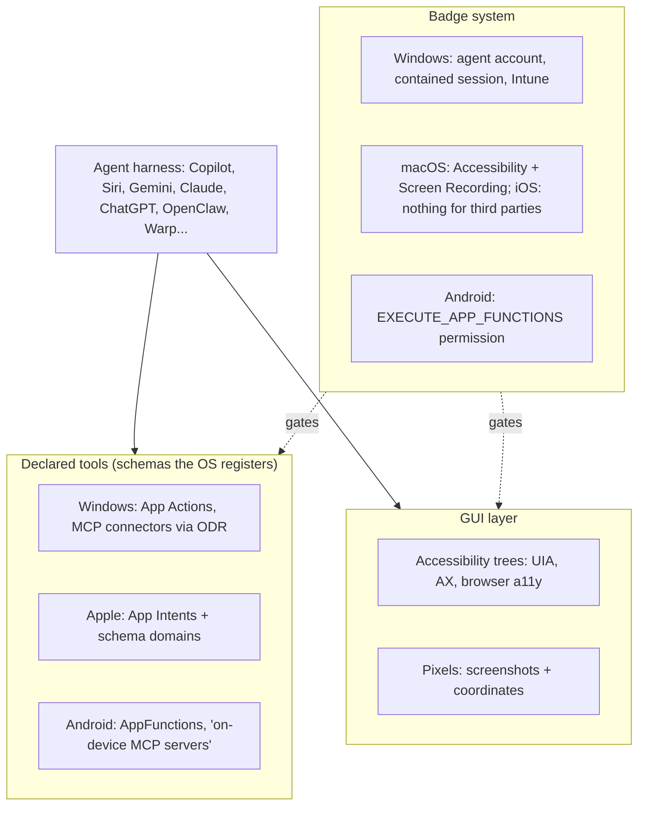

# The agent in the operating system: OS-level integration as a harness surface

*Research program: agent harnesses. Written 2026-09-08. Status: draft, pending verification.*

Sourcing note. This session's egress proxy allowed platform.claude.com, code.claude.com, github.com, raw.githubusercontent.com, www.microsoft.com and developer.android.com, and blocked learn.microsoft.com, support.microsoft.com, blogs.windows.com, apple.com, blog.google, openai.com, anthropic.com, claude.com, brave.com, arxiv.org and the press. Microsoft's Windows AI documentation was read from its GitHub source mirror (MicrosoftDocs/windows-ai-docs), the same text that Learn publishes. The web-search budget ran out two thirds of the way through the task. "Primary" means the page was read directly; "(via secondary)" means the claim rests on two or more search snippets from different outlets, not on the original page.

## What this document answers

- What "the agent woven into the OS" concretely means on Windows, macOS, iOS, Android, Chrome/ChromeOS and in the browser-as-OS products, and what had actually shipped by September 2026.
- How each platform lets an agent see and act: declared tools (App Intents, AppFunctions, Windows connectors) versus accessibility trees versus pixels, and how each platform gates that access.
- Which security incidents happened, what the vendors' permission models do about them, and what the OS vendors keep versus leave open to third parties.
- A verdict for developers and one for non-technical users, and what the evidence does to the program's thesis.

## TL;DR

- **Every OS vendor is building the harness into the OS, and every one of them is at preview stage.** Windows' agent workspace and Copilot Actions are "experimental", off by default, and Microsoft's own page warns of cross-prompt injection (Nov 2025, via secondary) [14]. Apple's rebuilt Siri, delayed from 2025, is due with iOS 27 in fall 2026 (via secondary) [19][20]. Android's AppFunctions is "an experimental preview" and its Gemini integration was "a private preview with trusted testers" as of May 2026 (primary) [21].
- **OS integration is converging on MCP-shaped declared tools, not on screen control.** Windows has an On-device Agent Registry for MCP servers [6]; Android says AppFunctions let apps "behave like on device MCP servers" [21]; Apple routes everything through App Intents and is deprecating SiriKit (via secondary) [20]. Pixel control is the fallback every vendor ships and none wants as the default: Anthropic's docs order the choice connector, then Bash, then Claude in Chrome, then computer use [4][5].
- **The permission primitive is the real product.** Windows runs contained MCP servers "in a separate Windows session using a separate agent user account", but consent is per host app: "any MCP server used in that session will have access to the user's files" [7]. Anthropic layers per-app, per-session approvals with fixed tiers (browsers view-only, terminals click-only) on top of macOS's two blunt permissions [5].
- **Standalone AI surfaces lose to distribution.** OpenAI's Operator was folded into ChatGPT within six months (Jan to Jul 2025); its Atlas browser shut down 292 days after launch (Oct 21, 2025 to Aug 9, 2026) and its features moved into the ChatGPT desktop app (via secondary) [28][30]. Microsoft's "agentic OS" post drew about 1.5M views and a locked reply thread (Nov 2025, via secondary) [16].
- **Security incidents are structural, not bugs.** Comet (Aug and Oct 2025), Atlas (Oct 2025), the Claude Chrome extension (fixed Feb 2026) and Microsoft 365 Copilot (EchoLeak, Jun 2025; Copilot Personal, Aug 2026) were all injection or exfiltration paths through content the agent reads (via secondary) [31][32][33][45]. OpenAI's CISO called prompt injection "a frontier, unsolved security problem" (Oct 2025, via secondary) [31].
- **Vendors keep the assistant, the registry, identity and policy; they leave the GUI layer and cross-vendor orchestration open, for now.** Microsoft's Agent 365 registry already inventories "more than 20 types of local agents" and Intune "can block execution methods for OpenClaw agents" (Jun 2026, primary) [12]: the OS vendor intends to govern third-party agents even where it does not host them.
- **For the thesis:** OS-level integration supports "the harness is the bottleneck" (vendors are building permissions, isolation and registries because the model can already click) and contradicts "a startup can define the default": the default OS-level harness will be Copilot, Siri or Gemini, and third parties get tool slots, OS permissions and a browser extension.

## 1. Vocabulary for a newcomer

Analogy. The OS is an office building and the agent is a contractor. You can let the contractor work in two ways. Hand over keys to specific rooms with labelled switches inside (declared tools: "send message", "create event"). Or let the contractor walk the corridors, read the signs and press whatever a human could press (GUI control). The building's badge system decides which of these the contractor gets, for how long, and what is logged. Everything below is one of those three things: labelled switches, corridors, or the badge system.

Precisely:

- **Declared tools**: functions an app registers with the OS in a schema the agent can read. Apple's App Intents (iOS 16+, 2022) [18], Android's AppFunctions (Android 16+) [21], Windows' App Actions and MCP agent connectors [6][10]. Cheap, reliable, permissioned per function, and only as complete as the app developer made them.
- **Accessibility tree**: the structured description of the UI that screen readers use (Windows UI Automation, macOS AX, the browser a11y tree). Text, not pixels; available for most but not all UI.
- **Pixel control**: screenshots in, mouse and keyboard events out. Universal and slow. Anthropic's computer use tool works in "screenshot pixel space" with 17 member tools [1]; OpenAI's CUA and Google's Gemini computer-use model do the same for browsers [26][29].
- **Agent workspace / agent account**: an OS identity and session the agent runs as, separate from the user's, so its blast radius is bounded by what that account may touch [7].

## 2. What shipped, by platform

### 2.1 Windows: MCP in the OS, an agent account, and a backlash

Windows is the furthest along and the most explicit. The docs describe an On-device Agent Registry (ODR), "a secure, manageable interface to discover and use agent connectors from local apps and remote servers" over MCP. Connectors so far: Windows Settings, Visual Studio GitHub Copilot and VS Code GitHub Copilot, plus a built-in File Explorer MCP server with ten tools (read, search, create, edit, move, zip) over "Documents, Desktop, Downloads, Music, Videos and Pictures" (primary, Oct–Dec 2025) [6][8]. Any packaged app can be a host: the quickstart has the host run `odr.exe list`, connect over stdio and call tools; package identity "is not enforced in the public preview release", and the preview needs build 26220.7262 or higher (Aug 2025) [9]. App Actions (Apr 2025) are the older, non-MCP way to register "an atomic unit of functionality" through an MSIX manifest [10][48], and Agent Launchers let apps "register AI agents and make them discoverable across the system" from Start and search [11].

Containment is the interesting part. Contained MCP servers run "in a separate Windows session using a separate agent user account". They cannot see user files, settings, registry, credentials or running windows unless granted; they can reach the internet and their own files. But the grant is coarse: "When the user grants access to their user files, any MCP server used in that session will have access to the user's files", and permissions apply per host app, not per server (primary, Nov 2025) [7]. Copilot Actions and the agent workspace, announced at Ignite on Nov 18, 2025 and pushed to Insiders the day before, sit on this: an "experimental agentic features" toggle, off by default, admin-only, with Microsoft's own warning about novel risks and cross-prompt injection (via secondary) [14][15].

The backlash was immediate. Windows president Pavan Davuluri's post that Windows is evolving into an "agentic OS" drew roughly 1.5M views and 484 replies before he locked replies; the complaints were reliability, performance and trust after Recall, and his follow-up conceded "we know we have a lot of work to do" (Nov 2025, via secondary) [16][50]. Recall is the precedent: pulled in 2024, relaunched opt-in on Copilot+ PCs on Apr 25, 2025, then blocked at the app level by Signal (May 2025), Brave (Jul 23, 2025) and AdGuard (via secondary) [44]. Third-party apps opting out of the OS's own screen capture is a measure of how much trust an OS-level agent starts with.

Build 2026 (Jun 2, 2026) moved the model into enterprise infrastructure: a Microsoft Execution Container (MXC) SDK in early preview giving "OS-level control over agent execution" through process and session isolation; Windows 365 for Agents, generally available, to run an agent "in a fully isolated, policy-governed Cloud PC"; the Agent 365 SDK (GA) and an Agent 365 registry (preview) that inventories "more than 20 types of local agents, including coding agents, AI desktop applications", with Intune policies that "can block execution methods for OpenClaw agents" (primary) [12]. Trade coverage adds "Windows Development Skills", an "Intelligent Terminal" and Windows AI APIs on CPU and GPU (via secondary; names unverified) [17]. The consumer status of Copilot Actions in Sept 2026 is unverified.

### 2.2 Apple: App Intents, Shortcuts, and a Siri that took three years

Apple's model is declared tools only. App Intents "make content and actions discoverable by Apple Intelligence and support system experiences like Siri, Spotlight, Shortcuts, and widgets", with "app schema domains" for well-known actions (primary) [18]. The consumer of those intents is Apple's assistant: on iOS there is no accessibility or screen-control route for another app's agent, so ChatGPT or Gemini on an iPhone can talk but cannot drive Mail. On macOS the route exists, through the Accessibility and Screen Recording permissions, and that is what Anthropic's computer use rides on [4].

The assistant itself slipped. The "more personalized Siri" (personal context, on-screen awareness, in-app actions) announced in June 2024 was delayed on Mar 7, 2025 ("longer than we thought"); at WWDC 2025 Craig Federighi said the first architecture was too limited, and Apple retargeted spring 2026 (via secondary) [19]. What arrived at WWDC 2026 (Jun 8) was a rebuilt Siri reported to run on a custom Gemini model under a roughly $1B-a-year deal, shipped as a standalone app that can take actions inside apps and chain them across apps, with iOS 27 in fall 2026; SiriKit was deprecated with a two-to-three-year migration to App Intents (via secondary) [20]. Whether an interim version shipped in iOS 26.4 is unverified. The harness lesson: Apple spent two years on the loop and context parts (personal context, on-screen entities) while the tools part (App Intents) has existed since 2022.

### 2.3 Android and Chrome: AppFunctions, Gemini in the OS, auto browse

Android is the most MCP-literal. AppFunctions is "an Android platform API with an accompanying Jetpack library to simplify Android MCP integration"; apps "behave like on device MCP servers"; callers need `EXECUTE_APP_FUNCTIONS` and "can include agents, apps, and AI assistants like Gemini". It is "an experimental preview", and "as of May 2026, AppFunctions integration with Gemini is in a private preview with trusted testers" (primary, page updated Sept 1, 2026) [21]. The library went from alpha01 (May 7, 2025) to alpha11 (Aug 26, 2026) with no stable release [22]. Google framed the direction as "The Intelligent OS" in Feb 2026 (via secondary) [23]; Android 17 (June 2026) shipped Gemini cross-app actions first on Pixel 10 and Galaxy S26, with a "live view", the option to take over, and confirmation before purchases (via secondary) [24].

Chrome is Google's browser-as-OS. Auto browse reached desktop on Jan 28, 2026 for US Google AI Pro and Ultra subscribers: Gemini presents its plan first, the user can take control or stop at any point, and usage is capped at 20 multi-step requests a day for Pro and 200 for Ultra (via secondary) [25]. It later reached Chrome for Android (date unverified). Under it is a screenshot-driven computer-use model, `gemini-2.5-computer-use-preview-10-2025`, driving Chrome through Playwright (primary) [26]. ChromeOS is reported to be merging into an Android-based "Aluminium OS" with Gemini at the system layer, unveiled May 12, 2026 with devices due fall 2026 (via secondary; low confidence) [27].

### 2.4 The browser as the OS: Operator, Atlas, Comet, Claude in Chrome

| Product | Launched | Status Sept 2026 | Observation | Notable |
|---|---|---|---|---|
| OpenAI Operator | Jan 2025, research preview | Folded into ChatGPT agent Jul 17, 2025; site closed Aug 31, 2025 (via secondary) [28] | Screenshots (CUA) [29] | First consumer computer-use product; lasted seven months as a surface |
| OpenAI Atlas | Oct 21, 2025, macOS only | Shutdown announced Jul 9, 2026, ended Aug 9, 2026; browser mode moved into ChatGPT desktop (via secondary) [30] | Chromium plus agent mode | Omnibox prompt injection disclosed Oct 24, 2025 [31] |
| Perplexity Comet | Jul 2025 | Live (via secondary) [43] | Page content plus screenshots | Brave: hidden Reddit text made it fetch a one-time password (Aug 2025); "unseeable" injections in screenshots (Oct 2025) [32] |
| Google Gemini in Chrome | Jan 28, 2026 desktop | Live, capped per day [25] | Screenshots via computer-use model [26] | Plan first, user can take over |
| Anthropic Claude in Chrome | Aug 2025 pilot (1,000 users) | GA around late Aug 2026 (via secondary) [34] | DOM tools (`read_page`, `get_page_text`, `find`) plus screenshots [3] | Pilot cut injection success from 23.6% to 11.2% (vendor figure, via secondary) [34]; XSS and allowlist flaw fixed Feb 19, 2026 [33] |
| Dia, Fellou, Opera Neon, Sigma | 2025–2026 | Live; Dia sold to Atlassian (Sept 2025, ~$610M; from memory, unverified) [43] | Mixed | Browser Use, the open-source driver, has 113k GitHub stars [39] |

Two things stand out. The browser is where the labs actually reach non-technical users today, because the login state is already there: Claude in Chrome "shares your browser's login state, so it can access any site you're already signed into" [3]. And the standalone agent browser is dead as a category for the labs: OpenAI's stated reason was that agentic browsing belongs inside the browser or application people already use (via secondary) [30].

### 2.5 Desktop agents: labs, startups, and bring-your-own-agent shells

Anthropic's computer use went from an Oct 2024 beta to a production toolset (`computer_toolset_20260801`) on the API and Google Cloud. The docs still say to use "a dedicated virtual machine or container with minimal privileges" and warn that "instructions on webpages or contained in images might override your instructions", with a screenshot classifier that steers the model to ask for confirmation [1]. The consumer version lives in Claude Desktop (Cowork and Code tabs): a "research preview on macOS and Windows" for Pro and Max, off by default, with per-app, per-session approvals; fixed tiers ("View only: browsers, trading platforms; Click only: terminals, IDEs; Full control: everything else"); other windows hidden while it works; the terminal "excluded from screenshots"; a global `Esc` whose keypress "is consumed so prompt injection can't use it to dismiss dialogs"; and a machine-wide lock so one session controls the screen (primary) [4][5]. On macOS 15+ it can work in background windows without taking the pointer (Sept 2026, via secondary) [35]. Screenshots are downscaled from 3456×2234 to about 1372×887 before the model sees them [4].

Startups occupy the gaps. Cua sells "open-source drivers, cross-OS fleets, and benchmarks" that drive native desktop apps in the background on macOS, Windows and Linux (22.4k stars, MIT) [37]. Screenpipe records the screen continuously, prioritises the OS accessibility tree and falls back to OCR, and feeds "Claude, Codex, Openclaw, Hermes" (21.5k stars; YC S26) [38]. Microsoft Research's UFO² calls itself a "Desktop AgentOS" and mixes "Windows UIA, Win32, WinCOM native control" with screenshots (Apr 2025) [36]. OpenClaw, an open-source assistant that "runs on your own computer and meets you in the channels you already use", has 389k stars; "tools run on the host for the main session unless you configure sandboxing" [40], which is why Microsoft built an Intune switch for it [12]. Warp open-sourced its terminal on Apr 28, 2026 as "an agentic development environment, born out of the terminal" (AGPL-3.0, MIT UI crates, 64.9k stars) that runs Warp's own agent or "Claude Code, Codex, Gemini CLI, and others", with OpenAI as "founding sponsor" [41]. Raycast has turned its launcher into an agent host with MCP and "AI Extensions" (via secondary; thin sourcing) [42].

## 3. Accessibility APIs versus pixels

| Approach | Who uses it | Strengths | Weaknesses |
|---|---|---|---|
| Declared tools | App Intents, AppFunctions, Windows connectors and App Actions, MCP | Deterministic, permissioned per function, cheap in tokens, auditable | Coverage depends on app developers; vendor gates the callers (Apple: only Siri; Android: privileged permission, private preview) |
| Accessibility tree | Anthropic browser use: `read_page` returns refs like `[ref_2]` that "survive layout shifts" [2]; UFO² (UIA) [36]; Screenpipe [38] | Text not images; stable element references; works without vision | Missing for canvas, custom controls, cross-origin iframes [2]; trees are "not always available in real-world scenarios" and "do not consistently improve benign task performance" (RedTeamCUA, via secondary) [46] |
| Pixels | Anthropic computer use ("coordinates only") [1][2]; OpenAI CUA [29]; Gemini computer use [26]; Cua [37] | Universal; needs no cooperation from the app | Slow and costly (20+ images per request triggers stricter limits [1]); scaling errors; screenshot-borne injections (Comet's "unseeable" text) [32]; every screenshot is a privacy exposure, the Recall lesson [44] |
| Hybrid | Browser use tool (refs plus coordinates) [2]; UFO² [36]; Screenpipe (tree first, OCR fallback) [38] | Best of both where the tree exists | Two code paths, two attack surfaces |

The vendors have voted with their routing rules. Anthropic: connector, then Bash, then Claude in Chrome, then screen, because computer use "is the broadest and slowest" [4]. Windows: contained MCP servers first, GUI only inside the agent workspace. Android and Apple: declared tools only for third parties. A smartphone study asked whether models "need to see everything" and compared screen text with screenshots (Apr 2026, via secondary) [46]. The practical answer in Sept 2026: pixels are the universal fallback, and the one every safety document tells you to put in a VM.

## 4. Permission models compared

| Platform | Unit of consent | Isolation | Kill switch and visibility | Default |
|---|---|---|---|---|
| Windows agent workspace | Per host app, per session; known folders [7][8] | Separate agent account and Windows session; server containment [7] | Logging; agent has its own desktop (via secondary) [15] | Off; admin toggle; "experimental" [14] |
| macOS, third-party agent | OS: app-wide Accessibility and Screen Recording, permanent; Anthropic adds per-app, per-session approvals and fixed tiers [4][5] | None from the OS; Anthropic hides other windows and excludes the terminal from screenshots [4] | `Esc` aborts and is consumed; notification while active [4] | Off; Pro and Max only |
| iOS | App Intents only, consumed by Siri and Shortcuts [18] | Full app sandbox | n/a | No third-party agent control |
| Android | `EXECUTE_APP_FUNCTIONS`, for privileged callers; Gemini private preview [21] | App sandbox | Live view, take over, confirm purchases (via secondary) [24] | Preview |
| Chrome (Gemini) | Per task, plan shown first; daily caps [25] | Browser profile | Take control any time [25] | Paid tiers |
| Claude in Chrome | Per-site permissions in the extension; per-action prompts in Claude Code with "allow all actions on that site for the session"; plan mode runs read-only calls and prompts for state changes [3] | A visible tab group in the user's own browser, sharing logins [3] | User handles logins and CAPTCHAs [3] | Off until `--chrome` or enabled |

The pattern: the OS gives a blunt, durable grant (an account, a permission, a privileged-app allowlist); the harness on top invents finer, temporary grants (per app, per site, per session, per tier). The fine grants are where the design work is, and none of them are portable across platforms.

## 5. Security incidents

| Date | Incident | Path | Outcome |
|---|---|---|---|
| Jun 2025 | EchoLeak, Microsoft 365 Copilot (via secondary) [45] | Zero-click prompt injection by email | First "zero-click" agent exploit; patched |
| Aug 2025 | Comet: hidden Reddit text made the agent fetch a one-time password (Brave, via secondary) [32] | Indirect injection in page content; cross-site actions with the user's sessions | Perplexity reportedly first marked the reports "not applicable" (alleged, one outlet) |
| Oct 2025 | Comet and other AI browsers: "unseeable" injections in screenshots (Brave) [32] | Text invisible to humans, read by OCR or vision | Pixel input is an injection channel too |
| Oct 24, 2025 | Atlas omnibox: a prompt disguised as a URL treated as trusted user intent (NeuralTrust) [31] | Trust-boundary confusion between user text and web text | OpenAI CISO: "frontier, unsolved" [31] |
| Nov 2025 | Microsoft's own agent-workspace warning: cross-prompt injection, novel risks [14] | Design-time admission | Shipped off by default |
| Fixed Feb 19, 2026 | Claude Chrome extension XSS and weak allowlist (v1.0.41) [33] | Zero-click injection via any website | Fixed before public reports (Mar 2026) |
| Aug 2026 | Microsoft Copilot Personal: one click exfiltrates data from connected apps (via secondary) [45] | Connector scope abuse | Patched |

None of these needed a model jailbreak. All of them exploit the harness: what content the loop trusts, what tools the account can reach, what the user is asked to confirm. That is the strongest single piece of evidence in this document for "the harness is the bottleneck".

## 6. What the OS vendors own and what they leave open

Own:

- The default assistant and its distribution: Copilot on the taskbar, Siri on the button, Gemini in the OS layer and in Chrome.
- The registry of declared tools (ODR, App Intents, AppFunctions) and who may call it. Apple lets only its own assistant call App Intents; Android gates callers with a privileged permission and a private preview [18][21]; Windows lets any packaged host call ODR today and plans to enforce identity [9].
- The isolation primitive: Windows agent account and MXC, macOS permissions, Android permissions [7][12].
- Enterprise policy and identity: Agent 365, Intune, Purview audit, extending to agents Microsoft does not host [12][13].
- The screen: Recall, Click to Do, Visual Intelligence, Gemini screen awareness.

Leave open:

- The GUI layer on desktops. macOS and Windows let a third-party process see and click under permanent OS permissions; this is the crack Anthropic, Cua, OpenClaw and UFO run through.
- Tool provision. Any app can be a connector or expose functions, and Windows explicitly wants third-party agents as hosts (Windows 365 for Agents, the Agent 365 registry) [12].
- Cross-OS and cross-vendor orchestration, screen memory, and the fine-grained permission UX above the blunt OS grants (Sections 4 and 2.5).
- Developer surfaces: the terminal (Warp), the launcher (Raycast), the IDE.

The direction of travel is toward less open, not more: identity enforcement for ODR hosts, Intune switches for named open-source agents, Apple's App Intents-only rule. A startup building on the open parts should assume the OS vendor will claim the permission layer next.

## 7. Verdicts

**For developers.** OS-level integration is already usable and it arrives through the CLI and the desktop app, not instead of them: `claude --chrome`, the `computer-use` MCP server, Warp's bring-your-own-agent terminal, Cua's drivers. The OS is becoming a tool provider (MCP registries, AppFunctions) that any harness can call; the loop, context and orchestration still live in the developer's harness. Build against declared tools first, accessibility second, pixels last, and expect the pixel path to need a VM.

**For non-technical users.** The only OS-level surface that reaches them by default is the vendor assistant, and in Sept 2026 each is a preview: Copilot Actions off by default behind an admin toggle; Siri rebuilt and shipping this fall after a two-year slip; Gemini's app control in private preview and its Chrome agent capped at 20 tasks a day; Anthropic's Cowork computer use a research preview on paid plans. The reachable version today is the browser inside a product they already use (Gemini in Chrome, ChatGPT desktop browser mode, Claude in Chrome). Trust, not capability, is the constraint: the Windows backlash and Recall show that "the OS does things for you" reads as "the OS watches you" until the permission model is visible and reversible.

## What this means for the thesis

Supports:

- The harness is the bottleneck. Every incident in Section 5 is a harness failure; every vendor's 2025–2026 work is permissions, isolation, registries and confirmation UX, not model quality. Microsoft built an agent account, a container SDK and a cloud PC for agents because the model could already click.
- Neither the CLI nor the desktop app is the default for non-technical people. The vendors are betting the default is the OS assistant plus the browser, and the labs agree: Operator and Atlas were absorbed into ChatGPT's existing app, and Claude's computer use ships inside Claude Desktop and Chrome.

Contradicts:

- The reimagined default is being built by the OS vendors, who own distribution, identity and the isolation primitive. A startup cannot add an agent account to Windows or a caller permission to Android. Third parties get tool slots and a browser extension.
- Even OpenAI could not make a new surface stick (Atlas, nine months). Distribution beat a better harness twice in a year.
- Declared-tool ecosystems (App Intents since 2022, AppFunctions since 2025) grow at the pace of app developers, not model quality; the "on the fly" harness that makes its own tools is still pixel control with a VM around it.

Nuance:

- The OS layer is standardising on MCP-shaped tools, which are open. Value moves up to the layer above the blunt OS grants: cross-platform permission UX, screen memory, orchestration of several agents across one person's devices, and audit. That layer is open today, and Agent 365 shows Microsoft wants it.
- The thesis should read: "the default harness for non-technical people will be OS-shaped; the question is whether it is the OS vendor's or someone else's." The evidence here says the vendor's, unless the vendor stumbles the way Apple did for two years.

## Open questions and unverified claims

1. Status of Copilot Actions and the agent workspace for general Windows 11 users in Sept 2026 is unverified; evidence stops at the Nov 2025 Insider rollout and the Build 2026 enterprise announcements.
2. WWDC 2026 details (product naming, Gemini model size, the $1B-a-year figure, SiriKit timeline) rest on press coverage; Apple pages were blocked. Whether iOS 26.4 shipped an interim Siri in spring 2026 is unknown.
3. Android 17 naming and device list, and the Aluminium OS story, come from secondary sources of uncertain quality.
4. The Claude in Chrome GA date (late Aug 2026) and the 23.6% to 11.2% figure are vendor claims relayed by third parties; Anthropic's posts were blocked.
5. The Dia acquisition (Atlassian, Sept 2025, ~$610M), the OSWorld human baseline (72.36%, from the OSWorld paper), the Oct 2024 computer-use launch date and the Comet launch day are from memory and unverified.
6. Build 2026 items "Windows Development Skills", "Intelligent Terminal", "Aion 1.0 Plan" and "Project Solara" come from one trade outlet and could not be checked against Microsoft's recap.
7. Perplexity's reported "no security impact" response to Brave is an allegation from one outlet.
8. The Agent Launchers doc carries ms.date "1/05/2025", possibly a typo for 2026.

## Sources

1. Anthropic, "Computer use tool", https://platform.claude.com/docs/en/agents-and-tools/tool-use/computer-use-tool, Sept 2026 (primary).
2. Anthropic, "Browser use tool", https://platform.claude.com/docs/en/agents-and-tools/tool-use/browser-use-tool, Sept 2026 (primary).
3. Anthropic, "Use Claude Code with Chrome", https://code.claude.com/docs/en/chrome, Sept 2026 (primary).
4. Anthropic, "Let Claude use your computer from the CLI", https://code.claude.com/docs/en/computer-use, Sept 2026 (primary).
5. Anthropic, "Desktop application", https://code.claude.com/docs/en/desktop, Sept 2026 (primary).
6. Microsoft, "MCP on Windows overview", docs source mirror, https://raw.githubusercontent.com/MicrosoftDocs/windows-ai-docs/docs/docs/mcp/overview.md, ms.date Dec 2025 (primary).
7. Microsoft, "Securely containing MCP servers on Windows", https://raw.githubusercontent.com/MicrosoftDocs/windows-ai-docs/docs/docs/mcp/servers/mcp-containment.md, Nov 2025 (primary).
8. Microsoft, "File Explorer MCP connector", https://raw.githubusercontent.com/MicrosoftDocs/windows-ai-docs/docs/docs/mcp/file-connector.md, Oct 2025 (primary).
9. Microsoft, "MCP host quickstart", https://raw.githubusercontent.com/MicrosoftDocs/windows-ai-docs/docs/docs/mcp/quickstart-mcp-host.md, Aug 2025 (primary).
10. Microsoft, "App Actions on Windows" and "Responsible AI and safety", https://raw.githubusercontent.com/MicrosoftDocs/windows-ai-docs/docs/docs/app-actions/index.md, Apr 2025 (primary).
11. Microsoft, "Agent Launchers on Windows", https://raw.githubusercontent.com/MicrosoftDocs/windows-ai-docs/docs/docs/agent-launchers/index.md, ms.date "1/05/2025" (primary).
12. Microsoft Security Blog, "Microsoft Build 2026: Securing code, agents, and models across the development lifecycle", https://www.microsoft.com/en-us/security/blog/2026/06/02/microsoft-build-2026-securing-code-agents-and-models-across-the-development-lifecycle/, Jun 2026 (primary).
13. Microsoft Security Blog, "From runtime risk to real-time defense: Securing AI agents", https://www.microsoft.com/en-us/security/blog/2026/01/23/runtime-risk-realtime-defense-securing-ai-agents/, Jan 2026 (primary).
14. Microsoft Support, "Experimental agentic features", https://support.microsoft.com/en-us/windows/ai/ai-features/experimental-agentic-features, Nov 2025 (blocked; via SC Media https://www.scworld.com/news/new-agent-workspace-feature-comes-with-security-warning-from-microsoft and GBHackers https://gbhackers.com/agentic-ai-feature/).
15. Windows Developer Blog, "Ignite 2025: Furthering Windows as the premier platform for developers, governed by security", https://blogs.windows.com/windowsdeveloper/2025/11/18/ignite-2025-furthering-windows-as-the-premier-platform-for-developers-governed-by-security/, Nov 2025 (blocked; via SiliconANGLE https://siliconangle.com/2025/11/18/microsoft-accelerates-automation-windows-mcp-agent-connectors/ and Petri https://petri.com/windows-11-agentic-computing-workspaces/).
16. Backlash coverage: Windows Latest https://www.windowslatest.com/2025/11/14/windows-11-agentic-os-ai-upgrade-faces-backlash-microsoft-responds-by-closing-replies/; Tom's Hardware https://www.tomshardware.com/software/windows/windows-boss-posts-lacklustre-response-to-agentic-os-backlash; Windows Central https://www.windowscentral.com/microsoft/windows-11/windows-president-addresses-current-state-of-windows-11-after-ai-backlash-we-know-we-have-a-lot-of-work-to-do; 4sysops https://4sysops.com/archives/microsoft-faces-massive-backlash-over-windows-11-agentic-os-plans-the-ai-naysayers-come-out-of-hiding/, Nov 2025 (secondary).
17. Redmondmag, "Microsoft Uses Build 2026 To Put AI Agents at the Center of Windows", https://redmondmag.com/articles/2026/06/02/microsoft-uses-build-2026-to-put-ai-agents-at-the-center-of-windows.aspx, Jun 2026 (secondary).
18. Apple, "App Intents", https://developer.apple.com/documentation/appintents, read via the docs data endpoint, Sept 2026 (primary).
19. TidBITS, "Apple Delays 'More Personalized' Siri", https://tidbits.com/2025/03/07/apple-delays-more-personalized-siri/, Mar 2025; MacRumors, https://www.macrumors.com/2025/06/12/apple-intelligence-siri-spring-2026/, Jun 2025 (secondary).
20. Quartz, "Apple unveils Siri AI with Google Gemini at WWDC 2026", https://qz.com/apple-siri-ai-google-gemini-wwdc-2026-060826; TechTimes, https://www.techtimes.com/articles/318005/20260608/wwdc-2026-app-intents-replaces-sirikit-gemini-siri-migration-clock-starts.htm; TechCrunch preview https://techcrunch.com/2026/06/04/what-to-expect-from-wwdc-2026-siris-highly-anticipated-revamp-and-apple-intelligence-updates/, Jun 2026 (secondary).
21. Google, "Overview of AppFunctions", https://developer.android.com/ai/appfunctions, updated Sept 1, 2026 (primary).
22. Google, "androidx.appfunctions releases", https://developer.android.com/jetpack/androidx/releases/appfunctions, alpha01 May 2025 to alpha11 Aug 2026 (primary).
23. 9to5Google, "Google details MCP-like 'AppFunctions' that let Gemini use Android apps", https://9to5google.com/2026/02/25/android-appfunctions-gemini/, Feb 2026; Android Developers Blog, "The Intelligent OS", https://android-developers.googleblog.com/2026/02/the-intelligent-os-making-ai-agents.html, Feb 2026 (blocked) (secondary).
24. TechTimes, "Android 17 Update Lands on Pixel Today", https://www.techtimes.com/articles/318517/20260616/android-17-update-lands-pixel-today-gemini-intelligence-skips-most-owners.htm, Jun 2026; Approov, https://approov.io/blog/android-17-android-is-becoming-an-agent-are-you-ready (secondary).
25. TechCrunch, "Chrome takes on AI browsers with tighter Gemini integration", https://www.techcrunch.com/2026/01/28/chrome-takes-on-ai-browsers-with-tighter-gemini-integration-agentic-features-for-autonomous-tasks/, Jan 2026; Google, https://blog.google/products-and-platforms/products/chrome/gemini-3-auto-browse/ (blocked); Neowin on Android rollout https://www.neowin.net/news/gemini-is-now-available-in-chrome-with-agentic-auto-browse-for-all-android-users-in-the-us/ (secondary).
26. Google, computer-use-preview reference implementation, https://github.com/google/computer-use-preview, model `gemini-2.5-computer-use-preview-10-2025` (primary).
27. ChromebookFixes, "Googlebook Unveiled, Aluminium OS Goes Public", https://chromebookfixes.com/news/googlebook-aluminium-os-2026/, May 2026; Starry Hope https://www.starryhope.com/chromebooks/chromeos-android-merger-aluminium-os/ (secondary, low confidence).
28. Wikipedia, "OpenAI Operator", https://en.wikipedia.org/wiki/OpenAI_Operator; OpenAI, "Introducing ChatGPT agent", https://openai.com/index/introducing-chatgpt-agent/, Jul 2025 (blocked) (secondary).
29. OpenAI, openai-cua-sample-app, https://github.com/openai/openai-cua-sample-app (primary).
30. TechCrunch, "OpenAI is shutting down Atlas", https://techcrunch.com/2026/07/09/openai-is-shutting-down-atlas-but-its-ai-browser-ambitions-are-still-growing/, Jul 2026; Enterprise DNA https://enterprisedna.co/resources/news/openai-atlas-browser-shutdown-chatgpt-agents-august-2026/; TechTimes https://www.techtimes.com/articles/320183/20260711/openai-kills-atlas-browser-after-8-months-what-replaces-it-what-users-must-do-now.htm (secondary).
31. NeuralTrust, "OpenAI Atlas Omnibox Prompt Injection", https://neuraltrust.ai/blog/openai-atlas-omnibox-prompt-injection, Oct 2025; CyberScoop https://cyberscoop.com/openai-chatgpt-atlas-prompt-injection-browser-agent-security-update-head-of-preparedness/; Simon Willison, https://simonwillison.net/2025/Oct/22/openai-ciso-on-atlas/, Oct 2025 (secondary).
32. Brave, "Indirect Prompt Injection in Perplexity Comet", https://brave.com/blog/comet-prompt-injection/, Aug 2025, and "Unseeable prompt injections in screenshots", https://brave.com/blog/unseeable-prompt-injections/, Oct 2025 (blocked; via ppc.land https://ppc.land/comet-browser-faces-multiple-security-vulnerabilities-from-prompt-injection/ and Simon Willison https://simonwillison.net/2025/Aug/25/agentic-browser-security/).
33. The Hacker News, "Claude Extension Flaw Enabled Zero-Click XSS Prompt Injection", https://thehackernews.com/2026/03/claude-extension-flaw-enabled-zero.html, Mar 2026; SOCRadar, https://socradar.io/blog/shadowprompt-zero-click-anthropics-claude/ (secondary).
34. Cloud Security Alliance, "Claude in Chrome: Six Security Risks", https://cloudsecurityalliance.org/blog/2026/09/04/top-6-claude-in-chrome-security-risks-to-model-before-you-roll-it-out, Sept 2026; Anthropic, "Claude in Chrome is generally available", https://claude.com/blog/claude-in-chrome-generally-available (blocked) (secondary).
35. The New Stack, https://thenewstack.io/claude-computer-use/; Cybersecurity News, https://cybersecuritynews.com/claude-ai-controls-macos-and-windows/; Anthropic Help Center, "Let Claude use your computer in Cowork", https://support.claude.com/en/articles/14128542-let-claude-use-your-computer-in-cowork (blocked), Sept 2026 (secondary).
36. Microsoft, UFO / UFO², https://github.com/microsoft/UFO, Feb 2024 to Nov 2025 (primary).
37. Cua, https://github.com/trycua/cua (primary).
38. Screenpipe, https://github.com/mediar-ai/screenpipe (primary).
39. Browser Use, https://github.com/browser-use/browser-use (primary).
40. OpenClaw, https://github.com/openclaw/openclaw (primary).
41. Warp, https://github.com/warpdotdev/warp (primary); Warp newsroom, https://www.warp.dev/newsroom/2026/4/28/warp-open-sources-its-agentic-development-environment, Apr 2026 (blocked).
42. Releasebot, "Raycast Release Notes, August 2026", https://releasebot.io/updates/raycast; Aigregator, https://aigregator.com/tools/raycast-ai (secondary, thin).
43. Seraphic Security, "Top 5 Agentic Browsers in 2026", https://seraphicsecurity.com/learn/ai-browser/top-5-agentic-browsers-in-2026-capabilities-and-security-risks/; Bright Data, https://brightdata.com/blog/ai/best-agent-browsers, 2026 (secondary).
44. Slashdot, "Microsoft Launches Windows Recall After Year-Long Delay", https://it.slashdot.org/story/25/04/25/1830232/microsoft-launches-windows-recall-after-year-long-delay, Apr 2025; The Register, https://www.theregister.com/2025/07/23/brave_browse_block_microsoft_recall/, Jul 2025; TechSpot, https://www.techspot.com/news/108817-privacy-apps-signal-brave-adguard-push-back-against.html (secondary).
45. Concentric AI, https://concentric.ai/too-much-access-microsoft-copilot-data-risks-explained/; VentureBeat, https://venturebeat.com/security/microsoft-salesforce-copilot-agentforce-prompt-injection-cve-agent-remediation-playbook; The Hacker News, https://thehackernews.com/2026/08/microsoft-copilot-personal-flaws-could.html, Aug 2026 (secondary).
46. Papers, not fetched (arXiv blocked): OSWorld, https://arxiv.org/abs/2404.07972 (2024); RedTeamCUA, https://arxiv.org/pdf/2505.21936 (May 2025); "Building Browser Agents", https://arxiv.org/pdf/2511.19477 (Nov 2025); "Do LLMs Need to See Everything?", https://arxiv.org/pdf/2604.17817 (Apr 2026); AgentHijack, https://arxiv.org/pdf/2605.25707 (May 2026) (secondary).
47. OSWorld, https://github.com/xlang-ai/OSWorld, OSWorld-Verified update Jul 2025 (primary).
48. Microsoft, App Actions on Windows samples, https://github.com/microsoft/App-Actions-On-Windows-Samples (primary).
49. Anthropic, anthropic-quickstarts computer-use-demo, https://github.com/anthropics/anthropic-quickstarts (primary).
50. Windows Forum, "Agentic Windows and Copilot: Backlash Over AI Driven OS", https://windowsforum.com/threads/agentic-windows-and-copilot-backlash-over-ai-driven-os.389648/, Nov 2025 (secondary).
